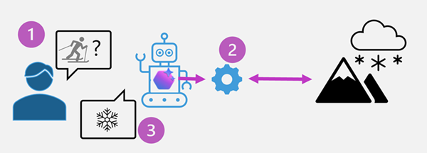

Azure AI Agent Service offers a powerful platform for integrating custom tools to enhance productivity and provide tailored solutions for specific business needs. By leveraging these custom tools, businesses can achieve greater efficiency and effectiveness in their operations.

## Benefits of using custom tools in Azure AI Agent Service

Custom tools in Azure AI services can significantly enhance productivity by automating repetitive tasks and streamlining workflows that are specific to your use case. These tools improve accuracy by providing precise and consistent outputs, reducing the likelihood of human error. Additionally, custom tools offer tailored solutions that address specific business needs, enabling organizations to optimize their processes and achieve better outcomes.

- **Enhanced productivity**: Automate repetitive tasks and streamline workflows.
- **Improved accuracy**: Provide precise and consistent outputs, reducing human error.
- **Tailored solutions**: Address specific business needs and optimize processes.

Adding tools to achieve custom functionality are available for the agent to decide to use, depending on how it decides to respond to the user prompt.

The diagram shows the process of an agent choosing to use the provided tool:

1. A user asks an agent for a report, such as about recent snowfall in their local mountains.
1. The agent determines the provided tool to retrieve snowfall for a specific location will be useful, and calls that tool.
1. The agent may choose to use other tools to best accomplish the user's task, such as retrieve knowledge using a built-in tool.
1. The agent then outputs the report and responds to the user.
