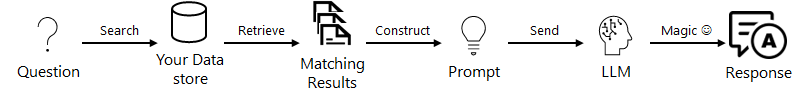

Vector databases, embeddings, and Retrieval Augmentation Generation (RAG) are crucial technologies for enhancing AI-driven applications, particularly in the context of vCore-based Azure Cosmos DB for MongoDB. Understanding these concepts is essential for implementing advanced functionalities such as vector search querying your own data.

## Understand embeddings in AI

Before we discuss vector databases or RAG systems, we need to understand embeddings and their role in AI applications. Embeddings convert items like words, sentences, or entire documents into numeric vectors that reflect their meanings. For example, a vector representing a word "cat" might be represented as follows:

```json
[0.1, 0.2, 0.3, 0.4, 0.5]
```

These vectors, created through machine learning techniques, help AI models understand and work with data more effectively. The AI models can then use these vectors to perform tasks like classification, clustering, or similarity matching. They play a crucial role in applications ranging from text analysis to computer vision, supporting tasks such as classifying texts, or generating images and code.

In platforms like Azure OpenAI, embeddings are key to helping large language models process and produce text that mirrors human communication. They turn complex data into a structured form that models can work with, enhancing the models' ability to generate relevant and coherent responses. Embeddings are also essential for vector databases, which store and retrieve data based on these numeric representations.

## Explore vector databases

Each value in the vector is considered a dimension of the data it represents. That vector then represents its position in a highly multi-dimensional space relative to all the other vectors. These vectors often have many dimensions, where some of the "smaller" embeddings models in Azure OpenAI have `1536` dimensions.

Vector databases save data as these highly multi-dimensional vectors created through transformations or embeddings from various data types like text, images, or videos. These databases excel at quickly finding data that matches semantically, not just through exact queries. This capability is valuable for applications such as locating similar images, documents, or products.

For example, in a vector database, you could search using an image or a piece of text as a query to find others that closely match in style or content. This process involves finding a query vector (embedding) for the search input and using similarity measures like *cosine similarity* or *Euclidean distance* to find the distance between vectors.

So, if you search for the word "cat," the database would return vectors that are most similar to the word "cat" based on the similarity measure used. These similarity measures rely on the transformations or embeddings to rank results based on how closely they match the query.

Vector databases can be an essential component of a Retrieval Augmentation Generation (RAG) systems, where they store and retrieve data for AI models to generate responses. By using vector databases, you can ensure that the AI models retrieve and generate responses based on your relevant and context-aware data, enhancing the accuracy and relevance of the responses.

## Explore Retrieval Augmented Generation (RAG)

RAG systems improve large language models by adding an information retrieval system. This system grounds AI responses in relevant, specific data, such as vectorized documents and images created from the data in your enterprise.

A RAG system using vector databases typically follows these steps:

1. Embeds the input question or query and retrieves the relevant data from a vector database.
1. Generates a prompt including the initial input and the data retrieved to provide context.
1. Queries the generative AI model with the combined prompt to generate a response.



Integrating RAG systems allows you to precisely control the data your language models use, making their responses more accurate and tailored. When linked with vector databases containing your data, the AI model can use your data, improving its responses and making those responses more applicable and context-aware to your enterprise.

In RAG systems, AI applications are tailored and managed by your data not the other way around.

Vector databases, embeddings, and Retrieval Augmentation Generation (RAG) are essential for enhancing AI-driven applications, especially with vCore-based Azure Cosmos DB for MongoDB and Azure OpenAI. Embeddings translate complex data into numeric vectors that improve the understanding of an AI model, which is crucial for tasks like text classification and data retrieval. Vector databases use these embeddings to perform fast, semantically driven searches, greatly enhancing data retrieval capabilities. When you combine these technologies into a RAG system, they allow AI to deliver responses that aren't only accurate but also tailored to your specific data, improving both the relevance and effectiveness of your applications.
