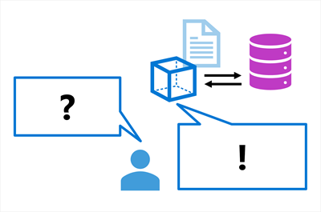

Language models are growing in popularity as they create impressive coherent answers to a user’s questions. Especially when a user interacts with a language model through chat, it provides an intuitive way to get the information they need.

One prevalent challenge when implementing language models through chat is the so-called **groundedness**, which refers to whether a response is rooted, connected, or anchored in reality or a specific context. In other words, groundedness refers to whether the response of a language model is based on factual information.

## Ungrounded prompts and responses

When you use a language model to generate a response to a prompt, the only information that the model has to base the answer on comes from the data on which it was trained - which is often just large amounts of uncontextualized text from the Internet or some other source.

The result will likely be a grammatically coherent and logical response to the prompt, but because it isn't grounded in relevant, factual data, it's uncontextualized; and may in fact be inaccurate and include "invented" information. For example, the question "Which product should I use to do *X*?" might include details of a fictional product.

## Grounded prompts and responses

In contrast, you can use a data source to *ground* the prompt with some relevant, factual context. The prompt can then be submitted to a language model, including the grounding data, to generate a contextualized, relevant, and accurate response.

The data source can be any repository of relevant data. For example, you could use data from a product catalog database to ground the prompt "Which product should I use to do *X*?" so that the response includes relevant details of products that exist in the catalog.

In this module, you explore how to create your own chat-based language model application that is grounded, by building a copilot with your own data.

