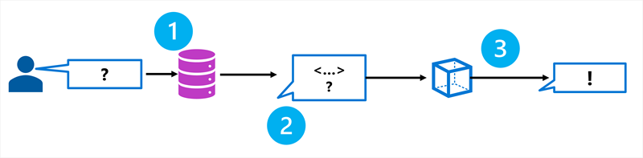

Language models excel in generating engaging text, and are ideal as the base for copilots. Copilots provide users with an intuitive chat-based application to receive assistance in their work. When designing a copilot for a specific use case, you want to ensure your language model is grounded and uses factual information that is relevant to what the user needs.

Though language models are trained on a vast amount of data, they may not have access to the knowledge you want to make available to your users. To ensure that a copilot is grounded on specific data to provide accurate and domain-specific responses, you can use **Retrieval Augmented Generation** (**RAG**).

## Understanding RAG

RAG is a technique that you can use to ground a language model. In other words, it's a process for retrieving information that is relevant to the user's initial prompt. In general terms, the RAG pattern incorporates the following steps:

1. **Retrieve** grounding data based on the initial user-entered prompt.
1. **Augment** the prompt with grounding data.
1. Use a language model to **generate** a grounded response.

By retrieving context from a specified data source, you ensure that the language model uses relevant information when responding, instead of relying on its training data.

Using RAG is a powerful and easy-to-use technique for many cases in which you want to ground your language model and improve the factual accuracy of your copilot's responses.

## Adding grounding data to an Azure AI project

You can use Azure AI Studio to build a custom copilot that uses your own data to ground prompts. Azure AI Studio supports a range of data connections that you can use to add data to a project, including:

- Azure Blob Storage
- Azure Data Lake Storage Gen2
- Microsoft OneLake

You can also upload files or folders to the storage used by your AI Studio project.

