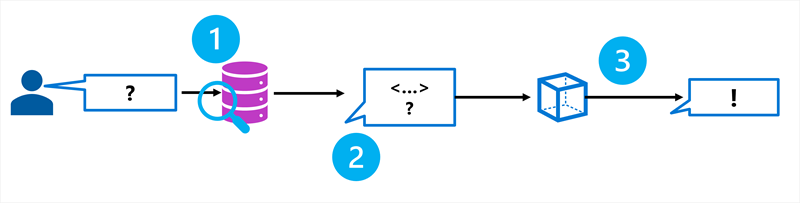
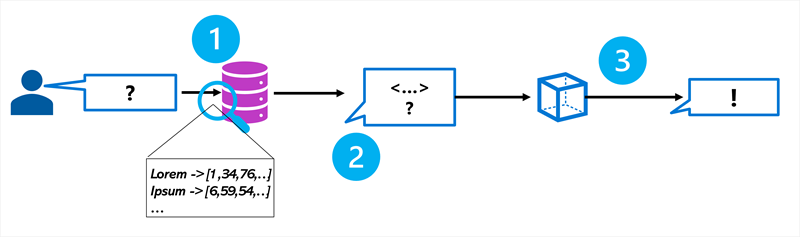

When you want to create a copilot that uses your own data to generate accurate answers, you need to be able to search your data efficiently. When you build a copilot with the Azure AI Studio, you can use the integration with **Azure AI Search** to retrieve the relevant context in your chat flow.

Azure AI Search is a **retriever** that you can include when building a language model application with prompt flow. Azure AI Search allows you to bring your own data, index your data, and query the index to retrieve any information you need.

## Using a *vector* index

While a text-based index will improve search efficiency, you can usually achieve a better data retrieval solution by using a *vector*-based index that contains *embeddings* that represent the text tokens in your data source.

An embedding is a special format of data representation that a search engine can use to easily find the relevant information. More specifically, an embedding is a vector of floating-point numbers.

For example, imagine you have two documents with the following contents:

- *"The children played joyfully in the park."*
- *"Kids happily ran around the playground."*

These two documents contain texts that are semantically related, even though different words are used. By creating vector embeddings for the text in the documents, the relation between the words in the text can be mathematically calculated.

Imagine the keywords being extracted from the document and plotted as a vector in a multidimensional space:

:::image type="content" source="../media/vector-embeddings.jpg" alt-text="Diagram of vector embeddings.":::

The distance between vectors can be calculated by measuring the cosine of the angle between two vectors, also known as the *cosine similarity*. In other words, the cosine similarity computes the semantic similarity between documents and a query.

By representing words and their meanings with vectors, you can extract relevant context from your data source even when your data is stored in different formats (text or image) and languages.

When you want to be able to use vector search to search your data, you need to create embeddings when creating your search index. To create embeddings for your search index, you can use an Azure OpenAI embedding model available in the Azure AI Studio.

> [!Tip]
> Learn more about [embeddings in the Azure OpenAI Service](/azure/ai-services/openai/concepts/understand-embeddings?azure-portal=true).

## Creating a search index

In Azure AI Search, a **search index** describes how your content is organized to make it searchable. Imagine a library containing many books. You want to be able to search through the library and retrieve the relevant book easily and efficiently. To make the library searchable, you create a catalog that contains any relevant data about books to make any book easy to find. A library’s catalog serves as the search index.

Though there are different approaches to creating an index, the integration of Azure AI Search in the Azure AI Studio makes it easy for you to create an index that is suitable for language models. You can add your data to the Azure AI Studio, after which you can use Azure AI Search to create an index in the Azure AI Studio using an embedding model. The index asset is stored in Azure AI Search and queried by the Azure AI Studio when used in a chat flow.

:::image type="content" source="../media/create-index.png" alt-text="Screenshot of creating an index in the Azure AI Studio.":::

How you configure your search index depends on the data you have and the context you want your language model to use. For example, **keyword search** enables you to retrieve information that exactly matches the search query. **Semantic search** already takes it one step further by retrieving information that matches the meaning of the query instead of the exact keyword, using semantic models. Currently, the most advanced technique is **vector search**, which creates embeddings to represent your data.

> [!Tip]
> Learn more about [vector search](/azure/search/vector-search-overview?azure-portal=true).

## Searching an index

There are several ways that information can be queried in an index:

- **Keyword search**: Identifies relevant documents or passages based on specific keywords or terms provided as input.
- **Semantic search**: Retrieves documents or passages by understanding the meaning of the query and matching it with semantically related content rather than relying solely on exact keyword matches.
- **Vector search**: Uses mathematical representations of text (vectors) to find similar documents or passages based on their semantic meaning or context.
- **Hybrid search**: Combines any or all of the other search techniques. Queries are executed in parallel and are returned in a unified result set.

When you create a search index in the Azure AI Studio, you're guided to configuring an index that is most suitable to use in combination with a language model. When your search results are used in a generative AI application, hybrid search gives the most accurate results.

Hybrid search is a combination of keyword (and full text), and vector search, to which semantic ranking is optionally added. When you create an index that is compatible with hybrid search, the retrieved information is precise when exact matches are available (using keywords), and still relevant when only conceptually similar information can be found (using vector search).

> [!Tip]
> Learn more about [hybrid search](/azure/search/hybrid-search-overview?azure-portal=true).
