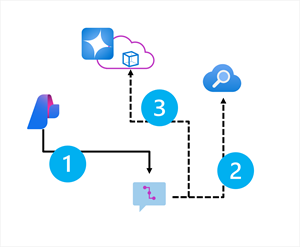

When you've created an Azure AI Search index for your contextual data, you can use it with an OpenAI model. To ground prompts with data from your index, the Azure OpenAI SDK supports extending the request with connection details for the index. The pattern for using this approach when working with an Azure AI Foundry project is shown in the following diagram.



1. Use an Azure AI Foundry project client to retrieve connection details for the Azure AI Search index and an OpenAI **ChatClient** object.
1. Add the index connection information to the **ChatClient** configuration so that it can be searched for grounding data based on the user prompt.
1. Submit the grounded prompt to the Azure OpenAI model to generate a contextualized response.

The following code example shows how to implement this pattern.

::: zone pivot="python"

```python
from azure.identity import DefaultAzureCredential
from azure.ai.projects import AIProjectClient
from azure.ai.projects.models import ConnectionType
import openai


# Initialize the project client
projectClient = AIProjectClient.from_connection_string(
    conn_str="<region>.api.azureml.ms;<project_id>;<hub_name>;<project_name>",
    credential=DefaultAzureCredential()
)

# Get an Azure OpenAI chat client
chat_client = projectClient.inference.get_azure_openai_client(api_version="2024-10-21")

# Use the AI search service connection to get service details
searchConnection = projectClient.connections.get_default(
    connection_type=ConnectionType.AZURE_AI_SEARCH,
    include_credentials=True,
)
search_url = searchConnection.endpoint_url
search_key = searchConnection.key

# Initialize prompt with system message
prompt = [
    {"role": "system", "content": "You are a helful AI assistant."}
]

# Add a user input message to the prompt
input_text = input("Enter a question: ")
prompt.append({"role": "user", "content": input_text})

# Additional parameters to apply RAG pattern using the AI Search index
rag_params = {
    "data_sources": [
        {
            "type": "azure_search",
            "parameters": {
                "endpoint": search_url,
                "index_name": "<azure_ai_search_index_name>",
                "authentication": {
                    "type": "api_key",
                    "key": search_key,
                }
            }
        }
    ],
}

# Submit the prompt with the index information
response = chat_client.chat.completions.create(
    model="<model_deployment_name>",
    messages=prompt,
    extra_body=rag_params
)

# Print the contextualized response
completion = response.choices[0].message.content
print(completion)
```

::: zone-end

::: zone pivot="csharp"

```csharp
using Azure.Identity;
using Azure.AI.Projects;
using Azure.AI.OpenAI;
using System.ClientModel;
using Azure.AI.OpenAI.Chat;
using OpenAI.Chat;

...

{
    
    // Initialize the project client
    var projectClient = new AIProjectClient(
        "<region>.api.azureml.ms;<project_id>;<hub_name>;<project_name>",
        new DefaultAzureCredential()
    );

    // Get an Azure OpenAI chat client
    ChatClient chatClient = projectClient.GetAzureOpenAIChatClient("<model_deployment_name>");
    
    // Use the AI search service connection to get service details
    var connectionsClient = projectClient.GetConnectionsClient();
    ConnectionResponse searchConnection = connectionsClient.GetDefaultConnection(ConnectionType.AzureAISearch, true);
    var searchProperties = searchConnection.Properties as ConnectionPropertiesApiKeyAuth;
    string search_url = searchProperties.Target;
    string search_key = searchProperties.Credentials.Key;
    

    
    // Initialize prompt with system message
    var prompt = new List<ChatMessage>()
    {
        new SystemChatMessage("You are a helful AI assistant.")
    };
    
    // Add a user input message to the prompt
    Console.WriteLine("Enter a question: ");
    input_text = Console.ReadLine();
    prompt.Add(new UserChatMessage(input_text));
    
    // Additional parameters to apply RAG pattern using the AI Search index
    ChatCompletionOptions options = new();
    options.AddDataSource(
        new AzureSearchChatDataSource()
        {
            Endpoint = new Uri(search_url),
            IndexName = "<azure_ai_search_index_name>",
            Authentication = DataSourceAuthentication.FromApiKey(search_key),
        }
    );
    
    // Submit the prompt with the index information
    ChatCompletion completion = chatClient.CompleteChat(prompt, options);
    var completionText = completion.Content[0].Text;
    
    // Print the contextualized response
    Console.WriteLine(completionText);
}
```

::: zone-end

In this example, the search against the index is *keyword-based* - in other words, the query consists of the text in the user prompt, which is matched to text in the indexed documents. When using an index that supports it, an alternative approach is to use a *vector-based* query in which the index and the query use numeric vectors to represent text tokens. Searching with vectors enables matching based on semantic similarity as well as literal text matches.

To use a vector-based query, you can modify the specification of the Azure AI Search data source details to include an embedding model; which is then used to vectorize the query text.

::: zone pivot="python"

```python
rag_params = {
    "data_sources": [
        {
            "type": "azure_search",
            "parameters": {
                "endpoint": search_url,
                "index_name": "<azure_ai_search_index_name>",
                "authentication": {
                    "type": "api_key",
                    "key": search_key,
                },
                # Params for vector-based query
                "query_type": "vector",
                "embedding_dependency": {
                    "type": "deployment_name",
                    "deployment_name": "<embedding_model_deployment_name>",
                },
            }
        }
    ],
}
```

::: zone-end

::: zone pivot="csharp"

```csharp
{
    ChatCompletionOptions options = new();
    options.AddDataSource(
        new AzureSearchChatDataSource()
        {
            Endpoint = new Uri(search_url),
            IndexName = "<azure_ai_search_index_name>",
            Authentication = DataSourceAuthentication.FromApiKey(search_key),
            // Params for vector-based query
            QueryType = "vector",
            VectorizationSource = DataSourceVectorizer.FromDeploymentName("<embedding_model_deployment_name>"),
        },
    );
}
```

::: zone-end