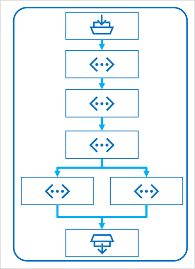
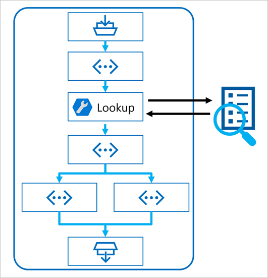

After uploading data to the Azure AI Studio and creating an index on your data using the integration with Azure AI Search, you can implement the RAG pattern with *Prompt Flow* to build a copilot application.

**Prompt Flow** is a development framework for defining flows that orchestrate interactions with an LLM.

A flow begins with one or more *inputs*, usually a question or prompt entered by a user, and in the case of iterative conversations the chat history to this point.

The flow is then defined as a series of connected *tools*, each of which performs a specific operation on the inputs and other environmental variables. There are multiple types of tool that you can include in a prompt flow to perform tasks such as:

- Running custom Python code
- Looking up data values in an index
- Creating prompt variants - enabling you to define multiple versions of a prompt for a large language model (LLM), varying system messages or prompt wording, and compare and evaluate the results from each variant.
- Submitting a prompt to an LLM to generate results.

Finally, the flow has one or more *outputs*, typically to return the generated results from an LLM.

## Using the RAG pattern in a prompt flow

The key to using the RAG pattern in a prompt flow is to use an Index Lookup tool to retrieve data from an index so that subsequent tools in the flow can use the results to augment the prompt used to generate output from an LLM.

## Use a sample to create a chat flow

Prompt flow provides various samples you can use as a starting point to create an application. When you want to combine RAG and a language model in your application, you can clone the **Multi-round Q&A on your data** sample.

The sample contains the necessary elements to include RAG and a language model:

:::image type="content" source="../media/chat-flow.png" alt-text="Screenshot of the chat flow created with the Q&A sample.":::

1. Append the history to the chat input to define a prompt in the form of a contextualized form of a question.
1. Look up relevant information from your data using your search index.
1. Generate the prompt context by using the retrieved data from the index to augment the question.
1. Create prompt variants by adding a system message and structuring the chat history.
1. Submit the prompt to a language model that generates a natural language response.

Let's explore each of these elements in more detail.

### Modify query with history

The first step in the flow is a Large Language Model (LLM) node that takes the chat history and the user's last question and generates a new question that includes all necessary information. By doing so, you generate more succinct input that is processed by the rest of the flow.

### Look up relevant information

Next, you use the Index Lookup tool to query the search index you created with the integrated Azure AI Search feature and find the relevant information from your data source.

> [!Tip]
> Learn more about the [Index Lookup tool](/azure/machine-learning/prompt-flow/tools-reference/index-lookup-tool?azure-portal=true).

### Generate prompt context

The output of the Index Lookup tool is the retrieved context you want to use when generating a response to the user. You want to use the output in a prompt that is sent to a language model, which means you want to parse the output into a more suitable format.

The output of the Index Lookup tool can include the top *n* results (depending on the parameters you set). When you generate the prompt context, you can use a Python node to iterate over the retrieved documents from your data source and combine their contents and sources into one document string. The string will be used in the prompt you send to the language model in the next step of the flow.

### Define prompt variants

When you construct the prompt you want to send to your language model, you can use variants to represent different prompt contents.

When including RAG in your chat flow, your goal is to ground the chatbot's responses. Next to retrieving relevant context from your data source, you can also influence the groundedness of the chatbot's response by instructing it to use the context and aim to be factual.

With the prompt variants, you can provide varying system messages in the prompt to explore which content provides the most groundedness.

### Chat with context

Finally, you use an LLM node to send the prompt to a language model to generate a response using the relevant context retrieved from your data source. The response from this node is also the output of the entire flow.

After configuring the sample chat flow to use your indexed data and the language model of your choosing, you can deploy the flow and integrate it with an application to offer users a copilot experience.
