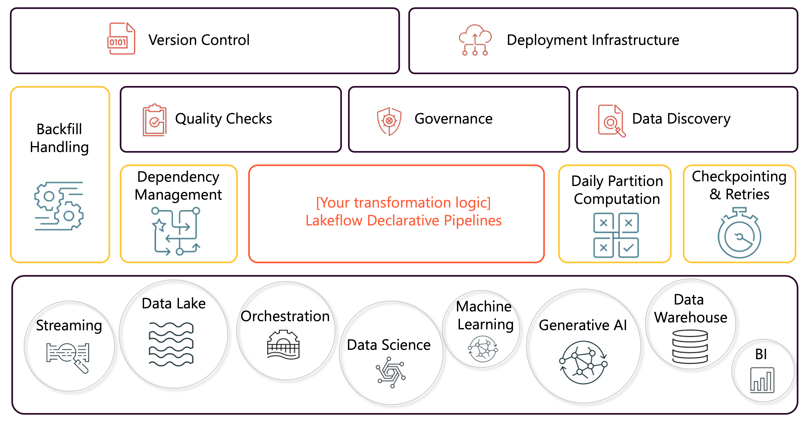

You and your team of data engineers want to focus on what really matters: shaping data so it’s ready for the business. That means transforming and aggregating it, preparing it for BI, data science, and machine learning. But before you can even get there, you’re stuck figuring out where the data actually lives—scattered across your data lake and data warehouse. Then comes the demand to support streaming pipelines for new use cases, enable generative AI projects, and manage orchestration, all while juggling version control, CI/CD, and deployment infrastructure. Add in data quality checks, governance, and discovery, and the challenges only grow. And beyond that, there’s the operational grind—hand-coding backfills, managing dependencies, partitions, checkpointing, and retries—when all you really want is to deliver reliable data.

That’s why building and running data pipelines is so difficult. Development is slow and labor-intensive, pipelines are fragile and error-prone, and delays ripple into the business. Operational complexity drives downtime, wasted resources, and engineering toil. And with batch and streaming often siloed, adapting to new requirements around latency, cost, and SLAs feels rigid and expensive.

With Lakeflow Declarative Pipelines, you and your team can leave those headaches behind. Instead of wrestling with orchestration and infrastructure, you can focus on writing and managing transformation logic. It's a framework within the Databricks Lakehouse Platform for building and running data pipelines in a **declarative** manner. The result: clean, reliable data pipelines, delivered with less effort and far more confidence.

Lakeflow Declarative Pipelines has several features for streamlining data engineering tasks and for enhancing data infrastructure reliability. You can define **data quality** rules and *expectations* directly within your pipeline code. The system monitors data quality in real-time, providing visibility and control over your data's integrity. With **Change Data Capture** (CDC), it handles inserts, updates, and deletes automatically in addition to handling out-of-order events.