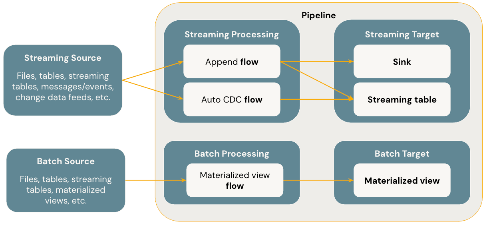

Lakeflow Declarative Pipelines is a framework in Azure Databricks for building and running both batch and streaming data pipelines. Instead of requiring engineers to write step-by-step instructions for data movement and transformations, Lakeflow Declarative Pipelines lets them declare the desired data flows and outcomes. The system then takes responsibility for orchestrating execution, ensuring reliability, and managing incremental updates. Pipelines in this framework can include flows that ingest and process data, streaming tables that continuously update with new events, materialized views that maintain precomputed results, and sinks that deliver outputs to external systems.

## What problem does it aim to solve?

Traditional data engineering pipelines are often imperative and low-level. Developers must define exactly how to ingest data, manage state, handle late-arriving events, recover from failures, and process incremental updates efficiently. This is both time-consuming and error-prone, especially when combining batch workloads with real-time streaming needs or when working with change data capture scenarios. Lakeflow Declarative Pipelines address these challenges by abstracting away much of the operational complexity. Instead of worrying about checkpoints, retry strategies, or dependencies between steps, engineers simply describe what data transformations and outputs are required, and the framework ensures the pipeline executes correctly and consistently.

## What are the benefits?

The declarative approach brings several advantages: 

- It **simplifies development** by letting engineers focus on business logic rather than operational details. 
- It improves efficiency through **incremental processing**: materialized views and flows only reprocess new or changed data, which reduces compute cost and latency. 
- It unifies **streaming and batch** semantics, so the same framework can power both real-time and scheduled workloads. 
- **Reliability** is built in through automatic retries at multiple levels, dependency management, and orchestration of flows within a pipeline. 
- It also provides native support for common enterprise needs such as **change data capture** and **slowly changing dimensions**, reducing the amount of custom code needed for these scenarios.
- Lakeflow Declarative Pipelines can **dynamically scale** resources based on a workload, which means that it can handle increases in data volume without manual intervention.

## Key Concepts

The following diagram illustrates the most important concepts of Lakeflow Declarative Pipelines.

### Pipeline

The pipeline is the top-level structure that contains all logic and execution in Lakeflow Declarative Pipelines. It defines the set of flows, streaming tables, materialized views, and sinks that together make up a data system. The pipeline automatically understands dependencies between components, determines the correct order of execution, and handles fault tolerance and retries. For the data engineer, the pipeline serves as the single definition that captures the full lifecycle of ingestion, transformation, and delivery.

### Flow

A flow represents a transformation step within a pipeline. It reads data from a source, applies logic, and writes the result to a target. Flows can be either batch or streaming, depending on the needs of the workload. They can operate in append mode, where new data is simply added to the target, or in automatic change data capture (AUTO CDC) mode, where changes are tracked and applied to maintain an up-to-date representation of the source. Flows are the primary mechanism by which data moves and evolves inside a pipeline.

### Streaming Table

A streaming table is a managed table that continuously ingests and updates with new data. It's the natural target for streaming flows, ensuring that data remains fresh as events arrive. Streaming tables integrate seamlessly with Unity Catalog, so they're governed and managed like other tables in Databricks. They can capture raw event data or maintain processed representations, and because they're managed resources, they automatically benefit from the reliability, orchestration, and incremental logic of the pipeline framework.

### Materialized View

A materialized view is a managed table designed for batch-oriented but incremental processing. Rather than recomputing the entire dataset each time, a materialized view only processes data that has changed since the last run. This allows complex transformations and aggregations to be kept up-to-date without high costs or long runtimes. Materialized views are useful for building curated datasets, summary tables, or analytical layers on top of raw ingested data.

### Sink

A sink is a destination for pipeline output that exists outside the managed table environment. Sinks are used primarily with streaming flows to deliver data to external systems, such as Kafka topics, Azure Event Hubs, or other Delta tables. They allow a pipeline to not only manage internal transformations but also publish results to downstream services, applications, or consumers. Sinks extend the reach of a pipeline beyond the Databricks environment, enabling it to power real-time data products and integrations.