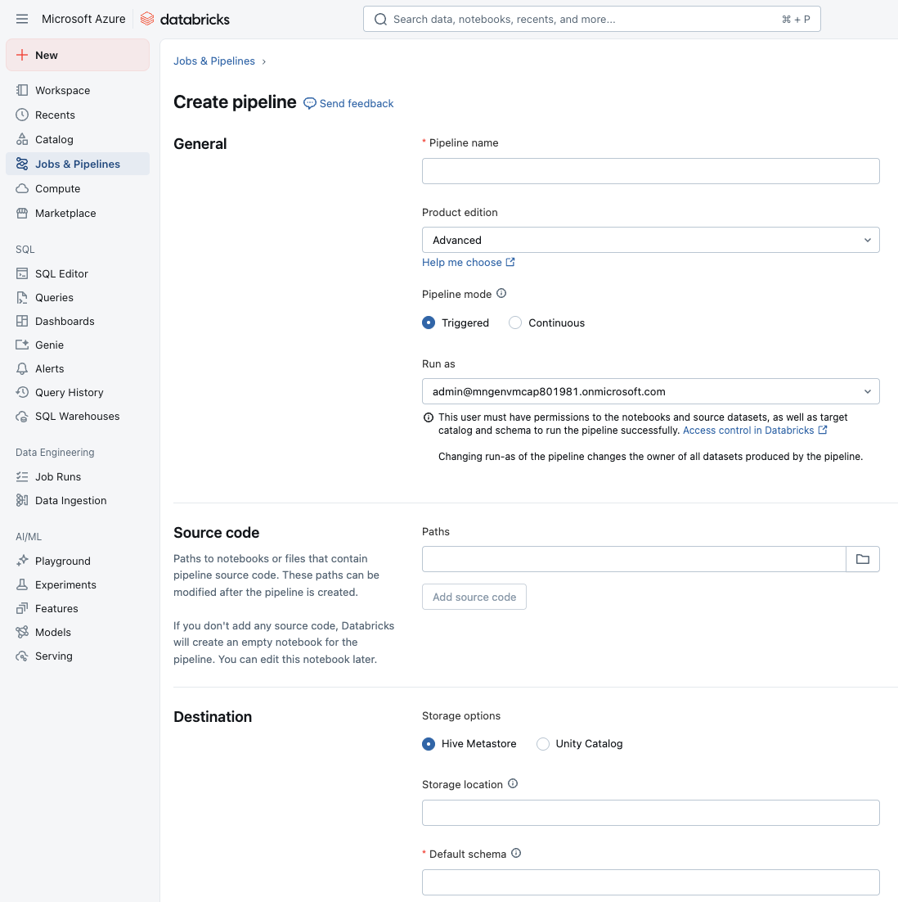
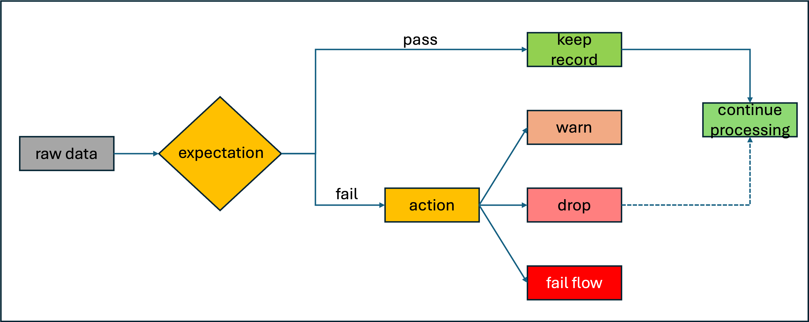
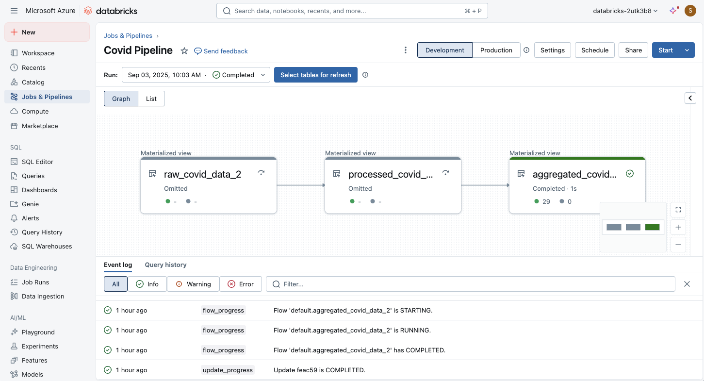

Data ingestion and integration form the foundational layer for effective data processing in Lakeflow Declarative Pipelines within Azure Databricks. This ensures that data from various sources is accurately and efficiently loaded into the system for further analysis and processing. 

Lakeflow Declarative Pipelines facilitates data ingestion and integration through:

- **Multi-source ingestion**: allows you to collect data from various sources.
- **Stream and batch data processing**: enables you to process data either continuously or in grouped intervals.
- **Schema management**: ensures that your data is well-structured and easy to manage.
- **Data quality and governance**: helps you maintain the integrity and compliance of your data
- **Pipeline automation and orchestration**: streamlines and controls the sequence of your data processing tasks
- **Integration with Azure ecosystem**: allows you to interact smoothly with various Azure tools and services
- **Performance optimization**: enhances your ability to process data quickly and effectively
- **Monitoring and lineage tracking**: helps you track the data's journey and monitor its movement through the system.

## Create a pipeline

First, you create an ETL pipeline in Lakeflow Declarative Pipelines. Lakeflow Declarative Pipelines creates pipelines by resolving dependencies defined in notebooks or files (called source code) using Lakeflow Declarative Pipelines syntax. Each source code file can contain only one language, but you can add multiple language-specific notebooks or files in the pipeline. 

In your workspace, you can create a new ETL Pipeline from the **Jobs & Pipelines** section in the sidebar. You should assign a **name** to the pipeline, configure a **notebook** or **files** that contain the source code, and set the **destination** storage location and schema. 



## Load from an existing table

In your notebook, you can load data from any existing table in Databricks. You can transform the data using a query, or load the table for further processing in your pipeline.

```sql
CREATE OR REFRESH MATERIALIZED VIEW top_baby_names_2021
COMMENT "A table summarizing counts of the top baby names for New York for 2021."
AS SELECT
  First_Name,
  SUM(Count) AS Total_Count
FROM baby_names_prepared
WHERE Year_Of_Birth = 2021
GROUP BY First_Name
ORDER BY Total_Count DESC
```

## Load files from cloud object storage

Databricks recommends using **Auto Loader** with Lakeflow Declarative Pipelines for most data ingestion tasks from cloud object storage or from files in a Unity Catalog volume. Auto Loader and Lakeflow Declarative Pipelines are designed to incrementally and idempotently load ever-growing data as it arrives in cloud storage.

Auto Loader can ingest `JSON`, `CSV`, `XML`, `PARQUET`, `AVRO`, `ORC`, `TEXT`, and `BINARYFILE` file formats.

The following SQL example reads data from cloud storage using Auto Loader:

```sql
CREATE OR REFRESH STREAMING TABLE sales
  AS SELECT *
  FROM STREAM read_files(
    'abfss://myContainer@myStorageAccount.dfs.core.windows.net/analysis/*/*/*.json',
    format => "json"
  );
```

The following SQL example use Auto Loader to create datasets from CSV files in a Unity Catalog volume:

```sql
CREATE OR REFRESH STREAMING TABLE customers
AS SELECT * FROM STREAM read_files(
  "/Volumes/my_catalog/retail_org/customers/",
  format => "csv"
)
```

## Parsing JSON

In Lakeflow Declarative Pipelines, when you parse JSON data using the function `from_json`, you can let the system automatically figure out the JSON schema (inference) and adjust it over time (evolution) rather than hardcoding a schema upfront. This is useful when schemas aren't known ahead of time or when they change often.

Each `from_json` expression, when set up for inference + evolution, needs a unique identifier called the `schemaLocationKey`. It lets the system keep track of which JSON schema belongs to which parsing expression. If you have multiple JSON parsing expressions in your pipeline, each must use a distinct schemaLocationKey. Also, the key must be unique in the context of a given pipeline.

Here's an example using SQL syntax demonstrating setting the schema argument to NULL, signaling that schema should be inferred rather than fixed:

```sql
SELECT
  value,
  from_json(value, NULL, map('schemaLocationKey', 'keyX')) parsedX,
  from_json(value, NULL, map('schemaLocationKey', 'keyY')) parsedY,
FROM STREAM READ_FILES('/databricks-datasets/nyctaxi/sample/json/', format => 'text')
```

You have the option instead to use a fixed schema with `from_json(jsonStr, schema, ...)`. If you choose fixed schema, then inference & evolution aren't used. Also, schema hints are useful when you want fixed schema but also want to anticipate or handle schema drift.

Here's an example in SQL where the query takes a JSON string containing two fields, a and b, and parses it into a structured object using the schema specified in the second argument. Here, the schema declares a as an integer and b as a double, so the result is a `STRUCT<a: INT, b: DOUBLE>`

```sql
SELECT from_json('{"a":1, "b":0.8}', 'a INT, b DOUBLE');
```

## Manage data quality with pipeline expectations

Optionally, you can use expectations to apply quality constraints that validate data as it flows through ETL pipelines. Expectations provide greater insight into data quality metrics and allow you to fail updates or drop records when detecting invalid records.



Here's an example of a materialized view that defines a constraint clause. In this case, the constraint contains the actual logic for what is being validated: the Country_Region shouldn't be empty. When a record fails this condition, the expectation is triggered.

```sql
CREATE OR REFRESH MATERIALIZED VIEW processed_covid_data (
 CONSTRAINT valid_country_region EXPECT (Country_Region IS NOT NULL) ON VIOLATION FAIL UPDATE
)
COMMENT "Formatted and filtered data for analysis."
AS
SELECT
   TO_DATE(Last_Update, 'MM/dd/yyyy') as Report_Date,
   Country_Region,
   Confirmed,
   Deaths,
   Recovered
FROM live.raw_covid_data;
```

Examples of constraints:

```sql
-- Simple constraint
CONSTRAINT non_negative_price EXPECT (price >= 0) ON VIOLATION DROP ROW

-- SQL functions
CONSTRAINT valid_date EXPECT (year(transaction_date) >= 2020) ON VIOLATION FAIL UPDATE

-- CASE statements
CONSTRAINT valid_order_status EXPECT (
  CASE
    WHEN type = 'ORDER' THEN status IN ('PENDING', 'COMPLETED', 'CANCELLED')
    WHEN type = 'REFUND' THEN status IN ('PENDING', 'APPROVED', 'REJECTED')
    ELSE false
  END
)

-- Multiple constraints
CONSTRAINT non_negative_price EXPECT (price >= 0),
CONSTRAINT valid_purchase_date EXPECT (date <= current_date())

-- Complex business logic
CONSTRAINT valid_subscription_dates EXPECT (
  start_date <= end_date
  AND end_date <= current_date()
  AND start_date >= '2020-01-01'
)

-- Complex boolean logic
CONSTRAINT valid_order_state EXPECT (
  (status = 'ACTIVE' AND balance > 0)
  OR (status = 'PENDING' AND created_date > current_date() - INTERVAL 7 DAYS)
)
```

Retaining invalid records is the default behavior for expectations. Records that violate the expectation are added to the target dataset along with valid records. If you specify `ON VIOLATION DROP ROW`, then records that violate the expectation are dropped from the target dataset. Finally, if you specify `ON VIOLATION FAIL UPDATE`, then the system atomically rolls back the transaction.

## Apply transformations

You can transform the data using a query, just like with standard SQL commands. In the following example, we define another materialized view that aggregates data.

```sql
CREATE OR REFRESH MATERIALIZED VIEW aggregated_covid_data
COMMENT "Aggregated daily data for the US with total counts."
AS
SELECT
   Report_Date,
   sum(Confirmed) as Total_Confirmed,
   sum(Deaths) as Total_Deaths,
   sum(Recovered) as Total_Recovered
FROM live.processed_covid_data
GROUP BY Report_Date;
```

## Execute and monitor the ETL pipeline

After you defined the code in notebooks or source code files, you can start the ETL pipeline. There's a visual interface you can use to monitor the execution:



The pipeline graph appears as soon as an update to a pipeline has successfully started. Arrows represent dependencies between data sets in your pipeline. By default, the pipeline details page shows the most recent update for the table, but you can select older updates from a drop-down menu.

Lakeflow Declarative Pipelines support tasks such as:

- Observing the progress and status of pipeline updates.
- Alerting on pipeline events such as the success or failure of pipeline updates. 
- Viewing metrics for streaming sources like Apache Kafka and Auto Loader. 
- Receiving email notifications when a pipeline update fails or completes successfully.