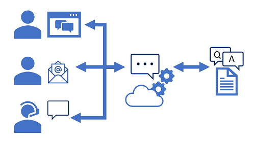

You can easily create a user support bot solution on Microsoft Azure using a combination of two core services:

- **Azure AI Language**: includes a custom question answering feature that enables you to create a knowledge base of question and answer pairs that can be queried using natural language input. 
    > [!NOTE]
    > The question answering capability in Azure AI Language is a newer version of the QnA Maker service - which is still available as a separate service.
- **Azure AI Bot Service**: provides a framework for developing, publishing, and managing bots on Azure.

## Creating a custom question answering knowledge base

The first challenge in creating a user support bot is to use Azure AI Language to create a knowledge base. You can use the *Language Studio*'s custom question answering feature to create, train, publish, and manage knowledge bases.

> [!NOTE]
> You can write code to create and manage knowledge bases using the Azure AI Language REST API or SDK. However, in most scenarios it is easier to use the Language Studio.

### Provision a Language resource

To create a knowledge base, you must first provision a **Language** resource in your Azure subscription. 

### Define questions and answers

After provisioning a Language resource, you can use the Language Studio's custom question answering feature to create a knowledge base that consists of question-and-answer pairs. These questions and answers can be:

- Generated from an existing FAQ document or web page.
- Entered and edited manually.

In many cases, a knowledge base is created using a combination of all of these techniques; starting with a base dataset of questions and answers from an existing FAQ document and extending the knowledge base with additional manual entries.

Questions in the knowledge base can be assigned *alternative phrasing* to help consolidate questions with the same meaning. For example, you might include a question like:

> *What is your head office location?*

You can anticipate different ways this question could be asked by adding an alternative phrasing such as:

> *Where is your head office located?*

### Test the knowledge base

After creating a set of question-and-answer pairs, you must save it. This process analyzes your literal questions and answers and applies a built-in natural language processing model to match appropriate answers to questions, even when they are not phrased exactly as specified in your question definitions. Then you can use the built-in test interface in the Language Studio to test your knowledge base by submitting questions and reviewing the answers that are returned. 

### Use the knowledge base

When you're satisfied with your knowledge base, deploy it. Then you can use it over its REST interface. To access the knowledge base, client applications require:

- The knowledge base ID
- The knowledge base endpoint
- The knowledge base authorization key

## Build a bot with Azure AI Bot Service

After you've created and deployed a knowledge base, you can deliver it to users through a bot.

### Create a bot for your knowledge base

You can create a custom bot by using the Microsoft Bot Framework SDK to write code that controls conversation flow and integrates with your knowledge base. However, an easier approach is to use the automatic bot creation functionality, which enables you to create a bot for your deployed knowledge base and publish it as an Azure AI Bot Service application with just a few clicks.

### Extend and configure the bot

After creating your bot, you can manage it in the Azure portal, where you can:

- Extend the bot's functionality by adding custom code.
- Test the bot in an interactive test interface.
- Configure logging, analytics, and integration with other services.

For simple updates, you can edit bot code directly in the Azure portal. However, for more comprehensive customization, you can download the source code and edit it locally; republishing the bot directly to Azure when you're ready.

### Connect channels

When your bot is ready to be delivered to users, you can connect it to multiple *channels*; making it possible for users to interact with it through web chat, email, Microsoft Teams, and other common communication media.

Users can submit questions to the bot through any of its channels, and receive an appropriate answer from the knowledge base on which the bot is based.
