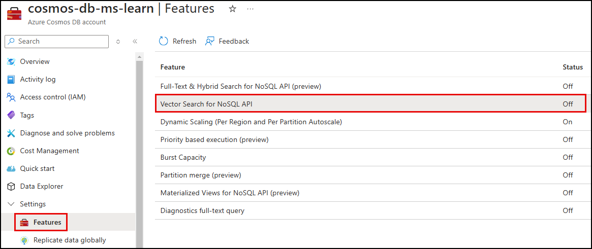
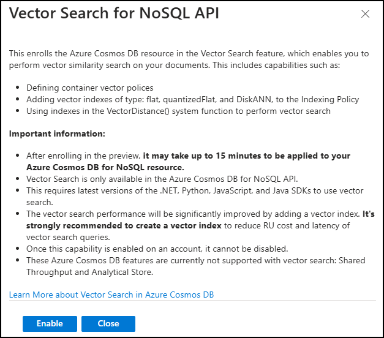

Azure Cosmos DB for NoSQL includes a vector search feature, which provides a robust method for storing and querying high-dimensional vectors. This capability is essential for Generative AI applications requiring an integrated vector search capability. Azure Cosmos DB for NoSQL's vector database allows embeddings to be stored, indexed, and queried alongside the original data, meaning each document in your database can contain high-dimensional vectors and traditional schema-free data. Keeping the vector embeddings and the original data they represent together facilitates better multi-modal data operations and enables greater data consistency, scale, and performance. It also simplifies data management, AI application architectures, and the efficiency of vector-based operations.

## Enable Vector Search in Azure Cosmos DB for NoSQL

Enabling the Vector Search for NoSQL API feature in Azure Cosmos DB can be done via the [Azure portal](https://portal.azure.com) or the Azure command-line interface (Azure CLI).

In the Azure portal, it's listed under **Features**.



After reviewing the feature description, you can enable the **Vector Search for NoSQL API** feature to make it available in your account.



Alternatively, you can enable Vector Search via the Azure CLI by executing the following command:

```azurecli
az cosmosdb update \
 --resource-group <resource-group-name> \
 --name <cosmos-db-account-name> \
 --capabilities EnableNoSQLVectorSearch
```

## Define container vector policy

Once the Vector Search feature is enabled on your Azure Cosmos DB for NoSQL account, you must define a vector embedding policy for the containers where you want to store vectors. This policy informs the Azure Cosmos DB query engine how to handle vector properties in the `VectorDistance` system function. It also instructs the vector indexing policy of necessary details, should you specify one.

> &#128221; The vector search feature is currently not supported on the existing containers, so you need to create a new container and specify the container-level vector embedding policy and the vector indexing policy at the time of container creation.

The following information is included in the container vector policy:

- `path`: The path of the property containing the vector embeddings.
- `datatype`: The type of the elements in the vector. The default is `Float32`.
- `dimensions`: This property is the number of dimensions in or length of each vector and will be driven by the model used to create embeddings.
- `distanceFunction`: The technique used to compute distance or similarity between vectors. The available options are Euclidean (default), cosine, and dot product.

In vector search, distance functions determine how similar or different vectors are within a multidimensional space. Popular methods include Euclidean distance, cosine similarity, and Manhattan distance, each offering unique ways to compare the vectors.

## Improve vector search efficiency with vector indexing

Azure Cosmos DB for NoSQL supports the creation of vector search indexes on top of stored embeddings. A vector search index is a container of vectors in latent space that enables a semantic similarity search across all data (vectors) contained within. Vector indexes are specialized for high-dimensional vector data, increasing the efficiency of performing vector searches using the `VectorDistance` system function in Azure Cosmos DB for NoSQL. The following types of vector index policies are supported:

| Type | Description | Max dimensions |
| ---- | ----------- | -------------- |
| flat | Stores vectors on the same index as other indexed properties. | 505 |
| quantizedFlat | Quantizes (compresses) vectors before storing on the index. This policy can improve latency and throughput at the cost of a small amount of accuracy. | 4096 |
| diskANN | Creates an index based on DiskANN for fast and efficient approximate search. | 4096 |

Vector searches reduced latency, increase throughput, and decreased RU consumption when using a vector index. A vector index search allows for a prompt preprocessing step where information can be semantically retrieved from an index and then used to generate a factually accurate prompt for the LLM (Large Language Model) to reason over. This process provides knowledge augmentation and domain-specific focus to an LLM. The vector search index returns a list of documents whose vector field is semantically similar to the incoming message. The original text stored within the same document augments the LLM's prompt, which the LLM then uses to respond to the requestor based on the information provided.
