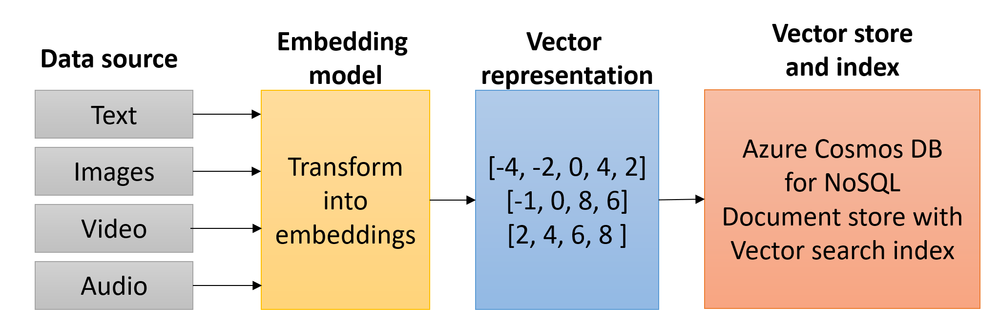

Vectors, also known as embeddings or vector embeddings, are mathematical representations of data in a high-dimensional space. Each dimension corresponds to a feature of the data in this space, and tens of thousands of dimensions might be used to represent sophisticated data. A vector's position in this space represents its characteristics. Words, phrases, or entire documents, and images, audio, and other types of data, can all be vectorized. Because data is represented as a vector, vector search can identify matching data across different data types.

An embedding is a data representation format that machine learning models and algorithms can efficiently utilize. The embedding is an information-dense representation of the semantic meaning of a piece of text. Each embedding is a vector of floating point numbers. Hence, the distance between two embeddings in the vector space correlates with the semantic similarity between two inputs in the original format.

## Generate embeddings with Azure OpenAI

Azure OpenAI is a cutting-edge service that integrates OpenAI's advanced language models with Microsoft's Azure platform, providing a secure and scalable environment for developers. This powerful combination enables the creation of intelligent applications that can understand and generate human-like text, essential for tasks like natural language processing, text summarization, and sentiment analysis. A fundamental application of Azure OpenAI is building sophisticated virtual assistants, or Generative AI applications, capable of handling complex queries, offering personalized responses, and seamlessly integrating with other services. By using an embedding model, developers can generate vector representations of textual data and store them in a vector store like Azure Cosmos DB for NoSQL. This approach facilitates efficient and accurate similarity searches, significantly enhancing the Generative AI application's ability to retrieve relevant information and provide contextually rich interactions.



Embeddings are generated by sending data to an embedding model, where it transforms into a vector. Azure OpenAI provides several models for creating embeddings, including the `text-embedding-ada-002`, `text-embedding-3-small`, and `text-embedding-3-large` models. The Azure OpenAI SDK for Python can be used to create an Azure OpenAI client, which provides a method for producing embeddings.

```python
from azure.identity import DefaultAzureCredential, get_bearer_token_provider
from openai import AzureOpenAI

# Enable Microsoft Entra ID RBAC authentication
credential = DefaultAzureCredential()
token_provider = get_bearer_token_provider(
 credential,
    "https://cognitiveservices.azure.com/.default"
)

# Instantiate an Azure OpenAI client
client = AzureOpenAI(
    api_version = AZURE_OPENAI_API_VERSION,
    azure_endpoint = AZURE_OPENAI_ENDPOINT,
    azure_ad_token_provider = token_provider
)

# Generate embeddings for input text
response = client.embeddings.create(
    input = "Build Generative AI applications with Python and Azure Cosmos DB for NoSQL",
    model = "text-embedding-3-large"
)

# Retrieve the generated embedding
embedding = response.data[0].embedding
```

Knowing the number of dimensions the model produces is crucial when defining a container vector policy in Azure Cosmos DB for NoSQL. It also plays a role in selecting an appropriate vector indexing policy. The dimensionality of the vectors created is dictated by the model used to generate them. In the previous example, the `text-embedding-3-large` model was used, which, by default, created vectors containing 3,072 dimensions. When defining a container vector policy, you must specify that number in the **Dimensions** property. Likewise, you need to choose an index type that supports the number of dimensions used.

Once created, the embeddings can be stored in a vector database, such as Azure Cosmos DB for NoSQL.

## Common development patterns for generating and storing vectors

Integrating Azure OpenAI and Azure Cosmos DB for NoSQL to generate and store vector embeddings typically requires an automated worker process that ensures efficiency, real-time processing, and seamless integration. Some common patterns that are used to accomplish this integration include:

1. **Azure Function with Cosmos DB Change Feed Trigger**

    An effective pattern for generating embeddings as data is inserted into Cosmos DB involves using an Azure Function in combination with the Cosmos DB change feed. The function's Cosmos DB trigger is invoked when documents are inserted or updated in the container. The function calls an Azure OpenAI embedding model to create vectors, updates the documents with these embeddings, and writes them back into Cosmos DB. This approach ensures real-time processing and immediate availability of vector embeddings for subsequent searches.

2. **Batch Processing with Azure Data Factory**

    Batch processing can be an efficient approach for bulk data operations on documents, whether they already exist in a Cosmos DB container or reside in another data store. You can use Azure Data Factory to orchestrate the process of generating vector embeddings. Data Factory can extract data from its source, send it to Azure OpenAI for embedding generation, and then write the enriched data into Cosmos DB. This method is beneficial for initial data loading or periodic updates where real-time processing isn't critical.

3. **Microservices Architecture**

    A microservices architecture can provide a solution that offers more granular control of the processes involved. Embedding generation can be encapsulated within a dedicated microservice. This service interacts with Azure OpenAI and Cosmos DB, generating vector embeddings as needed. Other services can call this microservice whenever they need to update or retrieve embeddings, ensuring a modular and maintainable system design.

By adopting these patterns, your applications can efficiently integrate vector embeddings, using the capabilities of Azure OpenAI and Cosmos DB for NoSQL to enhance search and data analysis.