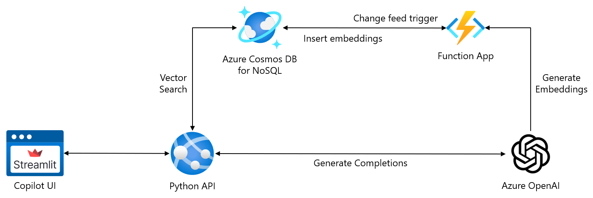

Generative AI applications, the next generation of intelligent assistants, are redefining productivity by providing context-aware support, enhancing decision-making processes, and automating complex workflows. With Azure Cosmos DB for NoSQL Python vector search, developers can build advanced Generative AI applications that deliver precise and efficient solutions by integrating the power of Python and its vast assortment of libraries and tools. Python's versatility in data manipulation integrated with the robust vector search capabilities of Azure Cosmos DB allows Generative AI applications to handle complex data queries and provide real-time insights efficiently. Additionally, vector search plays a crucial role when implementing a Retrieval-Augmented Generation (RAG) pattern. It enables the AI to retrieve the most relevant documents from a vast corpus based on similarity to the input query, thus enhancing the generation of accurate and contextually relevant responses. This synergy allows users to focus on strategic tasks while the AI Generative AI applications manage the heavy lifting of data processing and analysis.

## Configure a Python virtual environment

Virtual environments in Python are critical for maintaining a clean and organized development environment, offering numerous benefits that can significantly enhance your coding experience. They allow each project to have its own set of dependencies, isolated from others, which prevents conflicts and ensures a consistent development workflow. This isolation is beneficial when deploying projects to production, as it ensures that the exact versions of dependencies used during development are maintained, reducing the risk of unexpected bugs and incompatibilities. Furthermore, virtual environments make it easier to collaborate with other developers by providing a consistent setup across different machines and development stages. By using virtual environments, you can easily manage package versions, avoid dependency clashes, and ensure your projects run smoothly. This best practice is essential for a stable and dependable coding environment, making your development process more efficient and less prone to issues.

Creating a Python virtual environment can be easily accomplished using a command similar to the following command, which creates a virtual environment named `.venv` in the directory in which the command is run:

```bash
python -m venv .venv
```

Once created, you can activate the virtual environment by selecting the appropriate command for your OS and shell from the following table.

| Platform | Shell | Command to activate virtual environment |
| -------- | ----- | --------------------------------------- |
| POSIX | bash/zsh | `source .venv/bin/activate` |
| | fish | `source .venv/bin/activate.fish` |
| | csh/tcsh | `source .venv/bin/activate.csh` |
| | pwsh | `.venv/bin/Activate.ps1` |
| Windows | cmd.exe | `.venv\Scripts\activate.bat` |
| | PowerShell | `.venv\Scripts\Activate.ps1` |

After activating the virtual environment, any required Python libraries can be installed using the `pip install` command. Typically, required libraries and their versions are maintained in a `requirements.txt` file. This file allows versions to be specified and retained within the project, ensuring all libraries and dependencies are maintained between environments. These files store dependencies in the following format:

```ini
azure-cosmos==4.9.0
azure-identity==1.19.0
fastapi==0.115.5
openai==1.55.2
pydantic==2.10.2
requests==2.32.3
streamlit==1.40.2
uvicorn==0.32.1
```

Adding all libraries listed in this file can also be accomplished using the `pip install` command by running:

```bash
pip install -r requirements.txt
```

## Securely access Azure resources using Entra ID RBAC

Utilizing Microsoft Entra ID's Role-Based Access Control (RBAC) for authenticating against Azure services like Azure OpenAI and Azure Cosmos DB presents several key benefits over key-based methods. Entra ID RBAC enhances security through precise access controls tailored to user roles, effectively reducing unauthorized access risks. It also streamlines user management, enabling administrators to dynamically assign and modify permissions without the hassle of distributing and maintaining cryptographic keys. Furthermore, this approach enhances compliance and auditability by aligning with organizational policies and facilitating comprehensive access monitoring and review. Entra ID RBAC makes a more efficient and scalable solution for using Azure services by streamlining secure access management.

The following code snippet demonstrates authenticating and configuring a client for interacting with Azure OpenAI services using Microsoft Entra ID RBAC (role-based access control) authentication.

```python
from azure.identity import DefaultAzureCredential, get_bearer_token_provider
from openai import AzureOpenAI

# Enable Microsoft Entra ID RBAC authentication
token_provider = get_bearer_token_provider(
    DefaultAzureCredential(),
    "https://cognitiveservices.azure.com/.default"
)

client = AzureOpenAI(
    api_version = AZURE_OPENAI_API_VERSION,
    azure_endpoint = AZURE_OPENAI_ENDPOINT,
    azure_ad_token_provider = token_provider
)
```

The `token_provider = get_bearer_token_provider(DefaultAzureCredential(), "https://cognitiveservices.azure.com/.default")` previous line creates a token provider using the `DefaultAzureCredential` and the Azure Cognitive Services scope URL. `DefaultAzureCredential` handles the authentication process, and the `get_bearer_token_provider` utility function returns a token provider that obtains access tokens for Azure services. The `AzureOpenAI` client then uses the created `token_provider` to authenticate requests to the Azure OpenAI service using Microsoft Entra ID RBAC.

## Generative AI application architecture

The architecture of using separate frontend and backend layers provides significant extensibility, allowing for the seamless integration of extra functionalities over time. Once the initial Generative AI application is developed, incorporating new features, such as LangChain orchestration, into the APIs becomes straightforward.



This modular design enables developers to enhance the backend with advanced capabilities without disrupting the existing front end. For instance, LangChain can be added to handle complex workflows and chain multiple tasks, boosting the Generative AI application's functionality. This flexibility ensures the system remains scalable and adaptable, ready to incorporate future advancements, and efficiently meet evolving user needs.

## Create a UI with Streamlit

Streamlit is a powerful open-source Python library that enables rapid development of interactive web applications, making it an ideal choice for building a Generative AI application's user interface. With its intuitive API, developers can quickly create dynamic, responsive chat interfaces that facilitate real-time interactions. Streamlit's built-in support for various widgets and its seamless integration with popular data visualization tools allow for the easy incorporation of chat functionality, enabling users to communicate with the Generative AI application efficiently. By using Streamlit, you can streamline the process of constructing a user-friendly and engaging interface, ensuring a smooth and productive experience for users interacting with your Generative AI application.

```python
# Create a Generative AI application UI with Streamlit
import streamlit as st
import requests

st.set_page_config(page_title="Cosmic Works Generative AI application", layout="wide")

def send_message_to_copilot(message: str, chat_history: list = []) -> str:
    """Send a message to the Generative AI application chat endpoint."""
    try:
        api_endpoint = "http://localhost:8000"
        request = {"message": message, "chat_history": chat_history}
        response = requests.post(f"{api_endpoint}/chat", json=request, timeout=60)
        print('response:', response.content)
        return response.json()
    except Exception as e:
        st.error(f"An error occurred: {e}")
        return ""

def main():
    """Main function for the Cosmic Works Product Management Generative AI application UI."""

    st.write(
        """
        # Cosmic Works Product Management Generative AI application
    
        Welcome to Cosmic Works Product Management Generative AI application, a tool for managing and finding bicycle-related products in the Cosmic Works system.
    
        **Ask the Generative AI application to apply or remove a discount on a category of products or to find products.**
        """
    )

    if "messages" not in st.session_state:
        st.session_state.messages = []

    # Display message from the history on app rerun.
    for message in st.session_state.messages:
        with st.chat_message(message["role"]):
            st.markdown(message["content"])

    # React to user input
    if prompt := st.chat_input("What can I help you with today?"):
        with st.spinner("Awaiting the Generative AI application's response to your question..."):
            # Display user message in chat message container
            with st.chat_message("user"):
                st.markdown(prompt)
            
            # Send user message to Generative AI application and get response
            response = send_message_to_copilot(prompt, st.session_state.messages)            

            # Display assistant response in chat message container
            with st.chat_message("assistant"):
                st.markdown(response)
            
            # Add the current user message and assistant response messages to chat history
            st.session_state.messages.append({"role": "user", "content": prompt})
            st.session_state.messages.append({"role": "assistant", "content": response})
```

## Build a backend API with Python and FastAPI

FastAPI is a modern framework for developing APIs with Python, which is well-suited for creating robust backend APIs. When designing a Generative AI application UI with Streamlit, FastAPI can serve as the powerful backend engine for handling interactions with Azure services like Azure OpenAI and Cosmos DB. Using FastAPI's efficient request handling, you can quickly build endpoints that enable communication between the Streamlit front end and Azure's services. This setup ensures that user queries to the Generative AI application are processed smoothly, allowing real-time responses and efficient data management. FastAPI's simplicity and high performance make it an excellent choice for building the backend infrastructure needed to support advanced Generative AI applications.

```python
from fastapi import FastAPI
from azure.identity import DefaultAzureCredential, get_bearer_token_provider
from openai import AzureOpenAI

app = FastAPI()

# Enable Microsoft Entra ID RBAC authentication
token_provider = get_bearer_token_provider(
    DefaultAzureCredential(),
    "https://cognitiveservices.azure.com/.default"
)

client = AzureOpenAI(
    api_version = AZURE_OPENAI_API_VERSION,
    azure_endpoint = AZURE_OPENAI_ENDPOINT,
    azure_ad_token_provider = token_provider
)

@app.get("/chat")
async def root(message: str, deployment_name: str = "gpt-4o"):
    messages = [{"role": "user", "content": message}]
    completion = client.chat.completions.create(
        model=deployment_name,
        messages=messages,
    )
    return completion
```

## Leverage private data through function calling

Function calling in Azure OpenAI allows the seamless integration of external APIs or tools directly into your model’s output. When the model detects a relevant request, it constructs a JSON object with the necessary parameters, which you then execute. The result is returned to the model, enabling it to deliver a comprehensive final response enriched with external data.

When using function calling, there are several steps you need to perform in code. First, you must create a function that is called to perform an action. This method is a regular Python function. For example, the following function, `apply_discount`, accepts a discount amount, such as 0.1 for 10%, and a product category and applies that discount amount to every product matching that category:

```python
async def apply_discount(discount: float, product_category: str) -> str:
    """Apply a discount to products in the specified category."""
    # Load the database
    database = cosmos_client.get_database_client(DATABASE_NAME)
    # Retrieve the container
    container = database.get_container_client(CONTAINER_NAME)

    query_results = container.query_items(
        query = """
        SELECT * FROM Products p WHERE LOWER(p.category_name) = LOWER(@product_category)
        """,
        parameters = [
            {"name": "@product_category", "value": product_category}
        ]
    )

    # Apply the discount to the products
    async for item in query_results:
        item['discount'] = discount
        item['sale_price'] = item['price'] * (1 - discount) if discount > 0 else item['price']
        await container.upsert_item(item)

    return f"A {discount}% discount was successfully applied to {product_category}." if discount > 0 else f"Discounts on {product_category} removed successfully."
```

Next, you must provide a JSON-formatted function definition that the LLM (Larger Language Model) uses to understand how to interact with the function.

```json
{
   "type": "function",
   "function": {
         "name": "apply_discount",
         "description": "Apply a discount to products in the specified category",
         "parameters": {
            "type": "object",
            "properties": {
               "discount": {"type": "number", "description": "The percent discount to apply."},
               "product_category": {"type": "string", "description": "The category of products to which the discount should be applied."}
            },
            "required": ["discount", "product_category"]
         }
   }
}
```

The function definition must be added to an array of `tools` that can be passed into the LLM. It contains definitions for all functions you want to make available to your models. For example, the following `tools` array contains definitions for two functions, `apply_discount` and `get_category_names`.

```python
# Define function calling tools
tools = [
   {
      "type": "function",
      "function": {
            "name": "apply_discount",
            "description": "Apply a discount to products in the specified category",
            "parameters": {
               "type": "object",
               "properties": {
                  "discount": {"type": "number", "description": "The percent discount to apply."},
                  "product_category": {"type": "string", "description": "The category of products to which the discount should be applied."}
               },
               "required": ["discount", "product_category"]
            }
      }
   },
   {
      "type": "function",
      "function": {
            "name": "get_category_names",
            "description": "Retrieves the names of all product categories"
      }
   }
]
```

When using function calling with Azure OpenAI, you must make two calls to the LLM. The first allows the LLM to determine what "tools" to use, and the second generates a completion using a prompt enriched with output from the function calls.

The first call requires you to provide the Azure OpenAI client with the tools array and then capture the tool outputs in the response from that call:

```python
# First API call, providing the model to the defined functions
response = aoai_client.chat.completions.create(
   model = COMPLETION_DEPLOYMENT_NAME,
   messages = messages,
   tools = tools,
   tool_choice = "auto"
)

# Process the model's response
response_message = response.choices[0].message
messages.append(response_message)
```

You must then use the requested function calls to "handle" the response, where you make the calls to the functions requested by the LLM. This handler lets you call the functions and capture their output so it can be written into the conversation and used by the LLM on the next API call.

```python
# Handle function call outputs
if response_message.tool_calls:
   for call in response_message.tool_calls:
      if call.function.name == "apply_discount":
            func_response = apply_discount(**json.loads(call.function.arguments))
            messages.append(
               {
                  "role": "tool",
                  "tool_call_id": call.id,
                  "name": call.function.name,
                  "content": func_response
               }
            )
      elif call.function.name == "get_category_names":
            func_response = get_category_names()
            messages.append(
               {
                  "role": "tool",
                  "tool_call_id": call.id,
                  "name": call.function.name,
                  "content": json.dumps(func_response)
               }
            )
else:
   print("No function calls were made by the model.")
```

Finally, you make the second call to the LLM, passing in a `messages` collection enriched with outputs from your function calls.

```python
# Second API call, asking the model to generate a response
final_response = aoai_client.chat.completions.create(
   model = COMPLETION_DEPLOYMENT_NAME,
   messages = messages
)

# Output the completion response
print(final_response.choices[0].message.content)
```

## Use prompt engineering to provide a persona to your Generative AI application

Prompt engineering is a crucial technique in artificial intelligence and natural language processing. It guides AI models in generating desired outputs by crafting specific, well-structured inputs (prompts) that steer the AI's responses toward achieving accurate and relevant results.

Effective prompt engineering requires understanding the AI model's capabilities and limitations, and the nuances of language. By providing clear instructions, context, and examples within the prompt, developers can influence the AI to produce high-quality content, solve complex problems, or perform specific tasks. This approach enhances the AI's ability to comprehend and respond to various queries, making interactions more useful and engaging.

When building a Generative AI application, prompt engineering enables you to define a "persona" for your assistant. The persona instructs the LLM about interacting with Generative AI application users, describing how to handle inputs and create outputs. Creating a persona is accomplished using a system prompt that you add to the collection of messages used by the Azure OpenAI client and the underlying language model.

```python
# Define the system prompt that contains the assistant's persona.
system_prompt = """
You are an intelligent Generative AI application for Cosmic Works designed to help users manage and find bicycle-related products.
You are helpful, friendly, and knowledgeable, but can only answer questions about Cosmic Works products.
If asked to apply a discount:
    - Apply the specified discount to all products in the specified category. If the user did not provide you with a discount percentage and a product category, prompt them for the details you need to apply a discount.
    - Discount amounts should be specified as a decimal value (e.g., 0.1 for 10% off).
If asked to remove discounts from a category:
    - Remove any discounts applied to products in the specified category by setting the discount value to 0.
When asked to provide a list of products, you should:
    - Provide at least 3 candidate products unless the user asks for more or less, then use that number. Always include each product's name, description, price, and SKU. If the product has a discount, include it as a percentage and the associated sale price.
"""

# Provide the Generative AI application with a persona using the system prompt.
messages = [{ "role": "system", "content": system_prompt }]
```
