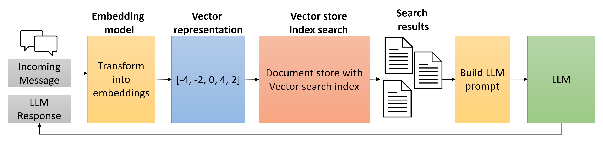

Integrating the vector search capabilities of Azure Cosmos DB for NoSQL into a Python-based Generative AI application significantly enhances the Generative AI application's ability to perform similarity searches efficiently. Vector search allows retrieving semantically similar items based on vector embeddings, making it ideal for Generative AI application' natural language processing tasks. By using vector search, a Generative AI application can quickly find and retrieve relevant information from large datasets, enriching its responses with accurate and contextually relevant data. This capability enhances the user experience by providing more precise and meaningful assistance, ultimately making the Generative AI application more intelligent and effective.

## What is vector search?

Vector search is a technique that allows items to be found based on their data characteristics instead of exact matches on a specific property or field. Instead of requiring exact matches, vector search enables you to identify matches based on their vector representations. This technique is advantageous when performing similarity searches and is valuable in applications that require searching for information within large blocks of text.



It plays a critical role in the implementation of the retrieval augmented generation (RAG) pattern frequently used by Generative AI applications by enabling secure and efficient integration of proprietary data into large language model (LLM) responses, ensuring that Generative AI applications can provide precise, domain-specific answers while maintaining the confidentiality and integrity of sensitive information.

## Understand the steps involved in vector search

Executing vector searches with Azure Cosmos DB for NoSQL involves the following steps:

1. Create and store vector embeddings for the fields on which you want to perform similarity searches.
2. Specify the vector embedding paths in the container's vector embedding policy.
3. Include any desired vector indexes in the indexing policy for the container.
4. Populate the container with documents containing vector embeddings.
5. Generate embeddings representing the search query using Azure OpenAI or another service.
6. Run a query using the `VectorDistance` function to compare the similarity of the search query embeddings to those embeddings of the vectors stored in the Cosmos DB container.

## Perform vector search using the VectorDistance function

The `VectorDistance` function in Azure Cosmos DB for NoSQL measures the similarity between two vectors by calculating their distance using metrics like cosine similarity, dot product, or Euclidean distance. This function is vital for applications that require quick and accurate similarity searches, such as those involving natural language processing or recommendation systems. By utilizing `VectorDistance`, you can efficiently handle high-dimensional vector queries, significantly improving the relevance and performance of your AI-driven applications.

Suppose, for example, you want to search for products about bike pedals by looking at the product description. First, you must generate embeddings for your query text. In this case, you might want to create embeddings for the query text "clip-in pedals." Providing the embedding for your search query text to the `VectorDistance` function in the vector search query, you can identify and retrieve products similar to your query, like the following query:

```sql
SELECT TOP 5 c.name, c.description, VectorDistance(c.embedding, [1,2,3]) AS SimilarityScore 
FROM c 
ORDER BY VectorDistance(c.embedding, [1,2,3])
```

The previous example shows a NoSQL query that projects the similarity score as the alias `SimilarityScore` and sorts it from most-similar to least-similar.

> &#10071; You should always use a `TOP N` clause in `SELECT` queries when performing vector searches. Without it, the vector search will attempt to return many more matches, resulting in the query costing more RUs and having higher latency than necessary.

Implementing vector search from Python code for a Generative AI application would look similar to:

```python
# Create a Cosmos DB client
cosmos_client = CosmosClient(url=AZURE_COSMOSDB_ENDPOINT, credential=credential)
# Load the database
database = cosmos_client.get_database_client(DATABASE_NAME)
# Retrieve the container
container = database.get_container_client(CONTAINER_NAME)

# Function for generating embeddings using Azure OpenAI's text-embedding-3-small model
def generate_embeddings(text: str):
    client = AzureOpenAI(
            api_version = AZURE_OPENAI_API_VERSION,
            azure_endpoint = AZURE_OPENAI_ENDPOINT,
            azure_ad_token_provider = token_provider
    )
    response = client.embeddings.create(input = text, model = "text-embedding-3-small")
    return response.data[0].embedding

def vector_search(query_embedding: list, num_results: int = 3, similarity_score: float = 0.25):
    """Search for similar product vectors in Azure Cosmos DB"""
    results = container.query_items(
        query = """
        SELECT TOP @num_results p.name, p.description, p.sku, p.price, p.discount, p.sale_price, VectorDistance(p.embedding, @query_embedding) AS similarity_score
        FROM Products p
        WHERE VectorDistance(p.embedding, @query_embedding) > @similarity_score
        ORDER BY VectorDistance(p.embedding, @query_embedding)
        """,
        parameters = [
            {"name": "@query_embedding", "value": query_embedding},
            {"name": "@num_results", "value": num_results},
            {"name": "@similarity_score", "value": similarity_score}
        ],
        enable_cross_partition_query = True
    )
    results = list(results)
    formatted_results = [{'similarity_score': result.pop('similarity_score'), 'product': result} for result in results]
    return formatted_results

# Get embeddings for search query text
query_embedding = generate_embeddings(query_text)

# Perform a vector search
results = vector_search(query_embedding, 3, 0.5)
```