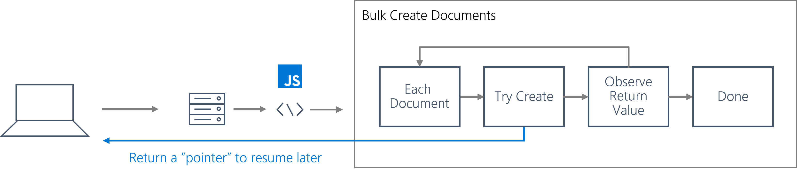

In a database, a transaction is typically defined as a sequence of point operations grouped together into a single unit of work. It's expected that a transaction provides **ACID** guarantees:

- **Atomicity** guarantees that all the work done inside a transaction is treated as a single unit where either all of it is committed or none.
- **Consistency** makes sure that the data is always in a healthy internal state across transactions.
- **Isolation** guarantees that no two transactions interfere with each other – generally, most commercial systems provide multiple isolation levels that can be used based on the application's needs.
- **Durability** ensures that any change that's committed in the database will always be present.

In Azure Cosmos DB SQL API, a stored procedure executes one or more operations as a single unit of work within the same scope. Stored procedures are registered in containers, and run within the scope of that specific container. Stored procedures are registered in containers, and run within the scope of that specific container.

> [!NOTE]
> Stored procedures are scoped to a single logical partition. You cannot execute a stored procedure that performs operations across logical partition key values.

Transactions occurs server-side in Azure Cosmos DB SQL API, so they must adhere to the same limitations as many other HTTP requests. All operations within a stored procedure must completed within a bounded amount of time. Specifically, the operations must be complete with the **server request timeout** duration.

For long-running lists of operations, a helper boolean value is returned by any JavaScript function that performs an operation indicating whether that operation is expected to complete within the request timeout duration. If the Boolean is **true**, you can continue on with the stored procedure. Once that Boolean is **false**, then the stored procedure must finalize as soon as possible. At this point, it is common to return a pointer so that subsequent calls to the stored procedure can start from the pointer instead of rewinding progress all the way to the beginning of the long-running list of operations.

