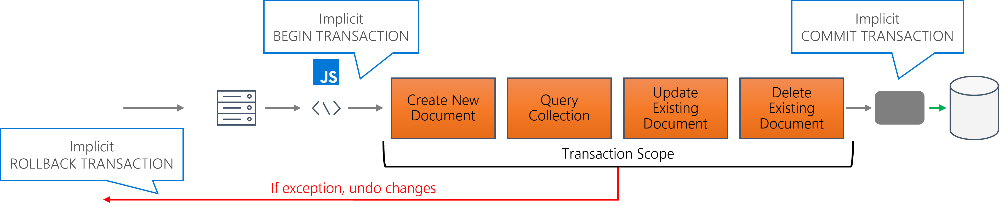

Transactions are deeply and natively integrated into Azure Cosmos DB SQL API’s JavaScript programming model. Inside a JavaScript function, all operations are automatically wrapped under a single transaction. If the function completes without any exception, all data changes are committed. Azure Cosmos DB’s SQL API will roll back the entire transaction if a single exception is thrown from the script.

Effectively, the start of the JavaScript function is similar to a **BEGIN TRANSACTION** statement in a database system, with the end of the function scope being the functional equivalent of **COMMIT TRANSACTION**. If any error is thrown, that’s the functional equivalent of **ROLLBACK TRANSACTION**.



In code, this is surfaced simply by throwing any error in JavaScript:

```javascript
throw new Error('Something');
```

Using the create item example from earlier in this module, you can create a callback function to determine if the operation returned an error from the server. If so, you can rethrow the error immediately to short-circuit your code and cause the entire stored procedure transaction to be rolled back.

```javascript
(error, newItem) => {
    if (error) throw error;
    // Do something with item
}
```
