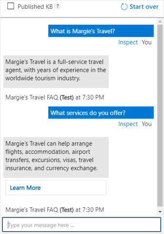

After you have defined a knowledge base, you can train its natural language model, and test it before publishing it for use in an application or bot.

## Testing a knowledge base

You can test your knowledge base interactively in Language Studio, submitting questions and reviewing the answers that are returned. You can inspect the results to view their confidence scores as well as other potential answers.

## Deploying a knowledge base

When you are happy with the performance of your knowledge base, you can deploy it to a REST endpoint that client applications can use to submit questions and receive answers.
