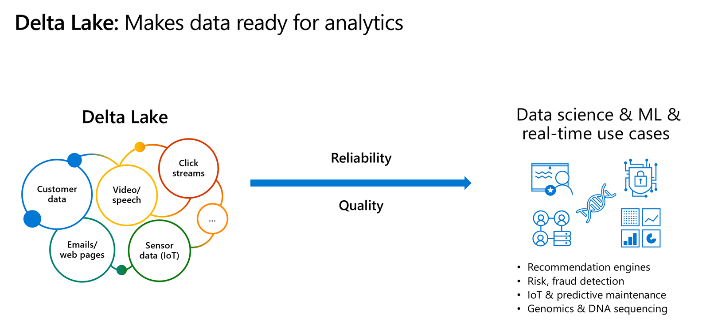
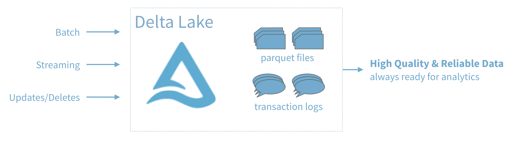

Delta Lake is a transactional storage layer designed specifically to work with Apache Spark and Databricks File System (DBFS). At the core of Delta Lake is an optimized Spark table. It stores your data as Apache Parquet files in DBFS and maintains a transaction log that efficiently tracks changes to the table.

## Data lakes

A data lake is a storage repository that inexpensively stores a vast amount of raw data, both current and historical, in native formats such as XML, JSON, CSV, and Parquet. It may contain operational relational databases with live transactional data.

Enterprises have been spending millions of dollars getting data into data lakes with Apache Spark. The aspiration is to do data science and ML on all that data using Apache Spark.


But the data is not ready for data science & ML. The majority of these projects are failing due to
unreliable data!

## The challenge with data lakes

Why are these projects struggling with reliability and performance?

To extract meaningful information from a data lake, you must solve problems such as:

- Schema enforcement when new tables are introduced.
- Table repairs when any new data is inserted into the data lake.
- Frequent refreshes of metadata.
- Bottlenecks of small file sizes for distributed computations.
- Difficulty sorting data by an index if data is spread across many files and partitioned.

There are also data reliability challenges with data lakes:

- Failed production jobs leave data in corrupt state requiring tedious recovery.
- Lack of schema enforcement creates inconsistent and low quality data.
- Lack of consistency makes it almost impossible to mix appends and reads, batch and streaming.

As great as data lakes are at inexpensively storing our raw data, they also bring with them performance challenges:

- **Too many small or very big files** - more time opening & closing files rather than reading contents (worse with streaming).
- **Partitioning also known as "poor man's indexing"**- breaks down if you picked the wrong fields or when data has many dimensions, high cardinality columns.
- **No caching** - cloud storage throughput is low (cloud object storage is 20-50MB/s/core vs 300MB/s/core for local SSDs).

## The solution: Delta Lake

Delta Lake is a file format that can help you build a data lake comprised of one or many tables in Delta Lake format. Delta Lake integrates tightly with Apache Spark, and uses an open format that is based on Parquet. Because it is an open-source format, Delta Lake is also supported by other data platforms, including [Azure Synapse Analytics](https://docs.microsoft.com/azure/synapse-analytics/spark/apache-spark-what-is-delta-lake).

Delta Lake makes data ready for analytics.



[Delta Lake](https://delta.io/) is an open-source storage layer that brings ACID transactions to Apache Spark&trade; and big data workloads.



You can read and write data that's stored in Delta Lake by using Apache Spark SQL batch and streaming APIs. These are the same familiar APIs that you use to work with Hive tables or DBFS directories. Delta Lake provides the following functionality:

**ACID Transactions**:
Data lakes typically have multiple data pipelines reading and writing data concurrently, and data engineers have to go through a tedious process to ensure data integrity, due to the lack of transactions. Delta Lake brings ACID transactions to your data lakes. It provides serializability, the strongest level of isolation level.

**Scalable Metadata Handling**:
In big data, even the metadata itself can be "big data". Delta Lake treats metadata just like data, leveraging Spark's distributed processing power to handle all its metadata. As a result, Delta Lake can handle petabyte-scale tables with billions of partitions and files at ease.

**Time Travel (data versioning)**:
Delta Lake provides snapshots of data enabling developers to access and revert to earlier versions of data for audits, rollbacks or to reproduce experiments.

**Open Format**:
All data in Delta Lake is stored in Apache Parquet format enabling Delta Lake to leverage the efficient compression and encoding schemes that are native to Parquet.

**Unified Batch and Streaming Source and Sink**:
A table in Delta Lake is both a batch table, as well as a streaming source and sink. Streaming data ingest, batch historic backfill, and interactive queries all just work out of the box.

**Schema Enforcement**:
Delta Lake provides the ability to specify your schema and enforce it. This helps ensure that the data types are correct and required columns are present, preventing bad data from causing data corruption.

**Schema Evolution**:
Big data is continuously changing. Delta Lake enables you to make changes to a table schema that can be applied automatically, without the need for cumbersome DDL.

**100% Compatible with Apache Spark API**:
Developers can use Delta Lake with their existing data pipelines with minimal change as it is fully compatible with Spark, the commonly used big data processing engine.

## Get started with Delta using Spark APIs

Delta Lake is included with Azure Databricks. You can start using it today. To quickly get started with Delta Lake, do the following:

Instead of `parquet`...

```python
CREATE TABLE ...
USING parquet
...

dataframe
    .write
    .format("parquet")
    .save("/data")
```

... simply say `delta`

```python
CREATE TABLE ...
USING delta
...

dataframe
    .write
    .format("delta")
    .save("/data")
```

### Using Delta with your existing Parquet tables

Step 1: Convert `Parquet` to `Delta` tables:

```python
CONVERT TO DELTA parquet.`path/to/table` [NO STATISTICS]
[PARTITIONED BY (col_name1 col_type1, col_name2 col_type2, ...)]
```

Step 2: Optimize layout for fast queries:

```python
OPTIMIZE events
WHERE date >= current_timestamp() - INTERVAL 1 day
ZORDER BY (eventType)
```

## Basic syntax

Two of the core features of Delta Lake are performing upserts (insert/updates) and Time Travel operations. We will explore these concepts more within the notebooks in this module.

To UPSERT means to "UPdate" and "inSERT". In other words, UPSERT is literally TWO operations. It is not supported in traditional data lakes, as running an UPDATE could invalidate data that is accessed by the subsequent INSERT operation.

Using Delta Lake, however, we can do UPSERTS. Delta Lake combines these operations to guarantee atomicity to
- INSERT a row 
- if the row already exists, UPDATE the row.

### Upsert syntax

Upserting, or merging, in Delta Lake provides fine-grained updates of your data. The following syntax shows how to perform an Upsert:

```sql
MERGE INTO customers -- Delta table
USING updates
ON customers.customerId = source.customerId
WHEN MATCHED THEN
    UPDATE SET address = updates.address
WHEN NOT MATCHED
    THEN INSERT (customerId, address) VALUES (updates.customerId, updates.address)
```

See [update table data syntax documentation](https://docs.delta.io/latest/quick-start.html#update-table-data).

### Time Travel syntax

Because Delta Lake is version controlled, you have the option to query past versions of the data. Using a single file storage system, you now have access to several versions your historical data, ensuring that your data analysts will be able to replicate their reports (and compare aggregate changes over time) and your data scientists will be able to replicate their experiments.

Other time travel use cases are:

- Re-creating analyses, reports, or outputs (for example, the output of a machine learning model). This could be useful for debugging or auditing, especially in regulated industries.
- Writing complex temporal queries.
- Fixing mistakes in your data.
- Providing snapshot isolation for a set of queries for fast changing tables.

Example of using time travel to reproduce experiments and reports:

```sql
SELECT count(*) FROM events
TIMESTAMP AS OF timestamp

SELECT count(*) FROM events
VERSION AS OF version
```

```python
spark.read.format("delta").option("timestampAsOf", timestamp_string).load("/events/")
```

If you need to rollback accidental or bad writes:

```sql
INSERT INTO my_table
    SELECT * FROM my_table TIMESTAMP AS OF
    date_sub( current_date(), 1)
```

See [time travel syntax documentation](https://docs.delta.io/latest/quick-start.html#read-older-versions-of-data-using-time-travel).

## Unit notebook

In this unit, you need to complete the exercises within a Databricks Notebook. To begin, you need to have access to an Azure Databricks workspace. If you do not have a workspace available, follow the instructions below. Otherwise, you can skip to the bottom of the page to [Clone the Databricks archive](#clone-the-databricks-archive).

## Unit Pre-requisites

**Microsoft Azure Account**: You will need a valid and active Azure account for the Azure labs. If you do not have one, you can sign up for a [free trial](https://azure.microsoft.com/free/)

- If you are a Visual Studio Active Subscriber, you are entitled to Azure credits per month. You can refer to this [link](https://azure.microsoft.com/pricing/member-offers/msdn-benefits-details/) to find out more including how to activate and start using your monthly Azure credit.

- If you are not a Visual Studio Subscriber, you can sign up for the FREE [Visual Studio Dev Essentials](https://www.visualstudio.com/dev-essentials/) program to create Azure free account.

## Create the required resources

To complete this lab, you will need to deploy an Azure Databricks workspace in your Azure subscription.

### Deploy an Azure Databricks workspace

1. Click the following button to open the Azure Resource Manager template in the Azure portal.
   [Deploy Databricks from the Azure Resource Manager Template](https://portal.azure.com/#create/Microsoft.Template/uri/https%3A%2F%2Fraw.githubusercontent.com%2FAzure%2Fazure-quickstart-templates%2Fmaster%2F101-databricks-workspace%2Fazuredeploy.json)

1. Provide the required values to create your Azure Databricks workspace:

   - **Subscription**: Choose the Azure Subscription in which to deploy the workspace.
   - **Resource Group**: Leave at Create new and provide a name for the new resource group.
   - **Location**: Select a location near you for deployment. For the list of regions supported by Azure Databricks, see [Azure services available by region](https://azure.microsoft.com/regions/services/).
   - **Workspace Name**: Provide a name for your workspace.
   - **Pricing Tier**: Ensure `premium` is selected.

1. Accept the terms and conditions.
1. Select Purchase.
1. The workspace creation takes a few minutes. During workspace creation, the portal displays the Submitting deployment for Azure Databricks tile on the right side. You may need to scroll right on your dashboard to see the tile. There is also a progress bar displayed near the top of the screen. You can watch either area for progress.

### Create a cluster

1. When your Azure Databricks workspace creation is complete, select the link to go to the resource.

1. Select **Launch Workspace** to open your Databricks workspace in a new tab.

1. In the left-hand menu of your Databricks workspace, select **Clusters**.

1. Select **Create Cluster** to add a new cluster.

    

1. Enter a name for your cluster. Use your name or initials to easily differentiate your cluster from your coworkers.

1. Select the **Cluster Mode**: **Single Node**.

1. Select the **Databricks RuntimeVersion**: **Runtime: 7.3 LTS (Scala 2.12, Spark 3.0.1)**.

1. Under **Autopilot Options**, leave the box **checked** and in the text box enter `45`.

1. Select the **Node Type**: **Standard_DS3_v2**.

1. Select **Create Cluster**.

## Clone the Databricks archive

1. If you do not currently have your Azure Databricks workspace open: in the Azure portal, navigate to your deployed Azure Databricks workspace and select **Launch Workspace**.
1. In the left pane, select **Workspace** > **Users**, and select your username (the entry with the house icon).
1. In the pane that appears, select the arrow next to your name, and select **Import**.

    

1. In the **Import Notebooks** dialog box, select the URL and paste in the following URL:

    ```
    https://github.com/solliancenet/microsoft-learning-paths-databricks-notebooks/blob/master/data-engineering/DBC/09-Building-And-Querying-A-Delta-Lake.dbc?raw=true
    ```

5. Select **Import**.
6. Select the **09-Building-And-Querying-A-Delta-Lake** folder that appears.

## Complete the following notebook

Open the **1.Open-Source-Delta-Lake** notebook. Make sure you attach your cluster to the notebook before following the instructions and running the cells within.

Within the notebook, you will:

- Create a table using Delta Lake.
- Use Delta Lake to create, append, and upsert tables.

After you've completed the notebook, return to this screen, and continue to the next step.
