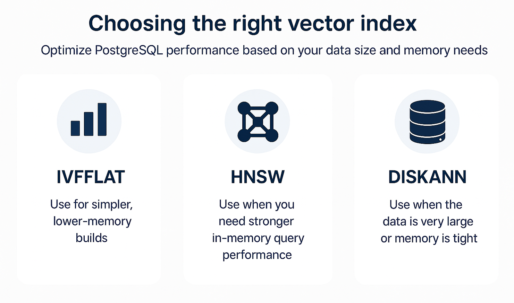

As your data set grows from hundreds to millions of rows, fast retrieval becomes a hard requirement. Without optimization, a similarity search scans the entire table, which raises latency and hurts the user experience. A *vector index* reduces the work by directing the database to the most promising rows first, so queries return faster. *Azure Database for PostgreSQL* supports vector indexes through the `pgvector` and `pg_diskann` extensions. In a Retrieval Augmentation Generation (RAG) solution, store each item's embedding in a *vector column* on the same row as its related fields, then index that column. That index is the *vector index*.

> [!TIP]
> To be able to use `pgvector` or `pg_diskann` on a Flexible Server, you must first add the `vector` extension on the *Server parameters* `azure.extensions` parameter.

## Why vector indexes matter

Speed is the name of the game. You want your queries to return results as quickly as possible. Think of an HR assistant that answers questions about policies. With 500 rows, a full scan might be fine. With 5 million rows, it isn't. Indexes reduce the amount of data scanned at query time. Indexes trade a bit of storage and build time for faster queries as data grows. *Vector indexes* quickly narrow down the search space, allowing for rapid retrieval of relevant rows.

## Index options in PostgreSQL

PostgreSQL supports several approximate nearest neighbor index types for vector search. Each has its own strengths and weaknesses. Two are provided by the `pgvector` extension, and a third is available via the `pg_diskann` extension:

  

- **IVFFlat (Inverted File with Flat Compression)** - Provided by the `pgvector` extension. Groups vectors into many *lists*. At query time, it picks the closest lists and compares the query only to items in those lists. The `ivfflat.probes` setting controls how many lists to check per query; more probes usually improve recall but add time. If you set probes equal to the number of lists, the search checks every list (an exact search over the index) and loses the speed benefit. Begin with the defaults and adjust `ivfflat.probes` at query time if obvious matches are missing.
  - Pros: fast to build, modest memory, predictable behavior.  
  - Cons: you choose the number of *lists*; large distribution changes can require a rebuild.

- **HNSW (Hierarchical Navigable Small Worlds)** - Provided by the `pgvector` extension. Builds a multilayer neighbor graph. Search begins in the top layer and narrows as it moves down to denser layers near the closest neighbors. Compared to `IVFFlat`, it can deliver better query speed at similar recall, but it uses more memory and takes longer to build. There's no training step, so you can create the index even on an empty table. The key settings are *m* and *ef_construction* when you build, and *hnsw.ef_search* when you query. The `m` parameter sets the maximum number of connections per node in each layer (default 16). The `ef_construction` parameter sets the size of the candidate list while the index is built (default 64). At query time, `hnsw.ef_search` controls the candidate list the search keeps (default 40). Larger values generally improve recall, with more memory or longer build/query time. Start with defaults, then adjust `hnsw.ef_search` when speed matters more and results are already solid.
  - Pros: strong speed and recall at query time.
  - Cons: higher memory and longer build time.

- **DiskANN (Disk Approximate Nearest Neighbor)** - Provided by the `pg_diskann` extension. This extension adds a separate `DiskANN` index access method. Keeps most of the structure on disk with a small working set in memory; designed for very large data. It offers high recall, high queries per second, and low query latency, even for tables with billions of rows. DiskANN’s Azure implementation stores full vectors on SSD while compressing working sets in RAM, which trims memory use and limits SSD reads during queries. The built-in vector compression and quantization preserve accuracy as data evolves, making DiskANN a strong fit for large semantic search and RAG scenarios. The defaults aim for strong results at large scale. If searches skip good neighbors, raise `diskann.l_value_is` to consider more candidates, then check latency. If memory is tight on very large tables, create the index with `product_quantized = true` to reduce memory use, noting there can be a small quality trade-off.

## Create a vector index

Creating an index in Azure Database for PostgreSQL is simple, first enable the respective extension, and then run the respective **CREATE INDEX** statement for the index type you want to use. Let's assume you're creating a vector index for a table named `company_policies`. The table embeddings are stored in a *vector* column named *embedding*.

Let's create some indexes:

Creating a `pgvector` indexes:

- Create the extension in PostgreSQL (you only need to enable the extension once per database):

  ```sql
  CREATE EXTENSION IF NOT EXISTS vector;
  ```

- Create an `IVFFlat` index:

    ```sql
    CREATE INDEX company_policies_vec_ivf
    ON company_policies
    USING ivfflat (embedding vector_cosine_ops)
    WITH (lists = 100);
            
    ANALYZE company_policies;
    ```

  This statement creates an `IVFFlat` index on the `embedding` column of the `company_policies` table. The `lists` parameter specifies how many lists to create in the index. You can adjust this value based on your data size and query performance needs.

- Create an `HNSW` index:

  ```sql
  CREATE INDEX company_policies_vec_hnsw
  ON company_policies
  USING hnsw (embedding vector_cosine_ops)
  WITH (m = 16, ef_construction = 64);
  ```

    This statement creates an `HNSW` index on the `embedding` column of the `company_policies` table. The `m` parameter sets the maximum number of connections per node, and `ef_construction` controls the size of the candidate list during index construction.

Creating a `pg_diskann` indexes:

- Creating a `pg_diskann` indexes (you only need to enable the extension once per database):

  ```sql
  CREATE EXTENSION IF NOT EXISTS pg_diskann CASCADE;
  ```

- Create a `DiskANN` index.

  ```sql
  CREATE INDEX company_policies_vec_diskann
  ON company_policies
  USING diskann (embedding vector_cosine_ops);
  ```

  Note how the `DiskANN` index is created without any extra parameters. While you can use parameters, DiskANN is designed to work well with default settings for a wide range of use cases.

## Operator and distance pairing

When creating a vector index, you must pair the operator class on the column with the matching operator in your query. This match ensures that the database uses the index effectively. The most common distance metrics are:

- **Cosine distance (`<=>`)** - Measures the angle between vectors. Common for unit-normalized text embeddings. Use `vector_cosine_ops` operator class.
- **Euclidean/L2 distance (`<->`)** - Measures straight-line distance between points. Use `vector_l2_ops` operator class.
- **Inner product (`<#>`)** - Maximizes dot product. Works best with unit-normalized vectors. Use `vector_ip_ops` operator class.

> [!NOTE]  
> **Rule of thumb:** Create the index with the operator class that matches your distance, and sort with the matching operator in the query. Mixing them prevents index use.

In the company policy example, cosine distance works well for text embeddings. Think of each question and policy as arrows pointing toward topics. The question 'How many days off do I get?' points almost the same way as the *Vacation policy* (small angle → strong match) and points away from *Travel reimbursement policy* (large angle → weak match). Here's how to create the index and query with cosine distance:

```sql
-- Create index with cosine operator class
CREATE INDEX company_policies_vec_ivf_cos
ON company_policies USING ivfflat (embedding vector_cosine_ops);
  
-- Query using cosine distance operator
SELECT id, title
FROM company_policies
ORDER BY embedding <=> azure_openai.create_embeddings('<embedding-deployment>',
                                                    'How many vacation days do employees get?')::vector
LIMIT 5;
```

## Key takeaways

As your tables grow, you need a vector index so retrieval stays fast. Store each embedding in a `vector` column on the same row as its data and index that column using `pgvector` or `pg_diskann`. Choose `IVFFlat` for simple, lower-memory builds, `HNSW` when you want stronger in-memory query performance, and `DiskANN` when the data is very large or memory is tight. At query time, match the operator class to the distance used in your query so the planner can use the index. Begin with defaults and make small, measured adjustments to query-time parameters (`ivfflat.probes`, `hnsw.ef_search`, `diskann.l_value_is`) if obvious matches are missing or speed needs improvement. After any change, run the same queries with `EXPLAIN (ANALYZE, VERBOSE, BUFFERS)` and check that the plan uses the index, execution time drops, I/O goes down, and the top results still look correct.