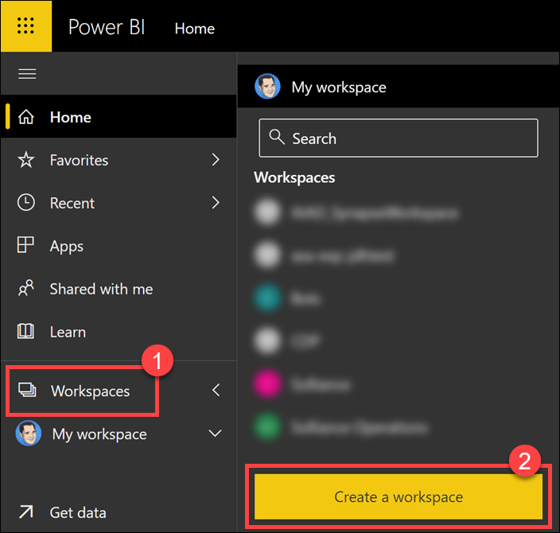
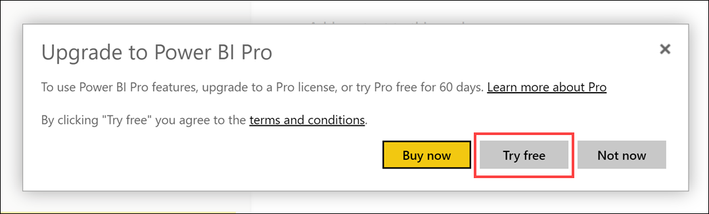
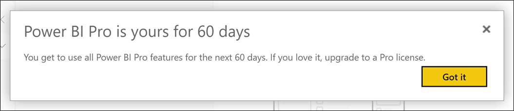
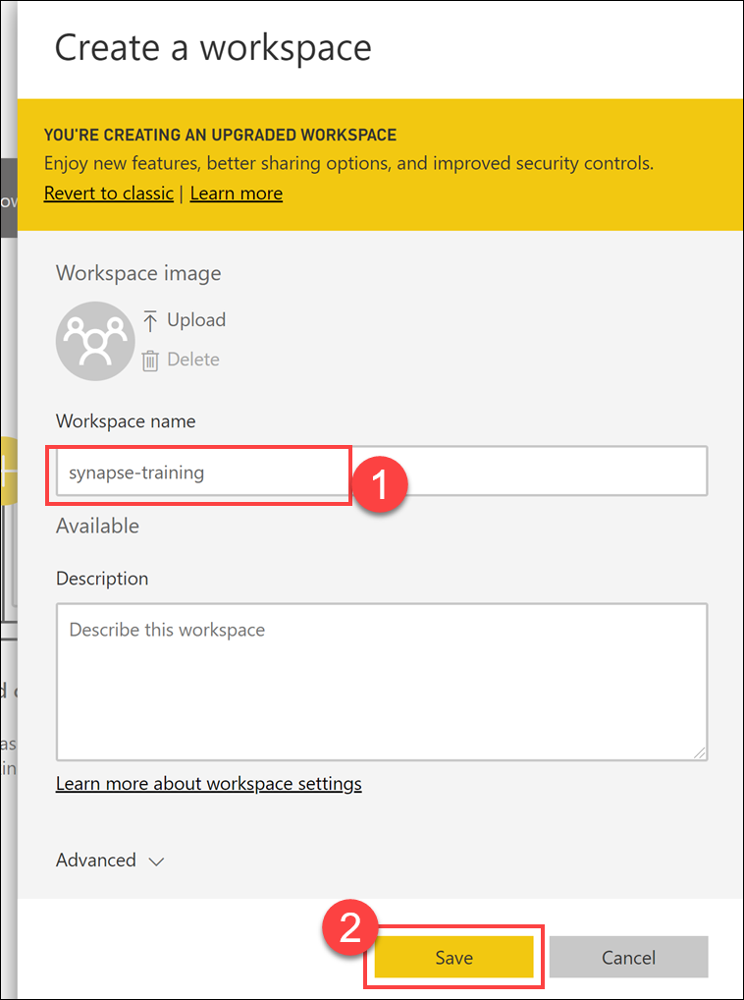
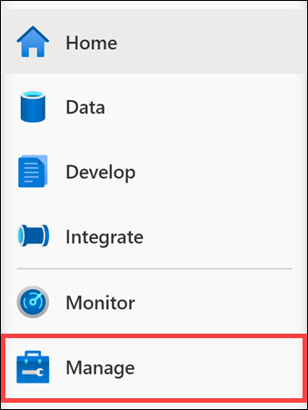
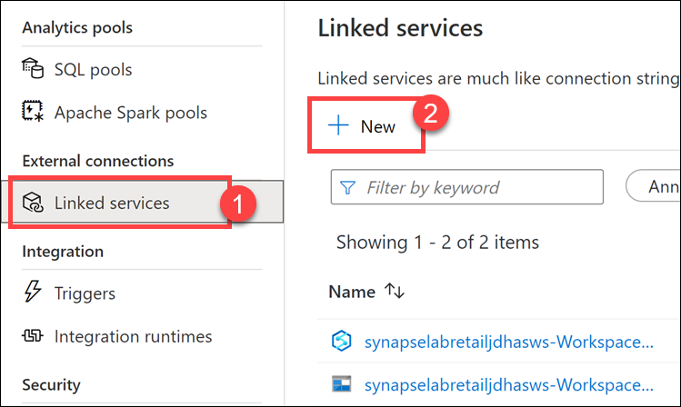
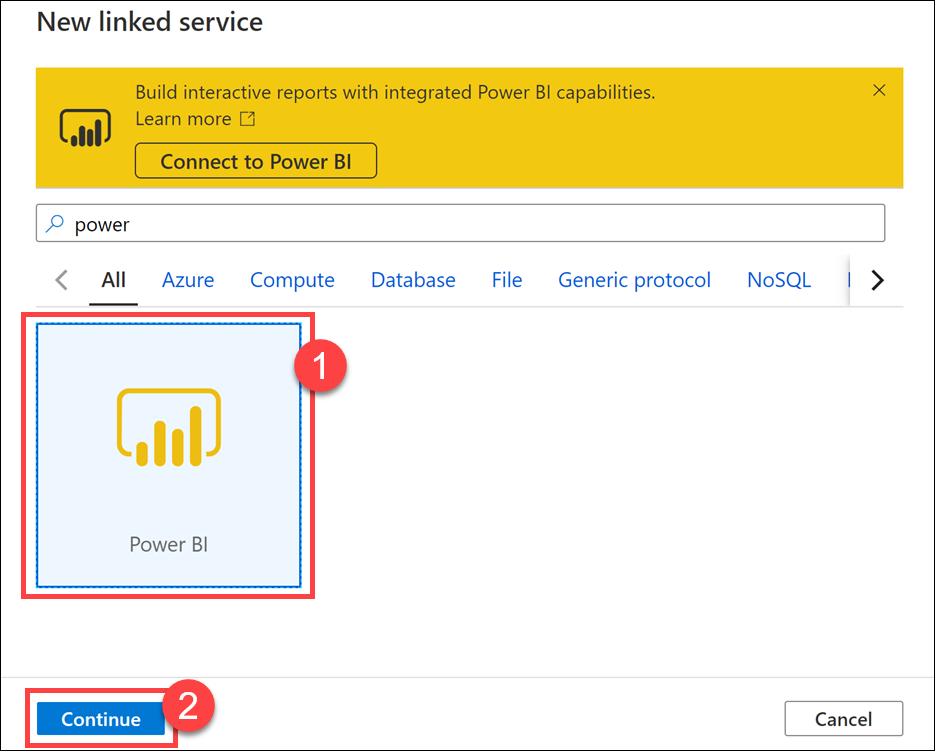
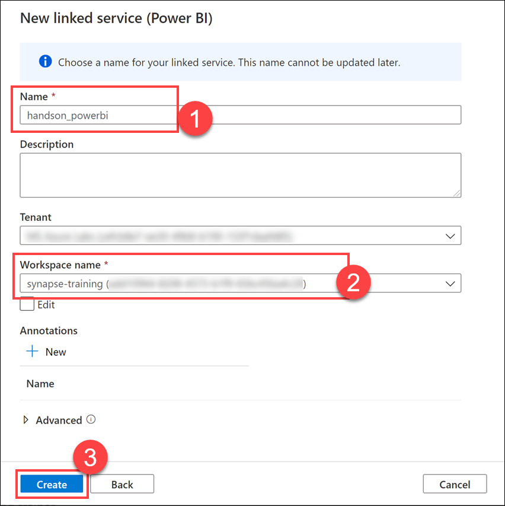
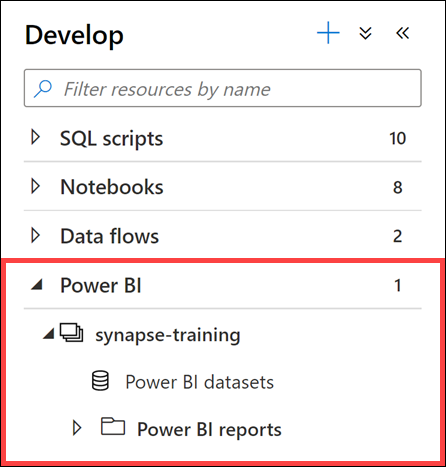

### Task 1: Create a Power BI workspace

1. In a new browser tab, navigate to <https://powerbi.microsoft.com/>.

2. Sign in with the same account used to sign in to Azure by selecting the **Sign in** link on the upper-right corner.

3. If this is your first time signing into this account, complete the setup wizard with the default options.

4. Select **Workspaces**, then select **Create a workspace**.

    

5. If you are prompted to upgrade to Power BI Pro, select **Try free**.

    

    Select **Got it** to confirm the pro subscription.

    

6. Set the name to **synapse-training**, then select **Save**.

    

### Task 2: Connect to Power BI from Synapse

1. Open Synapse Studio (<https://web.azuresynapse.net/>), and then navigate to the **Manage hub**.

    

2. Select **Linked services** on the left-hand menu, then select **+ New**.

    

3. Select **Power BI**, then select **Continue**.

    

4. In the dataset properties form, complete the following:

    | Field                  | Value                       |
    |------------------------|-----------------------------|
    | Name **(1)**           | _enter `handson_powerbi`_   |
    | Workspace name **(2)** | _select `synapse-training`_ |

    

5. Select **Create (3)**.

### Task 3: Explore the Power BI linked service in Synapse Studio

1. In  [**Azure Synapse Studio**](<https://web.azuresynapse.net/>) and navigate to the **Develop** hub using the left menu option.

    

2. Expand `Power BI`, expand `SynapseDemos` (or `synapse-training`, named after your resource group) and observe that you have access to your Power BI datasets and reports, directly from Synapse Studio.

    

    New reports can be created by selecting **+** at the top of the **Develop** tab. Existing reports can be edited by selecting the report name. Any saved changes will be written back to the Power BI workspace.
