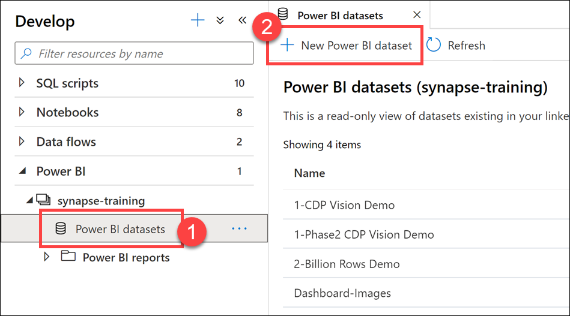
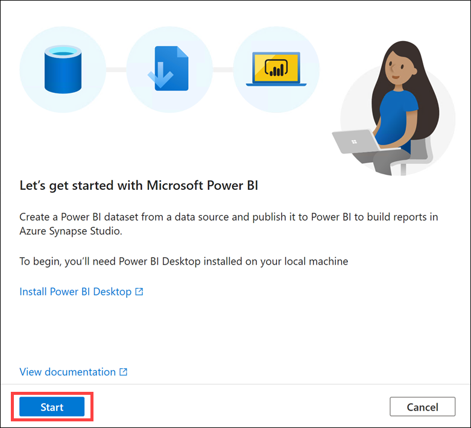
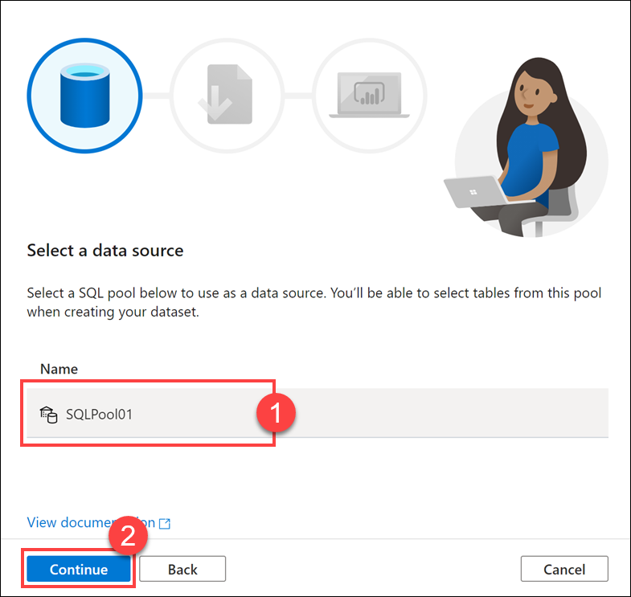
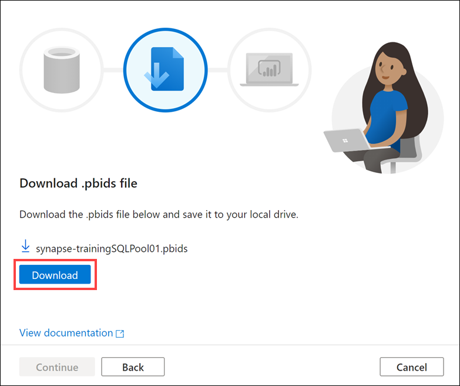

1. Beneath **Power BI**, under the linked Power BI workspace, select **Power BI datasets (1)**.

2. Select **New Power BI dataset (2)** from the top actions menu.

    

3. Select **Start** and make sure you have Power BI Desktop installed on your environment machine.

    

4. Select **SQLPool01**, then select **Continue**.

    

5. Next, select **Download** to download the `.pbids` file.

    

6. Select **Continue**, then **Close and refresh** to close the publishing dialog.

Now, you have a new Power BI Dataset.
