1. In the [Azure portal](https://portal.azure.com), navigate to your Synapse Workspace. In the **Overview (1)** tab, **copy** the **Serverless SQL endpoint (2)**:

    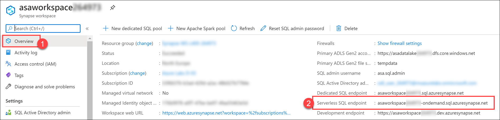

2. Switch back to Power BI Desktop. Create a new report, then click **Get data**.

    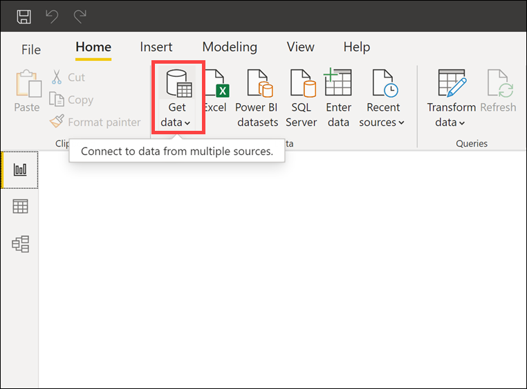

3. Select **Azure (1)** on the left-hand menu, then select **Azure Synapse Analytics (SQL DW) (2)**. Finally, click **Connect (3)**:

    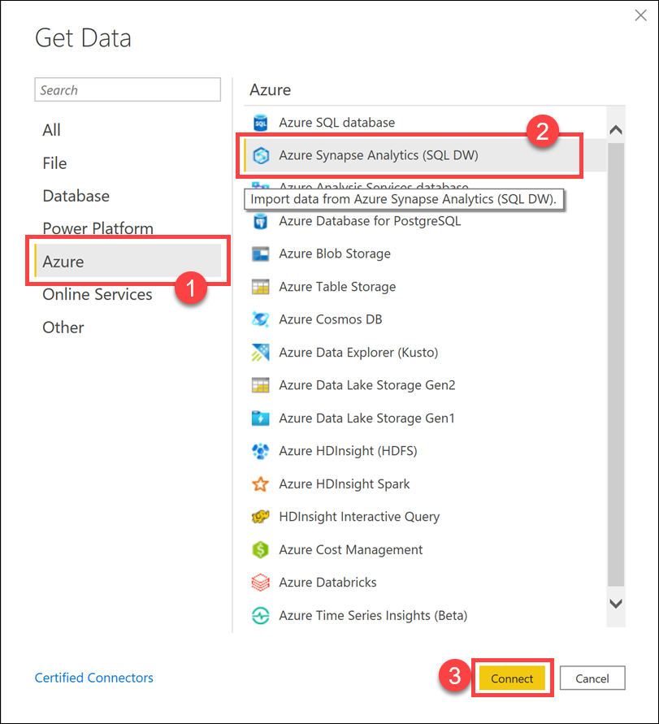

4. Paste the endpoint to the Serverless SQL endpoint identified on the first step into the **Server** field **(1)**, enter **`demo`** for the **Database (2)**, select **DirectQuery (3)**, then **paste the query below (4)** into the expanded **Advanced options** section of the SQL Server database dialog. Finally, click **OK (5)**.

    ```sql
    SELECT TOP (100) [Year]
    ,[Month]
    ,[Day]
    ,[TotalAmount]
    ,[ProfitAmount]
    ,[TransactionsCount]
    FROM [dbo].[2019Q1Sales]
    ```

    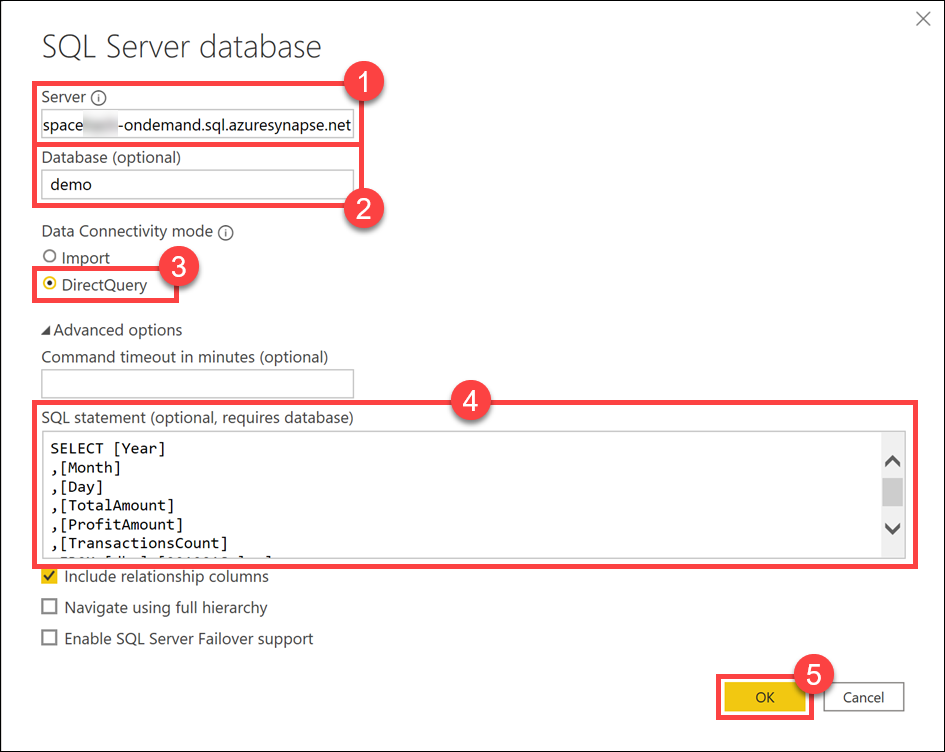

5. (If prompted) Select the **Microsoft account (1)** option on the left, **Sign in (2)** (with the same credentials you use for connecting to the Synapse workspace) and click **Connect (3)**.

    

6. Select **Load** in the preview data window and wait for the connection to be configured.

    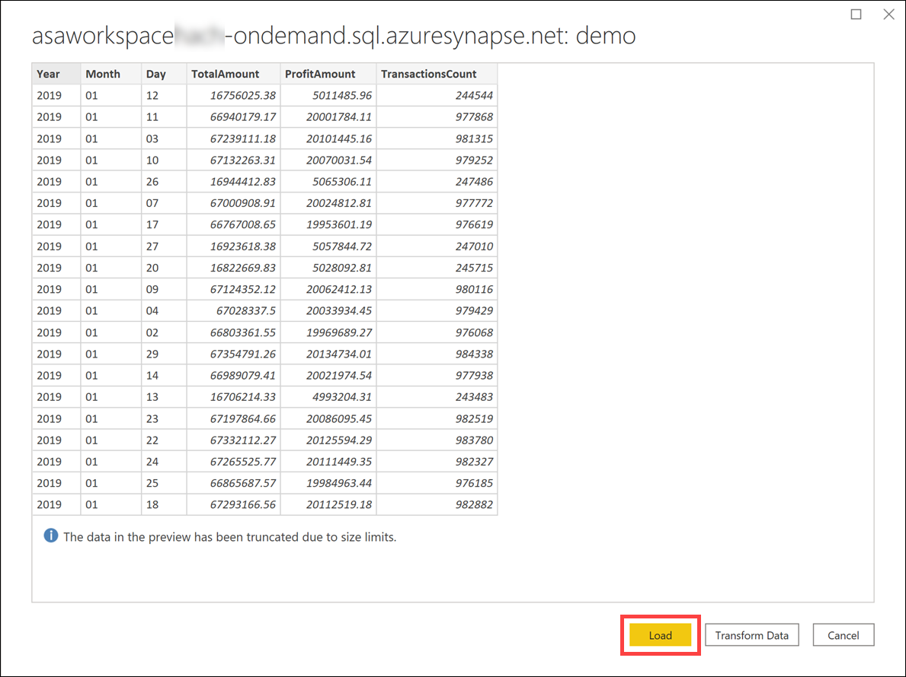

7. After the data loads, select **Line chart** from the **Visualizations** menu.

    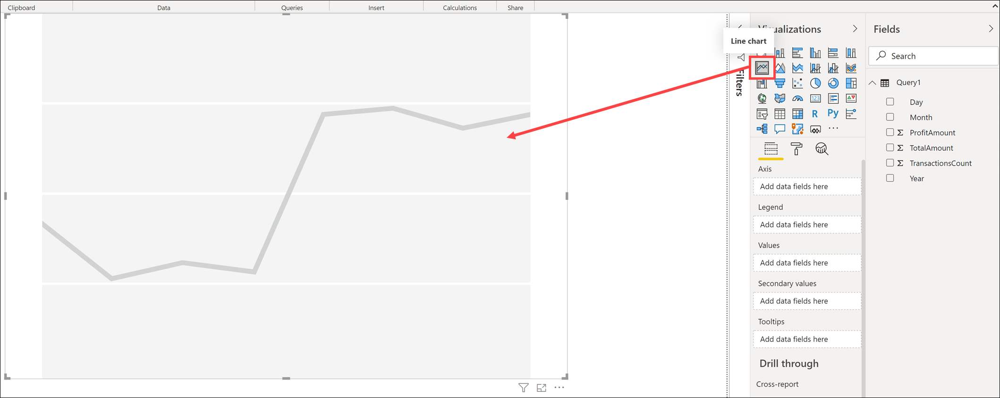

8. Select the line chart visualization and configure it as follows to show Profit, Amount, and Transactions count by day:

    - **Axis**: `Day`
    - **Values**: `ProfitAmount`, `TotalAmount`
    - **Secondary values**: `TransactionsCount`

    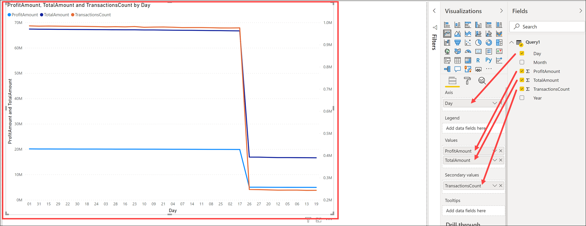

9. Select the line chart visualization and configure it to sort in ascending order by the day of transaction. To do this, select **More options** next to the chart visualization.

    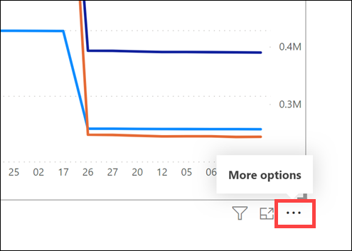

    Select **Sort ascending**.

    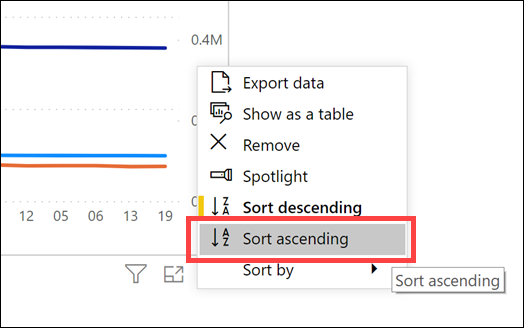

    Select **More options** next to the chart visualization again.

    

    Select **Sort by**, then **Day**.

    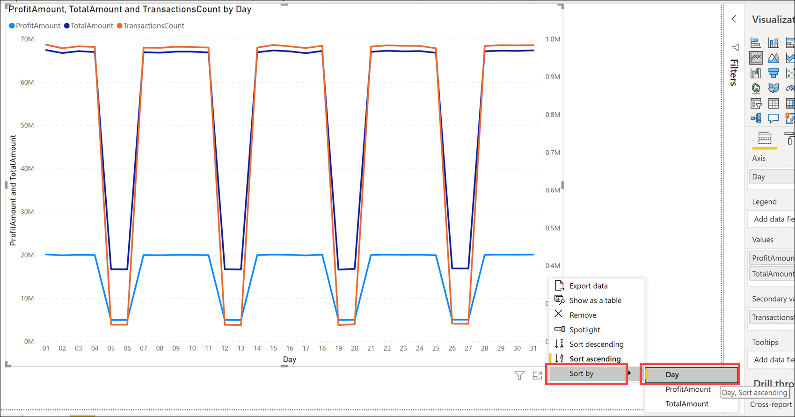

10. Click **Save** in the top-left corner.

    

11. Specify a file name **(1)**, such as `synapse-sql-serverless`, then click **Save (2)**.

    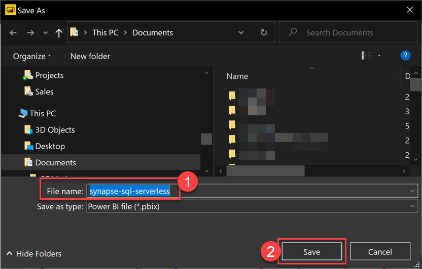

12. Click **Publish** above the saved report. Make sure that, in Power BI Desktop, you are signed in with the same account you use in the Power BI portal and in Synapse Studio. You can switch to the proper account from the right topmost corner of the window. In the **Publish to Power BI** dialog, select the workspace you linked to Synapse (for example, **synapse-training**), then click **Select**.

    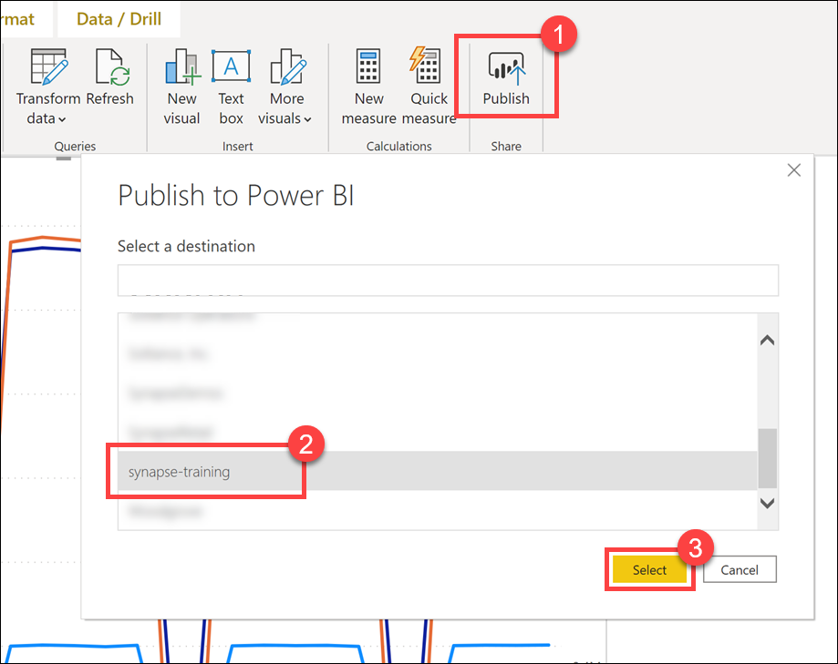

13. Wait until the publish operation successfully completes.

    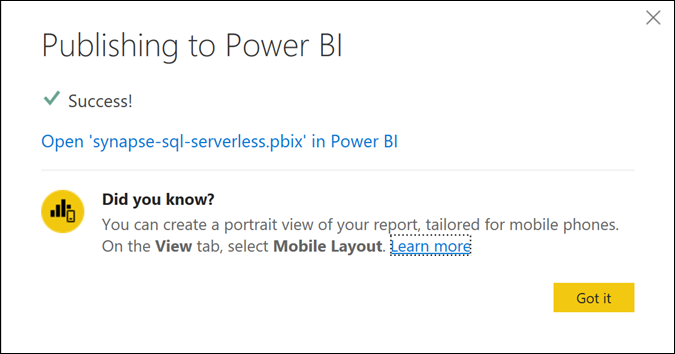

14. In [Azure Synapse Studio](https://web.azuresynapse.net), navigate to the **Develop** hub.

    

15. Expand the Power BI group, expand your Power BI linked service (for example, `synapse-training`), right-click on **Power BI reports** and select **Refresh (1)** to update the list of reports. You should see the two Power BI reports you created in this lab (`synapse-lab` and `synapse-sql-serverless` **(2)**).

    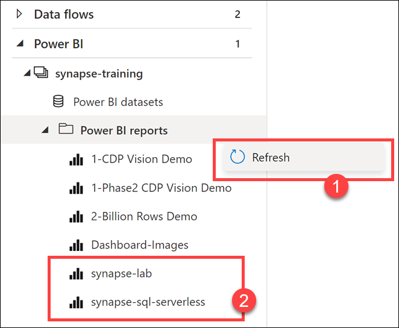

16. Select the **`synapse-lab`** report. You can view and edit the report directly within Synapse Studio!

    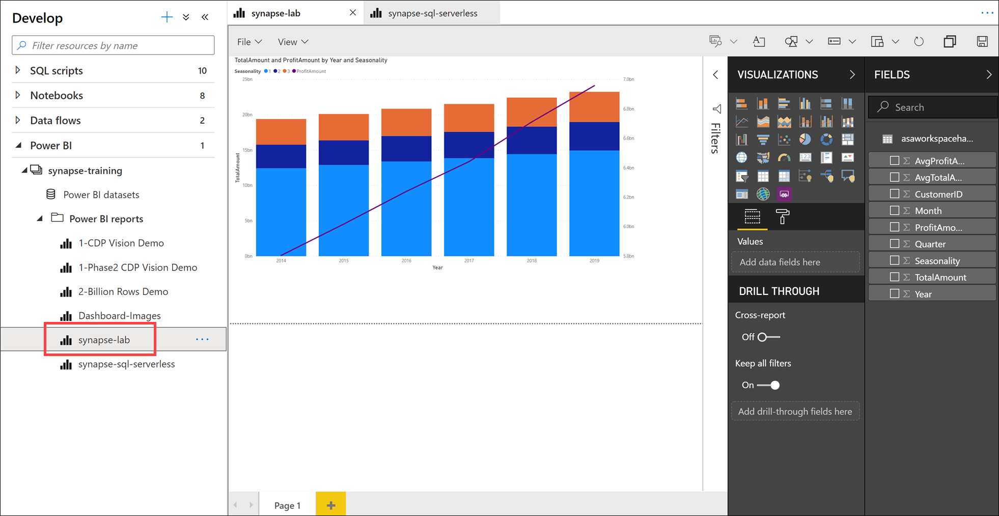

17. Select the **`synapse-sql-serverless`** report. You should be able to view and edit this report as well.

    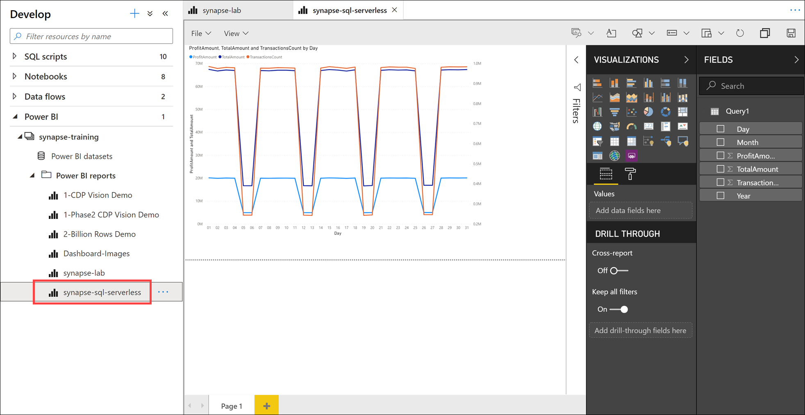
