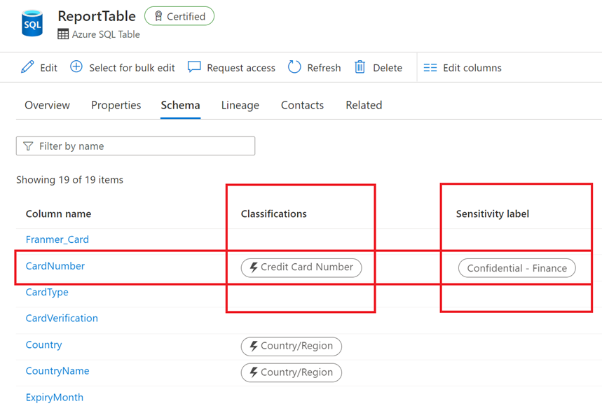

Glossary terms, classifications and labels are all annotations to a data asset. Each of them have a different meaning in the context of the data catalog.

## What is data classification?

Classifications are annotations that can be assigned to entities. The flexibility of classifications enables you to use them for multiple scenarios such as:

- understanding the nature of data stored in the data assets
- defining access control policies

Classification is based on the business context of the data. For example, you might classify assets by Passport Number, Driver's License Number, Credit Card Number, SWIFT Code, Person’s Name, and so on. Microsoft Purview has more than 200 system classifiers today. Users can also define their own classifiers in the data catalog. As part of the scanning process, classifications are automatically detected and applied as metadata within the Purview Data Catalog. 

### Classification rules

In Microsoft Purview, you can apply system or custom classifications on a file, table, or column asset. Microsoft Purview makes use of Regex patterns and bloom filters to classify data. These classifications are then associated with the metadata discovered in the Azure Purview Data Catalog.

Metadata is used to help describe the data that is being scanned and made available in the catalog. During the configuration of a scan set, you can specify classification rules to apply during the scan that will also serve as metadata. The existing classification rules fall under five major categories:

- Government - covers attributes such as government identity cards, driver license numbers, passport numbers, etc.
- Financial - covers attributes such as bank account numbers or credit card numbers.
- Personal - personal information such as a person's age, date of birth, email address, phone number, etc.
- Security - attributes like passwords that may be stored.
- Miscellaneous - attributes not covered in the other categories.

## Why classify data?

A good data governance strategy includes a process to classify data to understand its level of confidentiality, determine if the data source is compliant with various regulations, or how long to retain it for. Classification in Microsoft Purview makes data assets easier to understand, search, and govern. Classification can also help you implement measures to protect sensitive data. 

Once a classification is tagged to a data source after a scan, you can generate reports and insights to gain a stronger understanding of your data estate. Because classification is based on the business context of the data, it can help bridge the gap between the business and the data team.

### Data classification: system vs. custom classification

Microsoft Purview supports both system and custom classifications. There are over +200 system classifications available in Microsoft Purview today. Data teams need to know that if necessary classifications aren't available out of the box, they can work with the data stewards to create custom classifications, to meet their own organizational data governance requirements.

>[!IMPORTANT]
>For the entire list of available system classifications, see [Supported classifications in Microsoft Purview](/azure/purview/supported-classifications).

### Who creates custom classifications?

Purview Data Curators can create, update, and delete custom classifiers and classification rules. Purview Data Readers can only view classifiers and classification rules. 

In practical terms, Data Curators may not be members of the data team. It is however critical that data team members understand classification to be able to successfully work together and govern data across an organization.

## What are data labels?

The Microsoft Purview Data Map supports labeling structured and unstructured data stored across various data sources. This may sound familiar to you from other Microsoft technologies - and may be known as sensitivity labels. The data map extends the use of sensitivity labels from Microsoft Purview Information Protection to assets stored in infrastructure cloud locations and structured data sources.

Labels are defined in Microsoft Purview Information Protection, and you can extend the application to Microsoft Purview Data Catalog. 

The screenshot below shows both data classification and label in the Microsoft Purview Data Catalog. You can see that this Azure SQL table has a column called “CreditCard”:
- Classified as “Credit Card Number” because scan detected numbers corresponding to credit card pattern rules.
- Labeled as “Confidential – Finance” because credit card number was defined in your organization as confidential information (and this label brings encryption).

> [!div class="mx-imgBorder"]
> 

