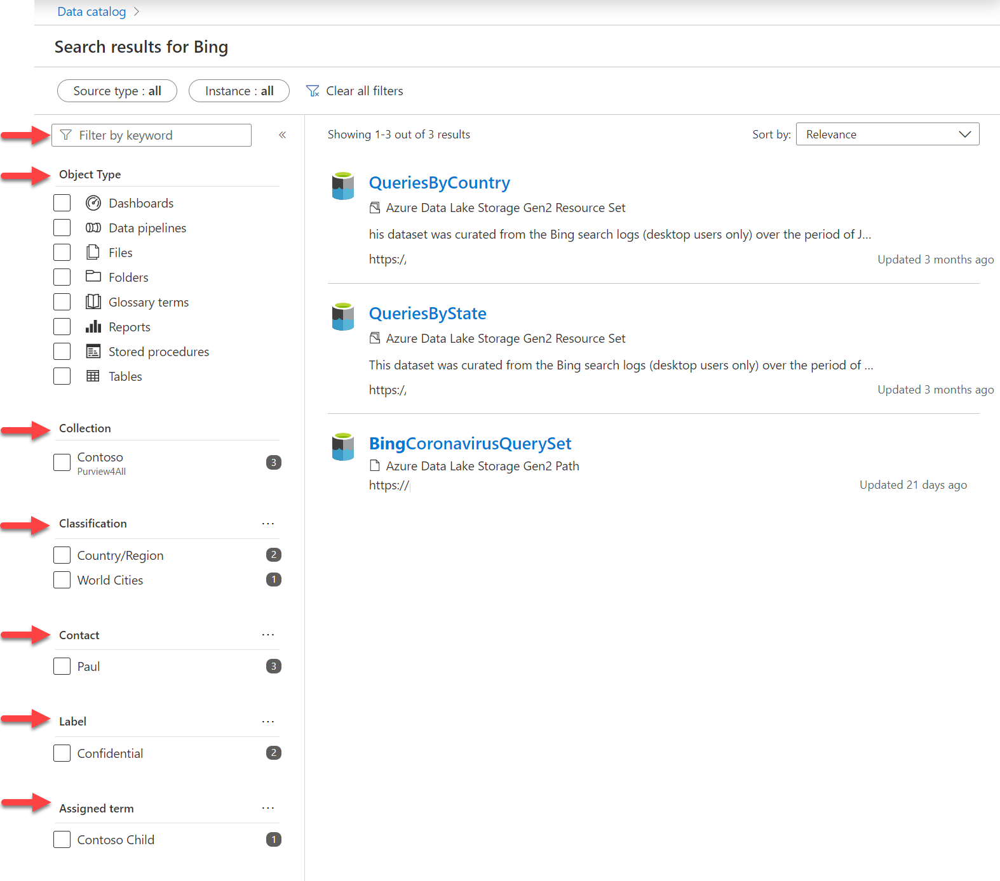

A data catalog search can empower business and data analysts to find and interpret data. The data catalog provides intelligent recommendations based on data relationships, business context, and search history. The Purview data catalog can assist data teams by adding business context to assets to drive analytics, AI and ML initiatives.

The data catalog can be searched by keyword, object type, collection, classification, contact, label, or assigned term. Results can then be sorted by relevance or name. 

> [!div class="mx-imgBorder"]
> 

For more information about searching for trusted assets for reporting, see [Discover trusted data using Microsoft Purview](/learn/modules/discover-trusted-data-use-azure-purview/).
