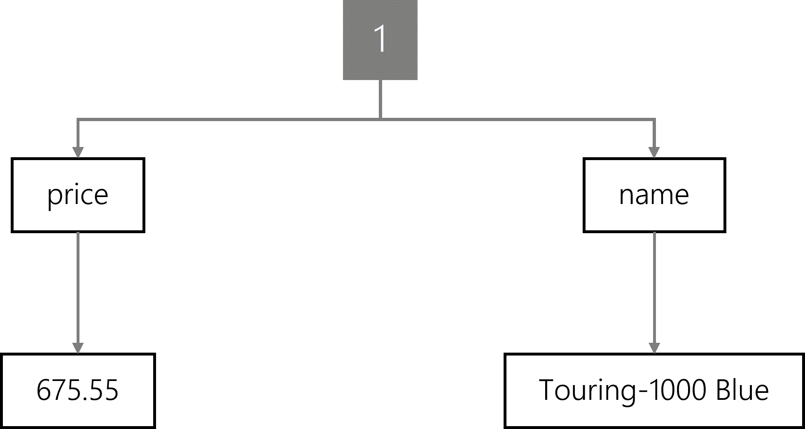
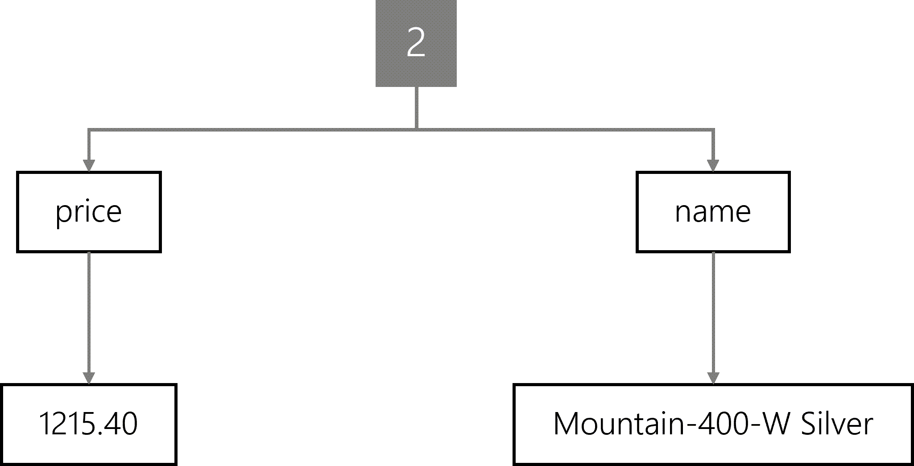
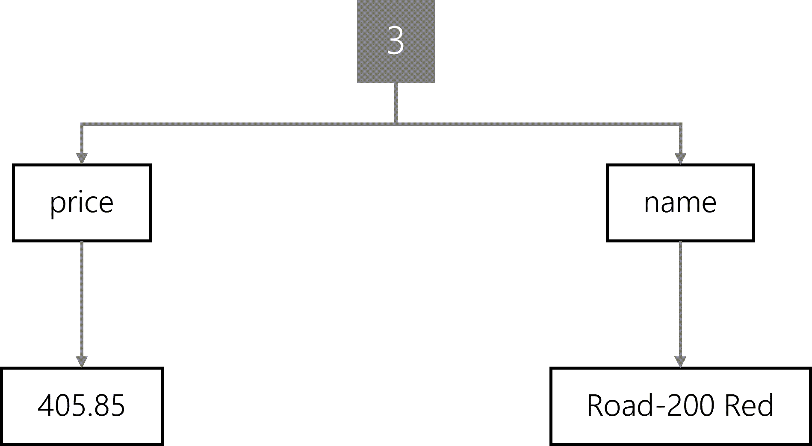
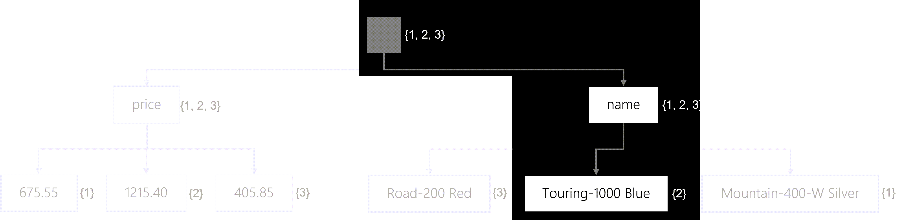
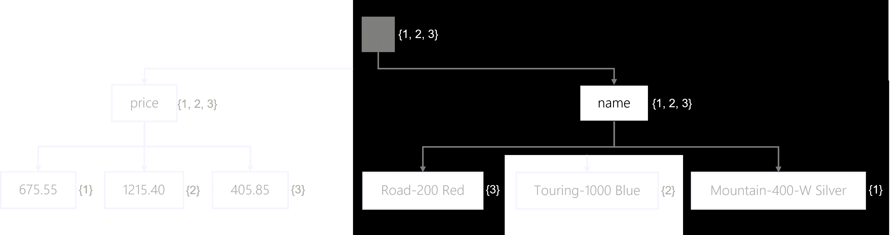
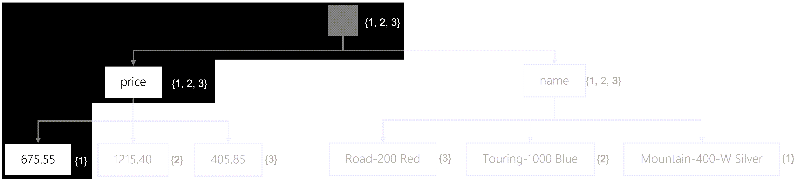

The query engine evaluates query filters and then traverses the index of your container. The query engine will automatically try to use the most efficient of the following three methods of evaluating filters:

| **Method** | **Description** | **RU implication** |
| ---: | :--- | :--- |
| **Index seek** | The query engine will seek an exact match on a field’s value by traversing directly to that value and looking up how many items match. Once the matched items are determined, the query engine will return the items as the query result. | The RU charge is constant for the lookup. The RU charge for loading and returning items is linear based on the number of items. |
| **Index scan** | The query engine will find all possible values for a field and then perform various comparisons only on the values. Once matches are found, the query engine will load and return the items as the query result. | The RU charge is still constant for the lookup, with a slight increase over the index seek based on the cardinality of the indexed properties. The RU charge for loading and returning items is still linear based on the number of items returned. |
| **Full scan** | The query engine will load the items, in their entirety, to the transactional store to evaluate the filters. | This type of scan does not use the index; however, the RU charge for loading items is based on the number of items in the entire container. |

> [!NOTE]
> An index scan can range in complexity from an efficient and precise index scan, to a more involved expanded index scan, and finally the most complex full index scan.

As a query developer, it’s essential to understand which queries will require a seek vs. a scan. It’s also important to understand which queries cannot use the index and will require a full scan. Specifically, you should optimize your queries to use filter predicates that use the most efficient lookup method.

Let’s illustrate how properties and queries can influence the lookup method. In this example, a fictional container has three items with unique identifiers, a **name** string property, and a **price** number property.

```json
[
  {
    "id": "1",
    "name": "Touring-1000 Blue",
    "price": 675.55
  },
  {
    "id": "2",
    "name": "Mountain-400-W Silver",
    "price": 1215.40
  },
  {
    "id": "3",
    "name": "Road-200 Red",
    "price": 405.85
  }
]
```

Each of these items could be visualized as a tree.

For the first item, the tree representation would include a **name** node with **Touring-1000 Blue** and a **price** node with a child value node of **675.55**.



The tree for the second item would have the same nodes with the values **Mountain-400-W Silver** and **1215.40,** respectively.



The final item’s tree is similar with the values **Road-200 Red** and **405.85**.



An inverted tree that includes all three items would have a root node that matches all three items. You can think of traversing the root node as similar, in concept, to a query with no filter. The tree contains a price node with three child nodes for each distinctive value. The price node matches all three items because every item includes a price field. However, each individual price node only matches a single item since the price for each item is distinct. The tree also contains a name node that matches all three items with individual child nodes for each distinct value.


To traverse the tree, a simple SQL query is written with a filter to only match items where the **name** is equivalent to the value of **Touring-1000 Blue**.

```sql
SELECT 
    *
FROM
    products p
WHERE
    p.name = 'Touring-1000 Blue'
```

The query engine could then traverse the tree in the following order:

1. The engine will start at the root. Right now, all items are still potential matches.
1. The engine will traverse the **name** node. Still, all items match.
1. Finally, the engine will traverse the exact match **Touring-1000 Blue** node. Only item **#2** matches at this point
1. The query engine will then load the entire JSON content for item #2 and return that in the result set.

This tree diagram illustrates the traversal process down to the **Touring-1000 Blue** node.



This traversal is an example of the **index seek** lookup method in action. The actual matching of an exact value is a flat charge in RU/s since the query engine uses the index instead of searching in each item’s JSON content. Once the matched items are found, the query engine will load the JSON content to return to the client application.

If the query filter doesn’t match any known value, no items will be returned in the result set. If multiple items have the same value for the field, the tree will direct the query engine to return multiple items.

Another example of an index seek would be a SQL query that uses the **IN** filter to perform an equality match on multiple possible fields.

```sql
SELECT 
    *
FROM
    products p
WHERE
    p.name IN ('Road-200 Red', 'Mountain-400-W Silver')
```

The query engine then traverses the tree in the following order:

1. The engine will start at the root. Right now, all items are still potential matches.
1. The engine will traverse the **name** node. Still, all items match.
1. Finally, the engine will traverse the exact matches. This includes the **Road-200Red** and **Mountain-400-W Silver** nodes. Only items **#1** and **#3** matches at this point
1. The query engine will then load the entire JSON content for both items #1 and #3 and then return that in the result set.

This tree diagram illustrates the traversal process for the matching child values in the **name** node.



Some queries use other operators that necessitate the use of a more complex index lookup method. In this example SQL query, items are filtered based on two range comparisons. In plain language, the query looks for items whose price is between **\$500** and **\$1,000**.

```sql
SELECT
    *
FROM
    products p
WHERE
    p.price >= 500 AND
    p.price <= 1000
```

The query engine will traverse the tree in the following order:

1. The engine will start at the root. Right now, all items are still potential matches.
1. The engine will traverse the **price** node. Still, all items match.
1. The query engine will perform a binary search on all possible values to indicate whether they match the filter or not.
1. Finally, the engine will map the matches values to their items. Only the **675.55** and **1215.40** nodes match. Then, only items **#1** and **#2** matches at this point
1. The query engine will then load the entire JSON content for both items #1 and #2 and then return that in the result set.



This binary search moved the query, in complexity, from an index seek to a precise index scan. The query engine scans all possible values in the index, but this is still far more efficient than a full scan of all JSON content. Queries that use range comparisons and string functions often will require the use of an index scan.

There are edge cases where the query engine cannot use the index to evaluate a filter. These cases will require the query engine to load the JSON content of all items into the transactional store before evaluating the filter. Full scans can potentially have significant request unit charges as the charge scales linearly with the total number of items in the container. While full scans are rare, it is essential to know that they are possible when using specific built-in functions in query filters.
