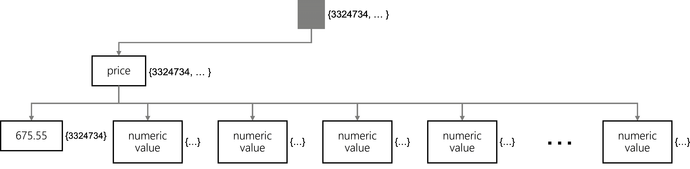

If you want your SQL queries to be endlessly flexible, why exclude any paths at all? Well, each insert or update operation requires the indexer to run to update the inverted index with data from your newly created or updated item. More oversized items, or bulk workloads, can cause the indexing to use many RU/s or take a significant amount of time.

Let’s consider an example JSON object that is much larger than previous examples.

```json
{
  "id": "3324734",
  "name": "Road-200 Green",
  "internal": {
    "tracking": {
      "id": "eac06d51-2462-4bfb-8eb6-46281da16f8e"
    }
  },
  "inStock": true,
  "price": 1303.33,
  "description": "Consequat dolore commodo tempor pariatur consectetur fugiat labore velit aliqua ut anim. Et anim eu ea reprehenderit sit ullamco elit irure laborum sunt ea adipisicing eu qui. Officia commodo ad amet ea consectetur ea est fugiat.",
  "warehouse": {
    "shelfLocations": [
      20,
      37,
      35,
      27,
      38
    ]
  },
  "metadata": {
    "color": "brown",
    "manufacturer": "Fabrikam",
    "supportEmail": "support@fabrik.am",
    "created_by": "sdfuouu",
    "created_on": "2020-05-05T19:21:27.0000000Z",
    "department": "cycling",
    "sku": "RD200-B"
  },
  "tags": [
    "pariatur",
    "et",
    "commodo",
    "ex",
    "tempor",
    "esse",
    "nisi",
    "ullamco",
    "Lorem",
    "ullamco",
    "ex",
    "ea",
    "laborum",
    "tempor",
    "consequat"
  ]
}
```

Using the default indexing policy, this entire item and all paths are indexed and added to the inverted index each time you create a new item or update an existing item.
Indexing runs over the entire item, even if you update a single property in the item.

To combat this, you can use an indexing policy that excludes all paths except for the ones you require for your SQL queries. Let’s consider a scenario where our application only issues the following two SQL queries:

```sql
SELECT 
    * 
FROM 
    products p
WHERE
    p.price >= <numeric-value> AND
    p.price <= <numeric-value>
```

```sql
SELECT 
    * 
FROM 
    products p
WHERE
    p.price = <numeric-value>
```

An indexing policy that excludes all paths, except for the **price** property path, would be appropriate here. This policy will still index items, but it will do so quickly because only one property is added to the inverted index.

```json
{
  "indexingMode": "consistent",
  "automatic": true,
  "includedPaths": [
    {
      "path": "/price/?"
    }
  ],
  "excludedPaths": [
    {
      "path": "/*"
    }
  ]
}
```

> [!TIP]
> Again, the drawback to this approach is that you will need to update the index anytime you change your schema.

Here is a diagram of the inverted index showing that it only has a single property to traverse and then multiple potential values.



Suppose your application is write-heavy and only ever does point reads using the **id** and **partition key** values. In that case, you can choose to disable indexing entirely using a customized indexing policy.

```json
{
  "indexingMode": "none",
}
```
