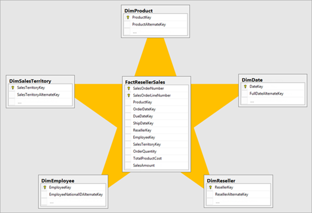

This unit introduces Power BI model terms. It’s important that you understand these terms in order to choose the appropriate model framework for your project. This unit describes the following terms:

- Data model
- Power BI dataset
- Analytic query
- Tabular model
- Star schema design
- Table storage mode
- Model framework

## Data model

A Power BI data model is a query-able data resource that’s optimized for analytics. Reports can query data models by using one of two analytic languages: Data Analysis Expressions (DAX) or Multidimensional Expressions (MDX). Power BI uses DAX, while paginated reports can use either DAX or MDX. The Analyze in Excel features uses MDX.

> [!TIP]
> A data model is also described as semantic model, especially in enterprise scenarios. Commonly, in the context of a data discussion and in this module, a data model is simply referred to as a model.

## Power BI dataset

You develop a Power BI model in Power BI Desktop, and once published to a workspace in the Power BI service, it’s then known as a dataset. A dataset is a Power BI artifact that’s a source of data for visualizations in Power BI reports and dashboards.

> [!NOTE]
> Not all datasets originate from models developed in Power BI Desktop. Some datasets represent connections to external-hosted models in AAS or SSAS. Others can represent real-time data structures, including push datasets, streaming datasets, or hybrid datasets. This module is concerned only with models developed in Power BI Desktop.

## Analytic query

Power BI reports and dashboards must query a dataset. When Power BI visualizes dataset data, it prepares and sends an analytic query. An analytic query produces a query result from a model that’s easy for a person to understand, especially when visualized.

An analytic query has three phases that are executed in this order:

1. Filter
2. Group
3. Summarize

**Filtering** (sometimes known as slicing) narrows down on a subset of the model data. Filter values aren’t visible in the query result. Most analytic queries apply filters because it’s common to filter by a time period, and usually other attributes. Filtering happens in different ways. In a Power BI report, you can set filters at report, page, or visual level. Report layouts often include slicer visuals to filter visuals on the report page. When the model enforces row-level security (RLS), it applies filters to model tables to restrict access to specific data. Measures, which summarize model data, can also apply filters.

**Grouping** (sometimes known as dicing) divides query result into groups. Each group is also a filter, but unlike the filtering phase, filter values are visible in the query result. For example, grouping by customer filters each group by customer.

**Summarization** produces a single value result. Typically, a report visual summarizes a numeric field by using an aggregate function. Aggregate functions include sum, count, minimum, maximum, and others. You can achieve simple summarization by aggregating a column, or you can achieve complex summarization by creating a measure using a DAX formula.

Consider an example: A Power BI report page includes a slicer to filter by a single year. There’s also a column chart visual that shows quarterly sales for the filtered year.

In this example, the slicer **filters** the visual by calendar year 2021. The column chart **groups** by quarters (of the filtered year). Each column is a group that represents a visible filter. The column heights represent the **summarized** sales values for each quarter of the filtered year.

## Tabular model

A Power BI model is a tabular model. A tabular model comprises one or more tables of columns. It can also include relationships, hierarchies, and calculations.

## Star schema design

To produce an optimized and easy-to-use tabular model, we recommend you produce a star schema design. Star schema design is a mature modeling approach widely adopted by relational data warehouses. It requires you to classify model tables as either dimension or fact.

Dimension tables describe business entities; the things you model. Entities can include products, people, places, and concepts including time itself. Fact tables store observations or events, and can be, for example, sales orders, stock balances, exchange rates, or temperature readings. A fact table contains dimension key columns that relate to dimension tables, and numeric measure columns. A fact table forms the center of a star, and the related dimension tables form the points of the star.

 

In an analytic query, dimensions table columns filter or group. Fact table columns are summarized.

For more information, see [Understand star schema and the importance for Power BI](/power-bi/guidance/star-schema).

## Table storage mode

Each Power BI model table (except calculated tables) has a storage mode property. The storage mode property can be either **Import**, **DirectQuery**, or **Dual**, and it determines whether table data is stored in the model.

- **Import** – Queries retrieve data that’s stored, or cached, in the model.
- **DirectQuery** – Queries pass through to the data source.
- **Dual** – Queries retrieve stored data or pass through to the data source. Power BI determines the most efficient plan, striving to use cached data whenever possible.

## Model framework

Table storage mode settings determine the model framework, which can be either import, DirectQuery, or composite. The following units in this module describe each of these frameworks and provides guidance on their use.

- An import model comprises tables that have their storage mode property set to **Import**.
- A DirectQuery model comprises tables that have their storage mode property set to **DirectQuery**, and they belong to the same source group. Source group is described later in this module.
- A composite model comprises more than one source group.