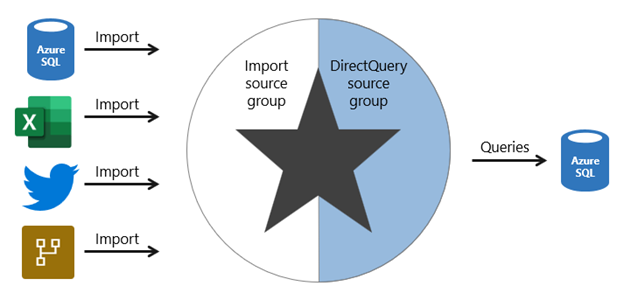
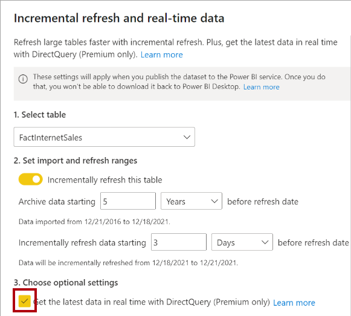

A composite model comprises more than one source group. Typically, there’s always the import source group and a DirectQuery source group.

> [!NOTE]
> Generally, the benefits and limitations associated with import and DirectQuery storage modes apply to composite models.

## Composite model benefits

There are several benefits to developing a composite model.

Composite models provide you with design flexibility. You can choose to integrate data using different storage modes, striking the right balance between imported data and pass-through data. Commonly, enterprise models benefit from using DirectQuery tables on large data sources and by boosting query performance with imported tables. Power BI features that support this scenario are described later in this unit.

Composite models can also boost the performance of a DirectQuery model by providing Power BI with opportunity to satisfy some analytic queries from imported data. Querying cached data almost always performs better than pass-through queries.

Lastly, when your model includes DirectQuery tables to a remote model, like a Power BI dataset, you can extend your model with new calculated columns and tables. It results in a specialized model based on a core model. For more information, see [Power BI usage scenarios: Customizable managed self-service BI](/power-bi/guidance/powerbi-implementation-planning-usage-scenario-customizable-managed-self-service-bi).

## Composite model limitations

There are several limitations related to composite models.

- Import (or dual, as described later) storage mode tables still require periodic refresh. Imported data can become out of sync with DirectQuery sourced data, so it’s important to refresh it periodically.
- When an analytic query must combine imported and DirectQuery data, Power BI must consolidate source group query results, which can impact performance. To help avoid this situation for higher-grain queries, you can add import aggregation tables to your model (or enable automatic aggregations) and set related dimension tables to use dual storage mode. This scenario is described later in this unit.
- When chaining models (DirectQuery to Power BI datasets), modifications made to upstream models can break downstream models. Be sure to assess the impact of modifications by performing [dataset impact analysis](/power-bi/collaborate-share/service-dataset-impact-analysis) first.

- Relationships between tables from different source groups are known as limited relationships. A model relationship is limited when the Power BI can’t determine a “one” side of a relationship. Limited relationships may result in different evaluations of model queries and calculations. For more information, see [Relationship evaluation](/power-bi/transform-model/desktop-relationships-understand).

## Boost DirectQuery model performance with import data

When there’s a justification to develop a DirectQuery model, you can mitigate some limitations by using specific Power BI features that involve import tables.

### Import aggregation tables

You can add import storage mode user-defined aggregation tables or enable automatic aggregations. This way, Power BI directs higher-grain fact queries to a cached aggregation. To boost query performance further, ensure that related dimension tables are set to use dual storage mode.

Automatic aggregations are a Premium feature. For more information, see [Automatic aggregations](/power-bi/enterprise/aggregations-auto).

### Dual storage mode

A dual storage mode table is set to use both import and DirectQuery storage modes. At query time, Power BI determines the most efficient mode to use. Whenever possible, Power BI attempts to satisfy analytic queries by using cached data.

Dual storage mode tables work well with import aggregation tables. They allow Power BI to satisfy higher-grain queries entirely from cached data.

Slicer visuals and filter card lists, which are often based on dimension table columns, render more quickly because they’re queried from cached data.

## Deliver real-time data from an import model

When you set up an import table with incremental refresh, you can enable the **Get the latest data in real-time with DirectQuery** option.

By enabling this option, Power BI automatically creates a table partition that uses DirectQuery storage mode. In this case, the table becomes a hybrid table, meaning it has import partitions to store older data, and a single DirectQuery partition for current data.

When Power BI queries a hybrid table, the query uses the cache for older data, and passes through to the data source to retrieve current data.

This option is only available with a Premium license.

For more information, see [Configure incremental refresh and real-time data](/power-bi/connect-data/incremental-refresh-configure).