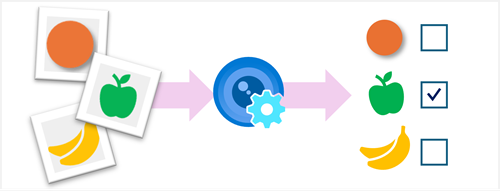

*Image classification* is a common computer vision problem that requires software to analyze an image and categorize (or *classify*) it.

For example, an unattended checkout system in a grocery store might use a camera to scan each item a customer adds to their cart, and use image classification to identify the product in the image.

In this module, you'll learn how the **Azure AI Custom Vision** service enables you to build your own computer vision models for image classification.
