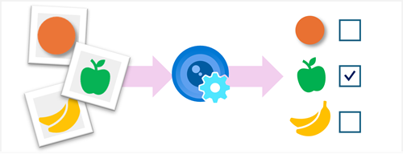

The **Azure AI Custom Vision** service enables you to build your own computer vision models for *image classification* or *object detection*.

Creating an Azure AI Custom Vision solution involves two tasks:

1. Use existing (labeled) images to train an Azure AI Custom Vision model.
2. Create a client application that submits new images to your model to generate predictions.

To use the Azure AI Custom Vision service, you must provision two kinds of Azure resource:

- A *training* resource (used to train your models). This can be:
    - An **Azure AI Services** resource.
    - An **Azure AI Custom Vision (Training)** resource.
- A *prediction* resource, used by client applications to get predictions from your model. This can be:
    - An **Azure AI Services** resource.
    - An **Azure AI Custom Vision (Prediction)** resource.

You can use a single **Azure AI Services** resource for both training and prediction, and you can mix-and-match resource types (for example, using an **Azure AI Custom Vision (Training)** resource to train a model that you then publish using an **Azure AI Services** resource).
