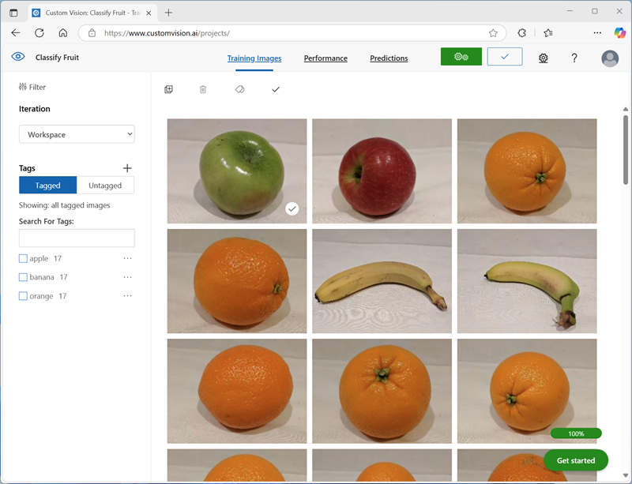

*Image classification* is a computer vision technique in which a model is trained to predict a class label for an image based on its contents. Usually, the class label relates to the main *subject* of the image.

For example, the following images have been classified based on the type of fruit they contain.

Models can be trained for multiclass classification (in other words, there are multiple classes, but each image can belong to only one class) or multilabel classification (in other words, an image might be associated with multiple labels).

## Training an image classification model

To train an image classification model with the Azure AI Custom Vision service, you can use the Azure AI Custom Vision portal, the Azure AI Custom Vision REST API or SDK, or a combination of both approaches.

In most cases, you'll typically use the Azure AI Custom Vision portal to train your model.

The portal provides a graphical interface that you can use to:

1. Create an image classification project for your model and associate it with a training resource.
2. Upload images, assigning class label tags to them.
3. Review and edit tagged images.
4. Train and evaluate a classification model.
5. Test a trained model.
6. Publish a trained model to a prediction resource.

The REST API and SDKs enable you to perform the same tasks by writing code, which is useful if you need to automate model training and publishing as part of a DevOps process.
