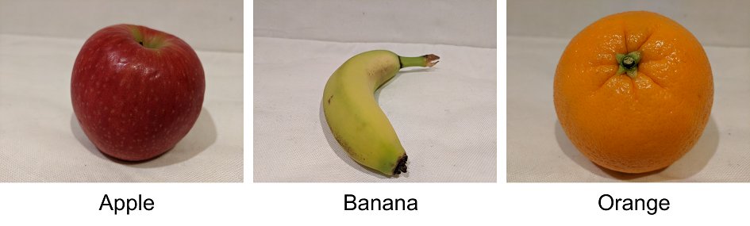

*Image classification* is a computer vision technique in which a model is trained to predict a class label for an image based on its contents. Usually, the class label relates to the main *subject* of the image.

For example, the following images have been classified based on the type of fruit they contain.

Models can be trained for multiclass classification (in other words, there are multiple classes, but each image can belong to only one class) or multilabel classification (in other words, an image might be associated with multiple labels).
