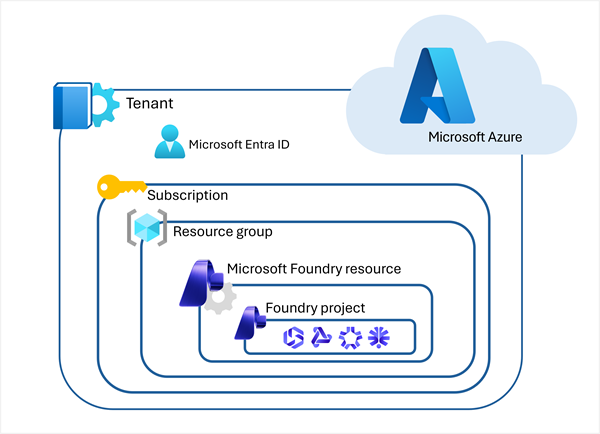

::: zone pivot="video"

>[!VIDEO https://learn-video.azurefd.net/vod/player?id=4feae8c8-985f-4359-805e-94c1385a517f]

> [!NOTE]
> See the **Text and images** tab for more details

::: zone-end

::: zone pivot="text"

Microsoft Foundry uses a multi-level approach to organize and build AI solutions. Understanding this hierarchy is essential for setting up your development environment correctly.

1. An **Azure Subscription** sets the billing construct and default access control for all resources.
2. A **Microsoft Foundry Resource** provides the underlying Azure service container that provides the infrastructure, endpoints, and access to models.
3. A **Foundry Project** is where you actually work with the built-in features, models, agents, and tools.

All of these components exist within the overall context of a Microsoft Azure *tenant* secured using *Microsoft Entra ID* authentication and authorization. Resources in a subscription are organized into *resource groups*.

## Prerequisites

Before you begin creating your Foundry project, ensure you meet the following requirements:

### Subscription requirements

You'll need an Azure subscription with active billing. Currently, Claude on Microsoft Foundry requires an **Enterprise Agreement (EA)** or **Microsoft Customer Agreement - Enterprise (MCA-E)** subscription.

> [!IMPORTANT]
> Free trials, student subscriptions, and pay-as-you-go sponsorships aren't currently supported for Claude. Request quotas are tied to EA and MCA-E subscription types.

### Permission requirements

To create and manage Foundry resources, you need:

- **Contributor** or **Owner** role on the resource group where you'll deploy the Foundry resource
- Permissions to **subscribe to offers in the Azure Marketplace** (Claude billing flows through the Azure Marketplace into your Azure invoice)

> [!TIP]
> Microsoft recommends following the principle of least privilege when assigning roles. Only grant the minimum permissions necessary for users to perform their tasks.

### Regional availability

Your Foundry project must be created in a supported region. Regional availability is expanding, so check the [official documentation](/azure/ai-foundry?azure-portal=true) for the latest list of supported regions.

> [!NOTE]
> If you're unsure about these prerequisites, have a conversation with whoever manages your Azure tenant before proceeding.

## Microsoft Foundry: A unified platform

Microsoft Foundry brings together all the components you need to build AI solutions:

- **Models** - Access to Claude and other AI models
- **Prompting** - Tools for crafting and testing prompts
- **Tools** - Extensibility through function calling and integrations
- **Data** - Management of training data, evaluation datasets, and knowledge bases
- **Agents** - Building and deploying autonomous AI agents

These capabilities aren't isolated features—they work together as a unified platform to support your entire AI development lifecycle.

Microsoft Foundry offers flexibility in how you develop AI applications:

### The Foundry portal

A web-based interface where you can:

- Create and manage Foundry projects.
- Explore available models and capabilities.
- Experiment with prompts and responses.
- Prototype quickly without local setup.

### Developer tools

Full development environments for production-grade work:

- **Azure CLI** - A command-line interface for scripting and automation.
- **Visual Studio Code** - An integrated development environment with rich AI tooling and Foundry integration.

::: zone-end
