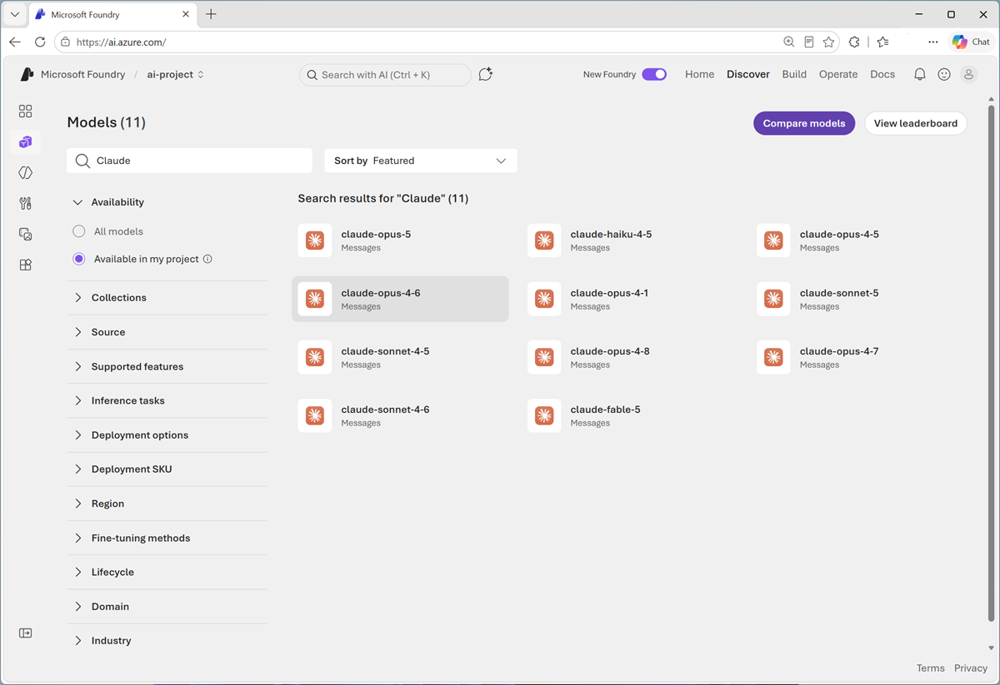

::: zone pivot="video"

>[!VIDEO https://learn-video.azurefd.net/vod/player?id=dd37563e-edc6-48fe-9c81-159c328723ee]

> [!NOTE]
> See the **Text and images** tab for more details

::: zone-end

::: zone pivot="text"

Before deploying AI in Microsoft Foundry, you need to choose your model. This decision is worth considering thoughtfully because more intelligent models typically cost more to run. The key is finding the right balance between capability and cost for your specific use case.

Microsoft Foundry offers multiple Claude models, each designed for different types of workloads.

Let's start with **Claude Haiku**. Haiku is Anthropic's fastest model and is optimized for high-volume scenarios where speed and cost efficiency matter most. It's ideal for tasks such as classification, extraction, routing, summarization, and agent orchestration. If you're making thousands of model calls and each task is relatively simple, Haiku is often the best choice. Anthropic describes it as its fastest model, delivering near-frontier intelligence with very low latency.

Next is **Claude Sonnet**, which Anthropic positions as the best combination of speed and intelligence. Sonnet is the workhorse model for most applications, offering strong performance across coding, writing, analysis, research, and agent-based workflows. If you're building a new AI solution and aren't sure where to begin, Sonnet is usually the best starting point.

For more demanding workloads, there's **Claude Opus**. Opus is designed for complex agentic coding and enterprise scenarios that require sophisticated reasoning and deeper analysis. If you're tackling challenging software engineering tasks, advanced business analysis, or agent workflows that require sustained reasoning, Opus may provide the additional capability you need.

Above Opus is **Claude Fable**, Anthropic's most capable generally available model. Fable is designed for long-running agents and the most challenging tasks, helping systems work more autonomously toward complex goals. When you need the highest capability available to most customers, Fable is the model to evaluate.

Finally **Claude Mythos** shares the same specifications as Fable, but Anthropic currently offers it only through limited availability to approved customers.

## How to choose the right model

A practical approach is to start with the smallest model that might meet your needs. Take twenty to thirty examples from your real workload and run them through Haiku. If the quality is sufficient, you've achieved the best possible cost and performance profile. If the task requires additional capability, move up to Sonnet. For more demanding reasoning or agentic workloads, evaluate Opus. And for your most important or most complex applications, consider Fable. The goal is not to use the largest model by default, but to find the smallest model that consistently delivers the quality your scenario requires.

Rather than guessing which model to use, follow this systematic approach:

### Start small, scale up as needed

1. **Begin with Haiku** - Start with the fastest, most cost-effective option
2. **Test with real data** - Take 20-30 examples from your actual workload
3. **Evaluate the results** - Assess whether the quality meets your requirements
4. **Iterate if needed** - If you hit a quality ceiling, step up to Sonnet, then to Opus if necessary

> [!IMPORTANT]
> Starting with Haiku helps you avoid overpaying for capability you don't need. Many tasks that seem complex can actually be handled by smaller models with proper prompt engineering.

## Claude in Foundry Models

In Microsoft Foundry, Claude models are available in the model catalog.

The catalog provides:

- **Complete model listings** - Browse all available Claude models
- **Model comparison tools** - Compare models across multiple attributes:
  - Performance characteristics
  - Cost per token (input and output)
  - Context window size
  - Latency expectations
  - Capability benchmarks
- **Deployment options** - Deploy models directly from the catalog to your project

::: zone-end
