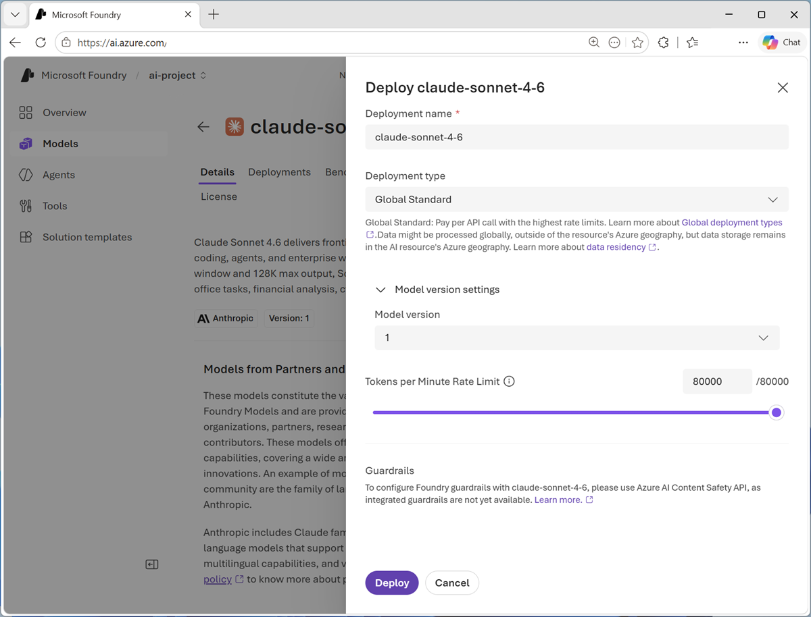
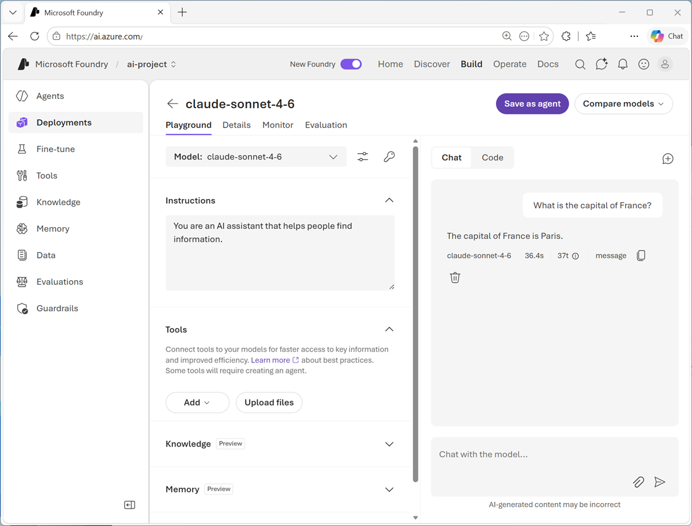

::: zone pivot="video"

>[!VIDEO https://learn-video.azurefd.net/vod/player?id=0660b5c2-6352-420c-8b1a-a5eaad73050b]

> [!NOTE]
> See the **Text and images** tab for more details

::: zone-end

::: zone pivot="text"

In Microsoft Foundry, a *deployment* is a specific instance of a model with its own unique *name* and *endpoint*; which are used by client applications to connect to and chat with your model.

## Deploying a model

The easiest way to deploy a model is from the model catalog in the Foundry portal. Claude models in Foundry are deployed using the *Global Standard* deployment configuration and billed through your Azure subscription.

> [!TIP]
> Unless you have a specific reason to customize it, keep the default deployment name. This makes it easier to identify which model is deployed and maintains consistency across your projects.

## Testing a deployment in the playground

Foundry provides a built-in playground where you can immediately test your deployment without writing any code.

The playground is perfect for:

- Verifying the deployment is working correctly.
- Experimenting with prompts and responses.
- Understanding the model's behavior before integration.
- Sharing examples with stakeholders.

::: zone-end
