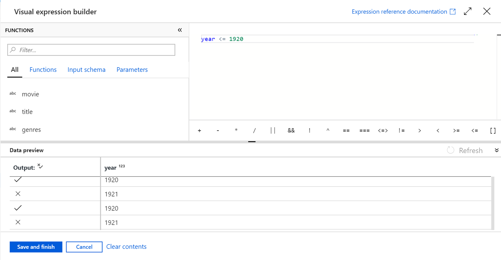

Mapping Data Flows provides many different transformations types that enable you to modify data. They're broken down into the following categories:

| **Category Name**                           | **Description**                                                                                                                                                                                                                                                                          |
| ------------------------------------------- | ---------------------------------------------------------------------------------------------------------------------------------------------------------------------------------------------------------------------------------------------------------------------------------------- |
| **Schema modifier transformations**         | These types of transformations will make a modification to a sink destination by creating new columns based on the action of the transformation. An example of this is the Derived Column transformation that creates a new column based on the operations performed on existing column. |
| **Row modifier transformations**            | These types of transformations impact how the rows are presented in the destination. An example of this is a Sort transformation that orders the data.                                                                                                                                   |
| **Multiple inputs/outputs transformations** | These types of transformations generate new data pipelines or merge pipelines into one. An example of this is the Union transformation that combines multiple data streams.                                                                                                              |
| **Formatters transformations**              | These types of transformations convert between complex data structures and string representations. An example is the Parse transformation that converts a JSON string column into individual columns.                                                                                    |

Below is a list of transformations that are available in the Mapping Data Flows

| **Name**              | **Category**            | **Description**                                                                                                                                                                                                                                                                                                                                                                                                                             |
| --------------------- | ----------------------- | ------------------------------------------------------------------------------------------------------------------------------------------------------------------------------------------------------------------------------------------------------------------------------------------------------------------------------------------------------------------------------------------------------------------------------------------- |
| **Aggregate**         | Schema modifier         | Define different types of aggregations such as SUM, MIN, MAX, and COUNT grouped by existing or computed columns.                                                                                                                                                                                                                                                                                                                            |
| **Alter row**         | Row modifier            | Set insert, delete, update, and upsert policies on rows. You can add one-to-many conditions as expressions. These conditions should be specified in order of priority, as each row will be marked with the policy corresponding to the first-matching expression. Each of those conditions can result in a row (or rows) being inserted, updated, deleted, or upserted. Alter Row can produce both DDL & DML actions against your database. |
| **Assert**            | Row modifier            | Set assert rules on each row to validate data quality and fail the pipeline when conditions aren't met.                                                                                                                                                                                                                                                                                                                                     |
| **Cast**              | Schema modifier         | Change column data types with type checking to catch conversion errors.                                                                                                                                                                                                                                                                                                                                                                     |
| **Conditional split** | Multiple inputs/outputs | Route rows of data to different streams based on matching conditions.                                                                                                                                                                                                                                                                                                                                                                       |
| **Derived column**    | Schema modifier         | Generate new columns or modify existing fields using the data flow expression language.                                                                                                                                                                                                                                                                                                                                                     |
| **Exists**            | Multiple inputs/outputs | Check whether your data exists in another source or stream.                                                                                                                                                                                                                                                                                                                                                                                 |
| **External call**     | Schema modifier         | Call external REST endpoints inline, row-by-row, to enrich your data stream.                                                                                                                                                                                                                                                                                                                                                                |
| **Filter**            | Row modifier            | Filter a row based upon a condition.                                                                                                                                                                                                                                                                                                                                                                                                        |
| **Flatten**           | Formatters              | Take array values inside hierarchical structures such as JSON and unroll them into individual rows.                                                                                                                                                                                                                                                                                                                                         |
| **Flowlet**           | Flowlets                | Build and include custom reusable transformation logic that can be shared across multiple data flows.                                                                                                                                                                                                                                                                                                                                       |
| **Join**              | Multiple inputs/outputs | Combine data from two sources or streams.                                                                                                                                                                                                                                                                                                                                                                                                   |
| **Lookup**            | Multiple inputs/outputs | Reference data from another source.                                                                                                                                                                                                                                                                                                                                                                                                         |
| **New branch**        | Multiple inputs/outputs | Apply multiple sets of operations and transformations against the same data stream.                                                                                                                                                                                                                                                                                                                                                         |
| **Parse**             | Formatters              | Parse text columns in your data stream that are strings of JSON, delimited text, or XML formatted text.                                                                                                                                                                                                                                                                                                                                     |
| **Pivot**             | Schema modifier         | An aggregation where one or more grouping columns have distinct row values transformed into individual columns.                                                                                                                                                                                                                                                                                                                             |
| **Rank**              | Schema modifier         | Generate an ordered ranking based upon sort conditions.                                                                                                                                                                                                                                                                                                                                                                                     |
| **Select**            | Schema modifier         | Alias columns and stream names, and drop or reorder columns.                                                                                                                                                                                                                                                                                                                                                                                |
| **Sink**              | -                       | A final destination for your data.                                                                                                                                                                                                                                                                                                                                                                                                          |
| **Sort**              | Row modifier            | Sort incoming rows on the current data stream.                                                                                                                                                                                                                                                                                                                                                                                              |
| **Source**            | -                       | A data source for the data flow.                                                                                                                                                                                                                                                                                                                                                                                                            |
| **Stringify**         | Formatters              | Turn complex types such as arrays and maps into plain strings.                                                                                                                                                                                                                                                                                                                                                                              |
| **Surrogate key**     | Schema modifier         | Add an incrementing nonbusiness arbitrary key value.                                                                                                                                                                                                                                                                                                                                                                                        |
| **Union**             | Multiple inputs/outputs | Combine multiple data streams vertically.                                                                                                                                                                                                                                                                                                                                                                                                   |
| **Unpivot**           | Schema modifier         | Pivot columns into row values.                                                                                                                                                                                                                                                                                                                                                                                                              |
| **Window**            | Schema modifier         | Define window-based aggregations of columns in your data streams.                                                                                                                                                                                                                                                                                                                                                                           |

## Data Flow Expression Builder

Some of the transformations that you can define have an **Data Flow Expression Builder** that will enable you to customize the functionality of a transformation using columns, fields, variables, parameters, functions from your data flow in these boxes. 

To build the expression, use the Expression Builder, which is launched by selecting the expression text box inside the transformation. You'll also sometimes see "Computed Column" options when selecting columns for transformation. When you select that, you'll also see the Expression Builder launched.

The Expression Builder tool defaults to the text editor option. The autocomplete feature reads from the entire Azure Data Factory Data Flow object model with syntax checking and highlighting.

