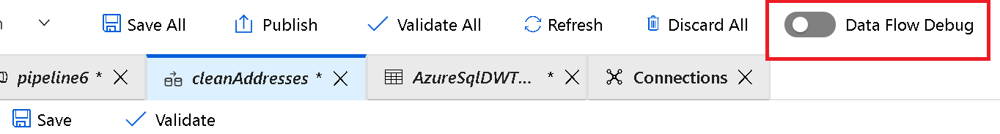
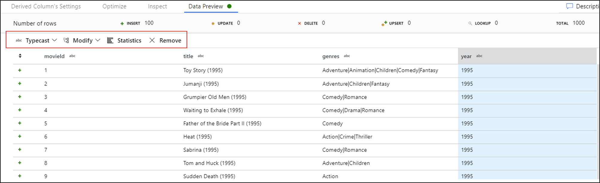

During the building of Mapping Data Flows, you can interactively watch how the data transformations are executing so that you can debug them. To use this functionality, it is first necessary to turn on the “Data Flow Debug” feature.

Clicking Debug will provision the Spark clusters required to interact with the Mapping Data Flow transformations. On turning Debug on, you will be prompted to select the Integration Runtime that you require to use in the environment. If you select AutoResolveIntegrationRuntime, a cluster with eight cores that will be available with a time to live value of 60 minutes. 

> [!Note]
> It typically takes 5-7 minutes for the cluster to spin up. With this mode on and the Spark clusters running, you are able to build your data flow step by step and view the data as it runs through each transformation phase. 

A Data Preview tab is available in Debug mode that will allow you to view the data at each stage of the pipeline. You can view the data after each transformation. The data previewer also provides the ability to actions on the data such as looking at descriptive statistics of the data, or the ability to modify the data.

Finally, you can use the debug settings to control the number of rows that are returned within the data previewer. 
> [!Note]
> It is recommended to limit the number of rows that returns enough to enable you to confirm that the data is correct. The bigger the data set, the longer it takes to return the results back. You can also use the Debug settings to specify any parameter values that should be used during the execution of the pipeline.