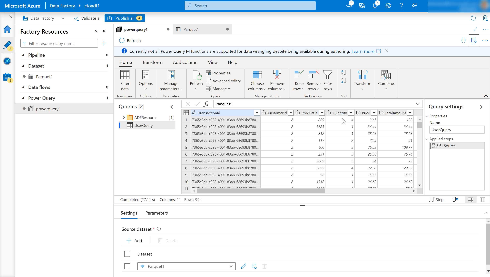
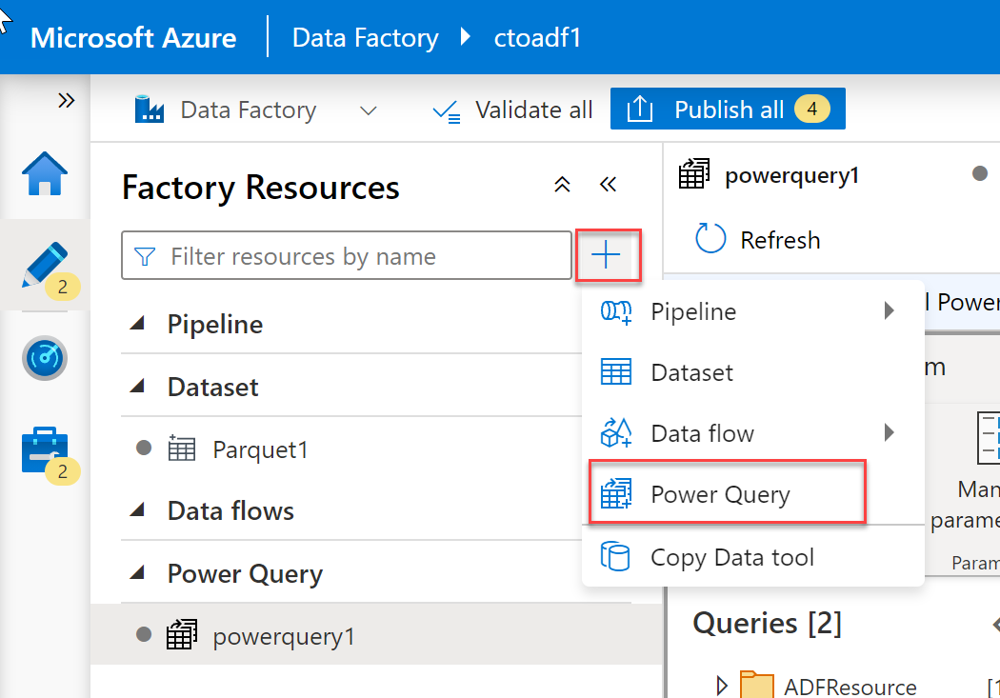
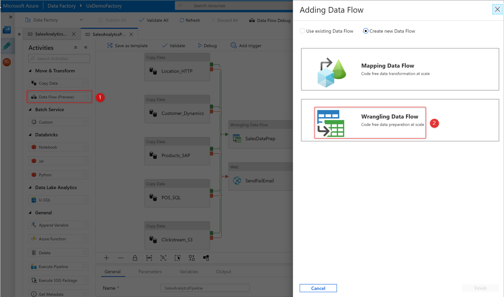
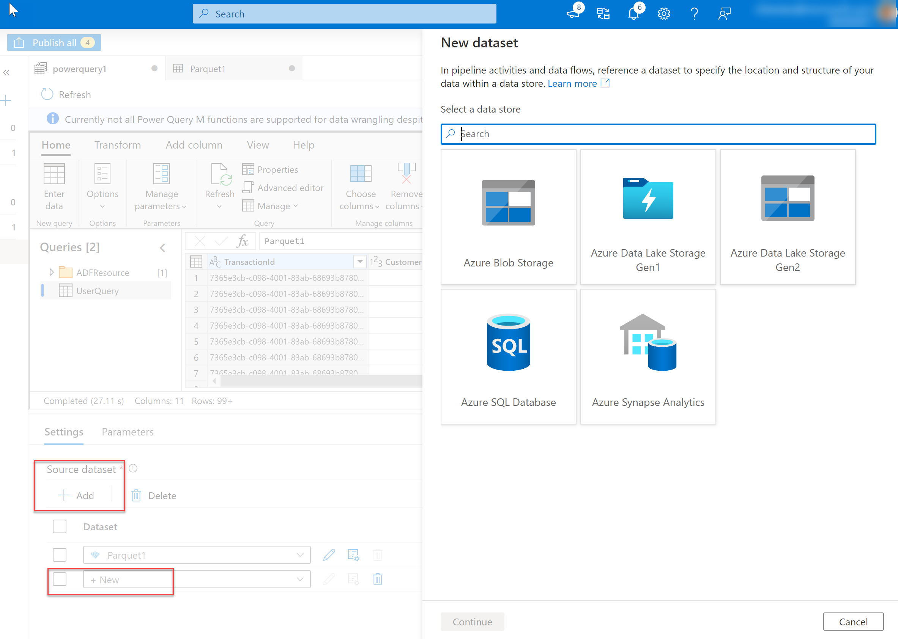
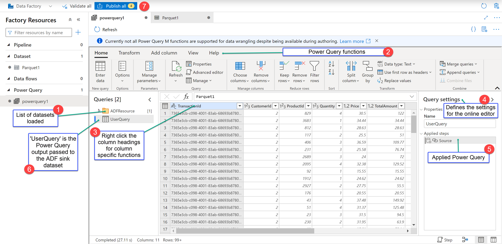
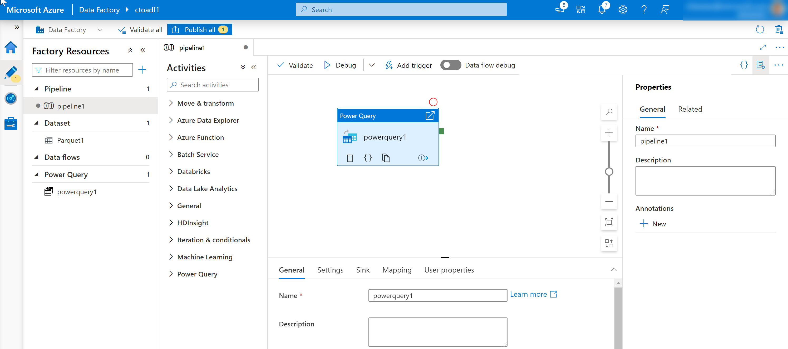

Wrangling Data Flow is a data flow object that can be added to the canvas designer as an activity in an Azure Data Factory pipeline to perform code free data preparation.  It enables individuals who are not conversant with the traditional data preparation technologies such as Spark or SQL Server, and languages such as Python and T-SQL to prepare data at cloud scale iteratively.

The Wrangling Data Flow uses a grid type interface for basic data preparation that is like the aesthetics of Excel, known as an Online Mashup Editor. The editor also enables more advanced users to perform more complex data preparation using formulas.

The formulas work with Power Query Online and makes Power Query M functions available for data factory users. Wrangling data flow then translates the M language generated by the Power Query Online Mashup Editor into spark code for cloud scale execution.

This capability enables both data engineers and citizen data integrators to interactively explore and prepare datasets. In addition, they can interactively work with the M language and preview the result before viewing it in the context of a wider pipeline. 

There are two ways to create a wrangling data flow in Azure Data Factory. One way is to click the plus icon and select Data Flow in the factory resources pane.

The other method is in the activities pane of the pipeline canvas. Open the Move and Transform accordion and drag the Data flow activity onto the canvas.

In both methods, in the side pane that opens, select Create new data flow and choose Wrangling data flow. Click OK.

Add a Source dataset for your wrangling data flow, and select a sink dataset. The following data sources are supported. 

| Connector | Data format | Authentication type |
|-|-|
| Azure Blob Storage | CSV, Parquet | Account Key |
| Azure Data Lake Storage Gen1 | CSV | Service Principal |
| Azure Data Lake Storage Gen2 | CSV, Parquet | Account Key, Service Principal |
| Azure SQL Database |  | SQL authentication |
| Azure Synapse Analytics |  | SQL authentication |

Once you have selected a source, then click on create.

This opens the Online Mashup Editor.

navigating-wrangling-data-flow

It consists of the following components:

1. Dataset list.

    This will provide the datasets that have been defined as the source for the Data Wrangling.

1. Wrangling Function toolbar.

	The toolbar contains a variety of data wrangling functions that the user can access to manipulate the data including:

	- Managing columns.
	- Transforming tables.
	- Reducing rows.
	- Adding columns.
	- Combining tables.

	Each item is context-sensitive and contains sub functions specific to it.

1. Column headings.

	As well as having the ability to rename columns, right-clicking the column will bring up context-sensitive items for managing columns.

1. Settings.

	This enables you to add or edit data sources and data sinks, and modify setting for the wrangling data task.

1. Steps window.

	This window shows the steps that have been applied to the wrangling output. In the example in the graphic, the step named “Source” has been applied the wrangling output named “UserQuery”.

1. Wrangling output list.

	Lists the data wrangling output that has been defined.

1. Done.

	Completes the Data Wrangling task work.

1. Publish button.

	Enables you to publish the work that has been created.

A wrangling data flow task appears in the canvass designer just like a Copy Activity task, or a Mapping Data Flow task and can be managed and monitored in the same way.

