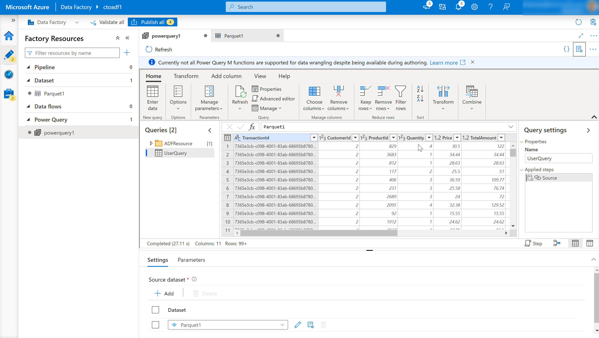
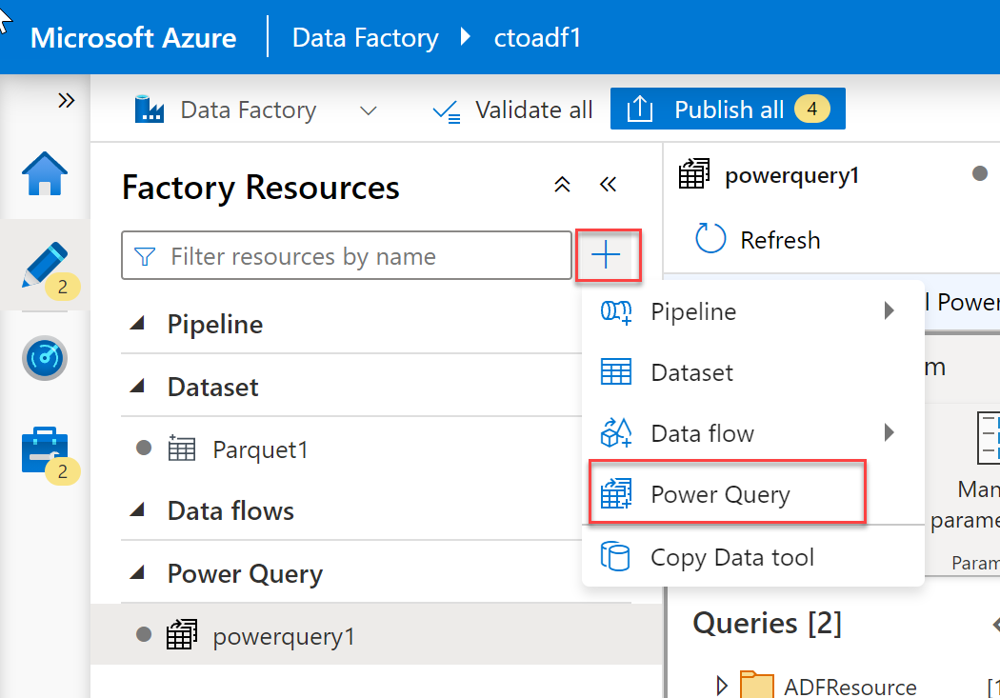
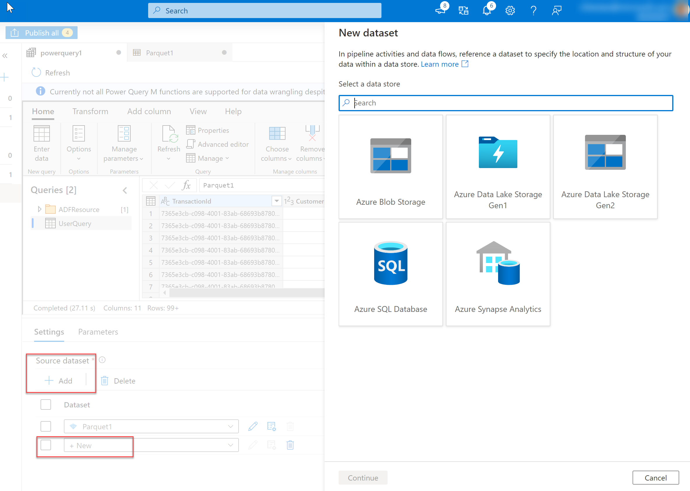
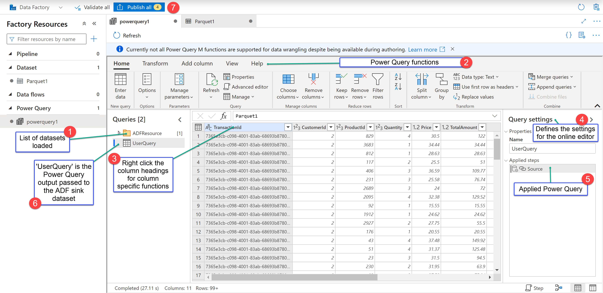
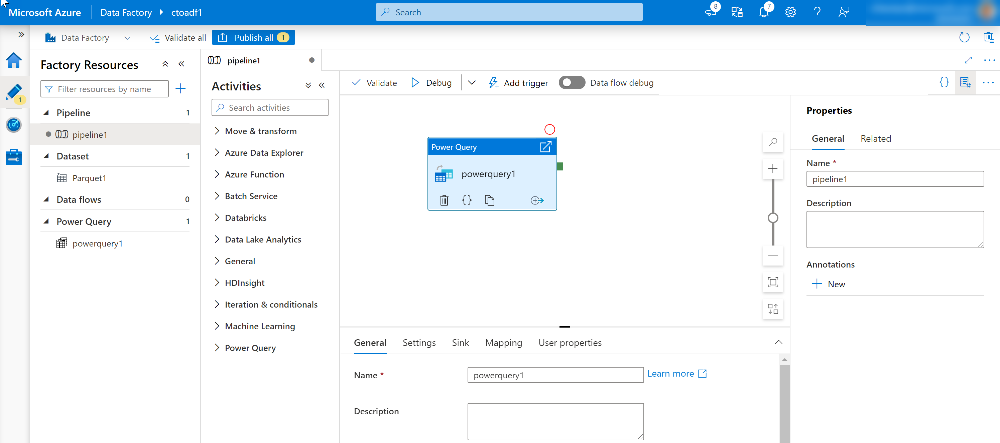

The Power Query feature within Azure Data Factory enables you to work with and wrangle data. It's an object that can be added to the canvas designer as an activity in an Azure Data Factory pipeline to perform code free data preparation. It enables individuals who aren't conversant with the traditional data preparation technologies such as Spark or SQL Server, and languages such as Python and T-SQL to prepare data at cloud scale iteratively.

The Power Query feature uses a grid type interface for basic data preparation that is like the aesthetics of Excel, known as an Online Mashup Editor. The editor also enables more advanced users to perform more complex data preparation using formulas. You first have to create a linked service to a source of the data first before you're able to access the data.

The formulas work with Power Query Online and makes Power Query M functions available for data factory users. Power Query then translates the M language generated by the Online Mashup Editor into spark code for cloud scale execution.

This capability enables both data engineers and data analysts to interactively explore and prepare datasets. In addition, they can interactively work with the M language and preview the result before viewing it in the context of a wider pipeline. 

To add a Power Query activity in Azure Data Factory, select the plus icon and select Power Query in the factory resources pane.

Add a Source dataset for your wrangling data flow, and select a sink dataset. The following data sources are supported. 

| Connector                    | Data format         | Authentication type                        |
| ---------------------------- | ------------------- | ------------------------------------------ |
| Azure Blob Storage           | CSV, Parquet, Excel | Account Key, Service Principal, MSI        |
| Azure Data Lake Storage Gen1 | CSV, Parquet, Excel | Service Principal, MSI                     |
| Azure Data Lake Storage Gen2 | CSV, Parquet, Excel | Account Key, Service Principal, MSI        |
| Azure SQL Database           | -                   | SQL authentication, MSI, Service Principal |
| Azure Synapse Analytics      | -                   | SQL authentication, MSI, Service Principal |

Once you select a source, select **Create**.

This opens the Online Mashup Editor.

It consists of the following components:

1. Dataset list.

    This provides the datasets that have been defined as the source for the Data Wrangling.

1. Wrangling Function toolbar.

	The toolbar contains various data wrangling functions that the user can access to manipulate the data including:

	- Managing columns.
	- Transforming tables.
	- Reducing rows.
	- Adding columns.
	- Combining tables.

	Each item is context-sensitive and contains sub functions specific to it.

1. Column headings.

	As well as having the ability to rename columns, right-selecting the column brings up context-sensitive items for managing columns.

1. Settings.

	This enables you to add or edit data sources and data sinks, and modify setting for the wrangling data task.

1. Steps window.

	This window shows the steps that have been applied to the wrangling output. In the example in the graphic, the step named "Source" has been applied the wrangling output named "UserQuery."

1. Power Query output list.

	Lists the data wrangling output that has been defined.

1. Publish button.

	Enables you to publish the work that has been created.

A Power Query task can be added in the canvass designer just like a Copy Activity task, or a Mapping Data Flow task and can be managed and monitored in the same way.

