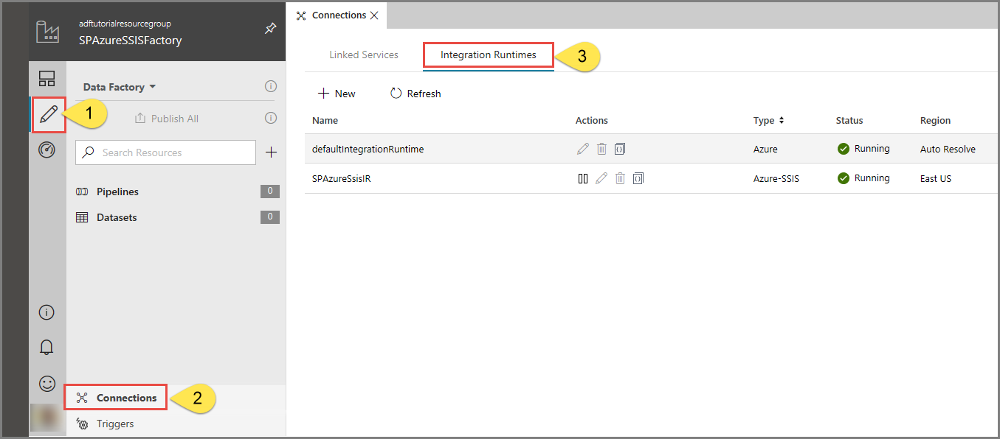
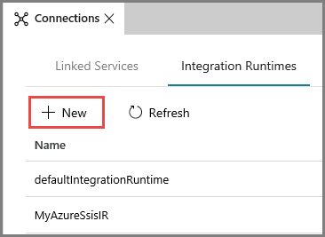
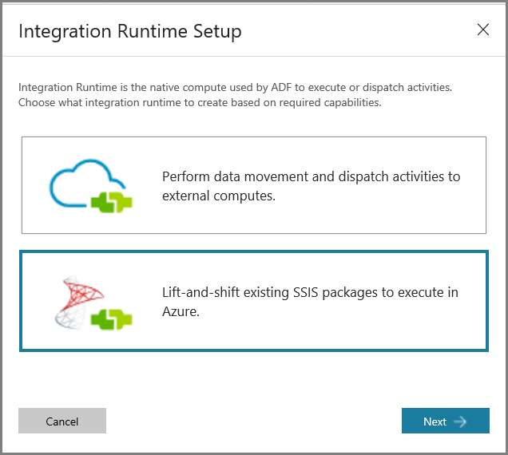
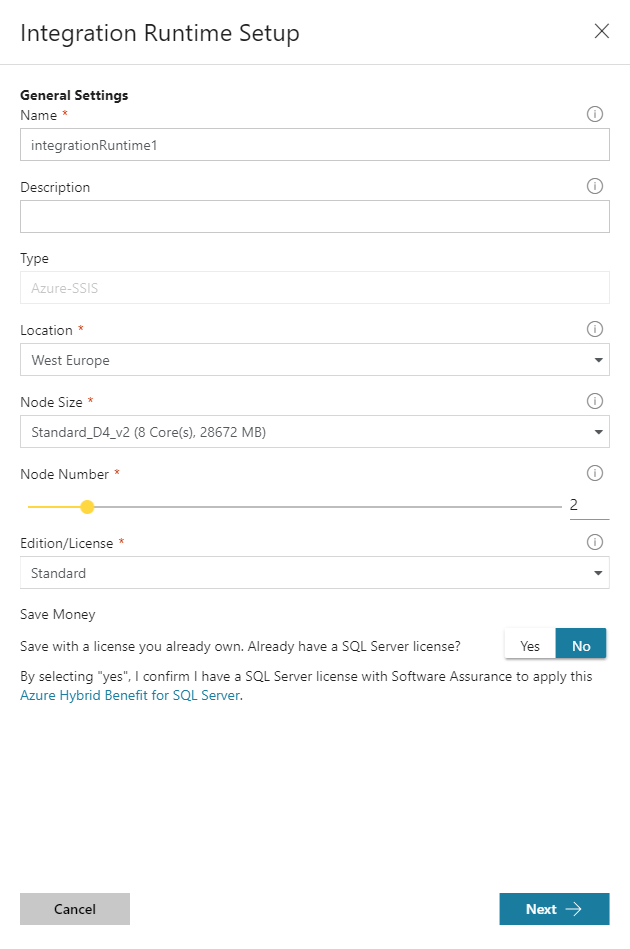
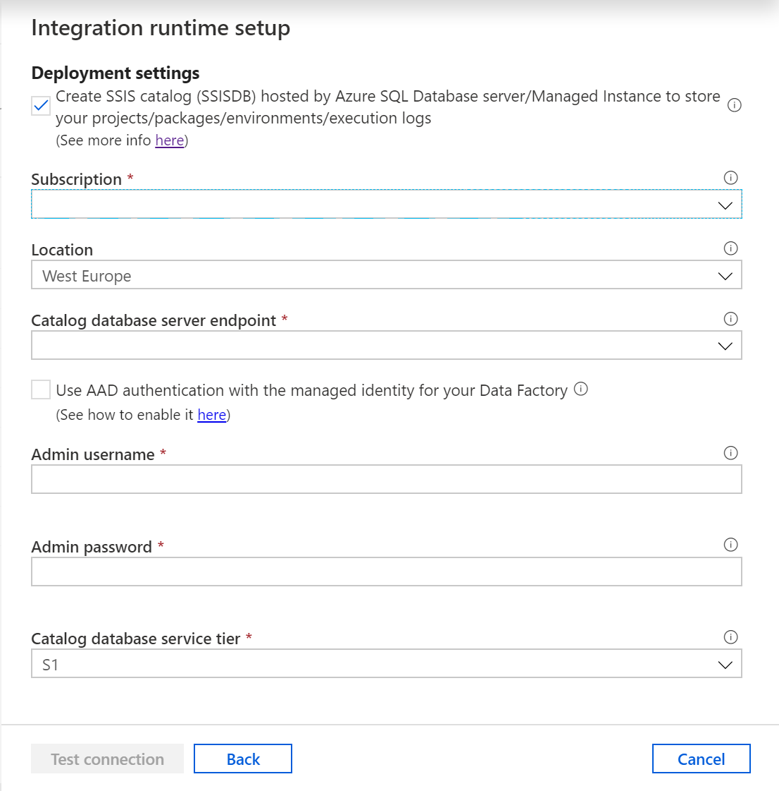
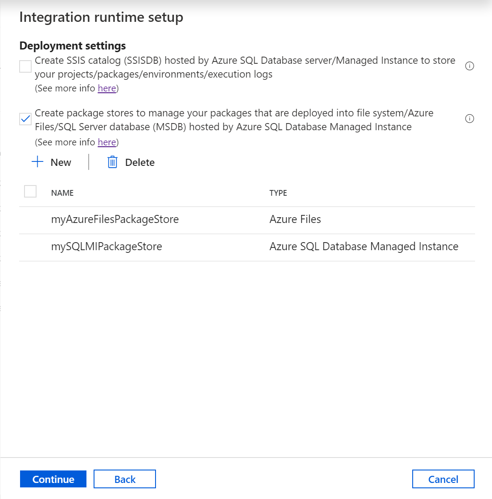
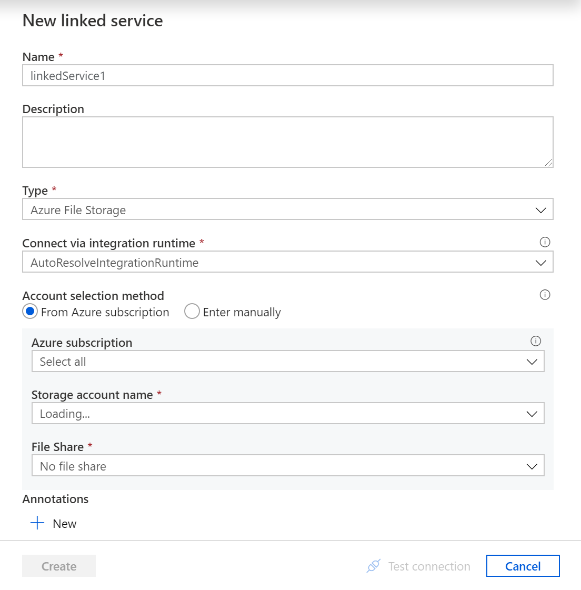
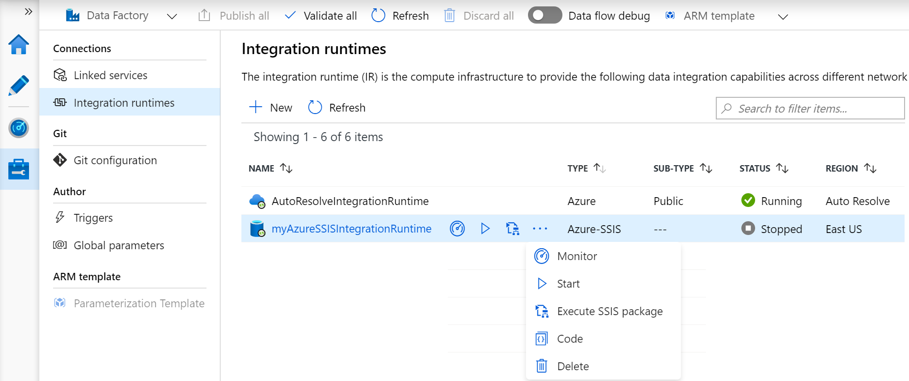

You may work in an organization where much of the transformation logic is currently held in existing SSIS packages that have been created on SQL Server. You have the ability to lift and shift SSIS package so you can execute them within Azure Data Factory, so you can make use in existing work. In order to do this you must set up an Azure-SSIS integration runtime.

## Azure-SSIS integration runtime

In order to make use of the Azure-SSIS integration runtime, it's assumed that there's SSIS Catalog (SSISDB) deployed on a SQL Server SSIS instance. With that prerequisite met, the Azure-SSIS integration runtime is capable of:

- Lift and shift existing SSIS workloads

During the provisioning of the Azure-SSIS integration runtime, you specify the following options:

- The node size (including the number of cores) and the number of nodes in the cluster.
- The existing instance of Azure SQL Database to host the SSIS Catalog Database (SSISDB), and the service tier for the database.
- The maximum parallel executions per node.

With the Azure-SSIS integration runtime enabled, you're able to manage, monitor, and schedule SSIS packages using tools such as SQL Server Management Studio (SSMS) or SQL Server Data Tools (SSDT).

## Create an Azure-SSIS integration runtime

1. In the Azure Data Factory designer, in the **Edit** tab, select **Connections**. Select the **Integration Runtimes** tab to view existing integration runtimes in your data factory.

    

1. Select **+ New** to create an Azure-SSIS IR and open the **Integration runtime setup** pane.

    

1. In the **Integration runtime setup** pane, select the **Lift-and-shift existing SSIS packages to execute in Azure** tile, and then select **Next**.

    

1. On selecting this option, there are three types of settings to configure

### General settings page

1. On the **General settings** page of **Integration runtime setup** pane, complete the following steps.

    

1. In **Name**, enter the name of your integration runtime.

1. For **Description**, enter the description of your integration runtime.

1. For **Location**, select the location of your integration runtime. It's recommended that you select the same location of your database server to host SSISDB.

1. For **Node Size**, select the size of node in your integration runtime cluster.

1. For **Node Number**, select the number of nodes in your integration runtime cluster.

1. For **Edition/License**, select the SQL Server edition for your integration runtime.

1. For **Save Money**, select the Azure Hybrid Benefit option for your integration runtime: Select **Yes** if you want to bring your own SQL Server license with Software Assurance to benefit from cost savings with hybrid use.

1. Select **Next**.

### Deployment settings page
1. On the **Deployment settings** page of **Integration runtime setup** pane, complete the following steps.

1. Select the **Create SSIS catalog (SSISDB) hosted by Azure SQL Database server/Managed Instance to store your projects/packages/environments/execution logs** check box to choose the package deployment mode.

    

1. For **Subscription**, select the Azure subscription that has your database server to host SSISDB.

1. For **Location**, select the location of your database server to host SSISDB. We recommend that you select the same location of your integration runtime.

1. For **Catalog Database Server Endpoint**, select the endpoint of your database server to host SSISDB.

1. To use managed identity authentication, select either the **Use Microsoft Entra authentication with the system managed identity for Data Factory** check box (for a single data factory using its system-assigned identity) or the **Use Microsoft Entra authentication with a user-assigned managed identity for Data Factory** check box (for scenarios where a specific user-assigned managed identity is required). If you skip these options, SQL authentication credentials from the following steps are used instead.

1. For **Admin Username**, enter the SQL authentication username for your database server to host SSISDB.

1. For **Admin Password**, enter the SQL authentication password for your database server to host SSISDB.

1. For **Catalog Database Service Tier**, select the service tier for your database server to host SSISDB. Select the Basic, Standard, or Premium tier, or select an elastic pool name.

The alternative approach is to:

1. Select the **Create package stores to manage your packages that are deployed into file system/Azure Files/SQL Server database (MSDB) hosted by Azure SQL Managed Instance** check box to choose whether you want to manage your packages that are deployed into MSDB, file system, or Azure Files (Package Deployment Model) with Azure-SSIS IR package stores.

    

1. On the **Add package store** pane, complete the following steps.

1. For **Package store name**, enter the name of your package store.

1. For **Package store linked service**, select your existing linked service that stores the access information for file system/Azure Files/Azure SQL Managed Instance where your packages are deployed or create a new one by selecting **New**. On the **New linked service** pane, complete the following steps.

    

1. For **Name**, enter the name of your linked service.

1. For **Description**, enter the description of your linked service.

1. For **Type**, select **Azure File Storage**, **Azure SQL Managed Instance**, or **File System**.

1. You can ignore **Connect via integration runtime**, since we always use your Azure-SSIS IR to fetch the access information for package stores.

1. If you select **Azure File Storage**, complete the following steps.

1. For **Account selection method**, select **From Azure subscription** or **Enter manually**.

1. If you select **From Azure subscription**, select the relevant **Azure subscription**, **Storage account name**, and **File share**.

1. If you select **Enter manually**, enter \\\\<storage account name\>.file.core.windows.net\<file share name> for **Host**, Azure\\<storage account name\> for **Username**, and \<storage account key\> for **Password** or select your **Azure Key Vault** where it's stored as a secret.

    > [!NOTE]
    > There are different settings if you select **Azure SQL Managed Instance**, or **File System**

1. Select **Test connection** when applicable and if it's successful, select **Next**.
 
### Advanced settings page

1. On the **Advanced settings** page of **Integration runtime setup** pane, complete the following steps.

    

1. For **Maximum Parallel Executions Per Node**, select the maximum number of packages to run concurrently per node in your integration runtime cluster. 

1. Select the **Customize your Azure-SSIS Integration Runtime with additional system configurations/component installations** check box to choose whether you want to add standard/express custom setups on your Azure-SSIS IR. 

1. Select the **Select a VNet for your Azure-SSIS Integration Runtime to join, allow ADF to create certain network resources, and optionally bring your own static public IP addresses** check box to choose whether you want to join your Azure-SSIS IR to a virtual network.

1. Select the **Set up Self-Hosted Integration Runtime as a proxy for your Azure-SSIS Integration Runtime** check box to choose whether you want to configure a self-hosted IR as proxy for your Azure-SSIS IR. For more information.

1. Select **Continue**.

1. On the **Summary**, review all provisioning settings, and select **Finish** to start the creation of your integration runtime.

1. On the **Connections** pane of **Manage** hub, switch to the **Integration runtimes** page and select **Refresh**.

    
