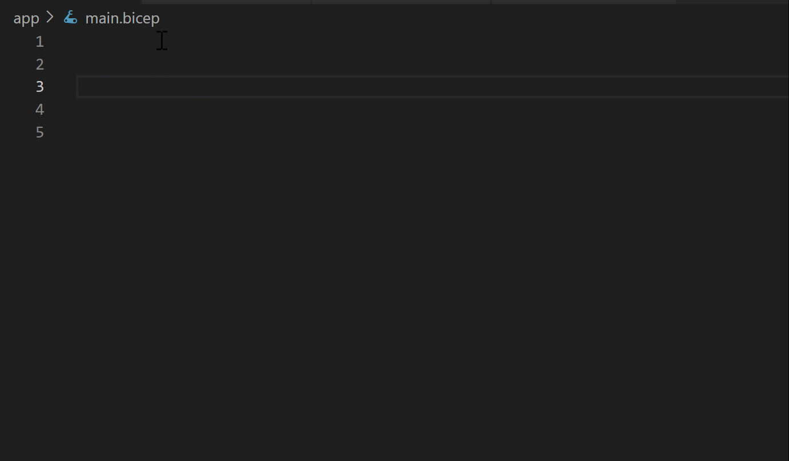

Automating database deployment is a crucial ability to create a reliable and sustainable development process. This unit provides you with the information to be able to use Bicep files and Azure Resource Manager (ARM) templates in your database deployments.

## Bicep

[Azure Bicep](/azure/azure-resource-manager/bicep/overview) is Microsoft's recommended declarative language for deploying Azure resources. A Bicep file compiles into an Azure Resource Manager (ARM) JSON template at deployment time, so a Bicep-based workflow gives you all the capabilities of ARM templates with a more concise syntax that's easier to author and maintain.

Bicep isn't intended to be a general-purpose programming language. Instead, it's a specialized tool for creating files that declare Azure infrastructure resources and their properties. This approach ensures consistent resource deployment throughout the development lifecycle.

### Benefits

Bicep offers the following benefits:

- **Continuous full support –** Bicep provides support for all resource types and API versions for Azure services, which means that as soon as a resource provider introduces new resource types and API versions, you can use them in your Bicep file without waiting for a tool update.

- **Simple syntax –** Compared to an equivalent JSON file, Bicep files are more concise and easier to read.

- **Easy to use –** Bicep requires no previous knowledge of programming languages and is easy to write and understand.

    

- **Idempotent deployments –** Like ARM templates, Bicep deployments are *idempotent*, so you can repeatedly deploy your infrastructure throughout the development lifecycle with confidence that your resources end up in a consistent state.

- **Modular and reusable –** Bicep files can be split into modules and combined, so you can compose the deployments you need and share common patterns across projects.

- **Authoring tools –** You can author Bicep files in Visual Studio Code with the Bicep extension, which provides IntelliSense, syntax validation, and in-line help.

### Deploy a Bicep file with PowerShell

You have several options for the scope of your deployment when using PowerShell and Bicep. You can deploy to a resource group, a subscription, a management group (a collection of subscriptions under the same Azure tenant, commonly used in large enterprise deployments), or a tenant.

Here's a Bicep definition to create a single database in Azure SQL Database:

```Bicep
@description('The name of the SQL logical server.')
param serverName string = uniqueString('sql', resourceGroup().id)

@description('The name of the SQL Database.')
param sqlDBName string = 'SampleDB'

@description('Location for all resources.')
param location string = resourceGroup().location

@description('The administrator username of the SQL logical server.')
param administratorLogin string

@description('The administrator password of the SQL logical server.')
@secure()
param administratorLoginPassword string

resource sqlServer 'Microsoft.Sql/servers@2022-02-01' = {
  name: serverName
  location: location
  properties: {
    administratorLogin: administratorLogin
    administratorLoginPassword: administratorLoginPassword
  }
}

resource sqlDB 'Microsoft.Sql/servers/databases@2022-02-01' = {
  parent: sqlServer
  name: sqlDBName
  location: location
  sku: {
    name: 'Standard'
    tier: 'Standard'
  }
}
```

In this example, a single database is defined using the DTU-based Standard tier. When creating the database, you also specify the server that manages it and the Azure region where it's located.

To deploy this file, save it as `main.bicep` on your local computer and run the following commands in PowerShell:

```PowerShell
$projectName = Read-Host -Prompt "Enter a project name that is used for generating resource names"
$location = Read-Host -Prompt "Enter an Azure location (e.g., centralus)"
$adminUser = Read-Host -Prompt "Enter the SQL Server administrator username"
$adminPassword = Read-Host -Prompt "Enter the SQL Server administrator password" -AsSecureString

$resourceGroupName = "${projectName}rg"

# Create a new resource group
New-AzResourceGroup -Name $resourceGroupName -Location $location

# Deploy resources using a Bicep file
New-AzResourceGroupDeployment -ResourceGroupName $resourceGroupName -TemplateFile ./main.bicep -administratorLogin $adminUser -administratorLoginPassword $adminPassword
```

This script prompts the user for a project name, Azure location, and SQL Server administrator credentials, creates a new resource group in the specified location, and deploys the Bicep file that provisions the Azure SQL logical server and database.

## Azure Resource Manager (ARM) templates

Azure Resource Manager (ARM) templates are JavaScript Object Notation (JSON) documents that describe the resources to deploy within an Azure Resource Group. Bicep files compile into this JSON format at deployment time, so understanding ARM templates is useful when you're reading exported templates, working with existing solutions, or troubleshooting deployments.

ARM templates are declarative, allowing you to specify your resources and properties without writing a full sequence of programming commands. They support orchestration (managing the deployment of interdependent resources in the correct order) and extensibility (allowing you to run PowerShell or Bash scripts after your resources are deployed). You can also export the ARM template of any existing resource group from the Azure portal, which is a useful way to learn template syntax or reproduce an existing environment.

### Bicep vs. JSON

The following examples show the difference between a Bicep file and the equivalent JSON template. Both examples deploy a storage account.

```json
{
  "$schema": "https://schema.management.azure.com/schemas/2019-04-01/deploymentTemplate.json#",
  "contentVersion": "1.0.0.0",
  "parameters": {
    "location": {
      "type": "string",
      "defaultValue": "[resourceGroup().location]"
    },
    "storageAccountName": {
      "type": "string",
      "defaultValue": "[format('toylaunch{0}', uniqueString(resourceGroup().id))]"
    }
  },
  "resources": [
    {
      "type": "Microsoft.Storage/storageAccounts",
      "apiVersion": "2022-09-01",
      "name": "[parameters('storageAccountName')]",
      "location": "[parameters('location')]",
      "sku": {
        "name": "Standard_LRS"
      },
      "kind": "StorageV2",
      "properties": {
        "accessTier": "Hot"
      }
    }
  ]
}
```

```bicep
param location string = resourceGroup().location
param storageAccountName string = 'toylaunch${uniqueString(resourceGroup().id)}'

resource storageAccount 'Microsoft.Storage/storageAccounts@2022-09-01' = {
  name: storageAccountName
  location: location
  sku: {
    name: 'Standard_LRS'
  }
  kind: 'StorageV2'
  properties: {
    accessTier: 'Hot'
  }
}
```

The Bicep file is shorter and easier to read while producing the same deployment. You can also install the [Bicep extension for Visual Studio Code](/azure/azure-resource-manager/bicep/install#visual-studio-code-and-bicep-extension) to author Bicep files with rich IntelliSense and syntax validation.

## Source control for templates

Bicep files and ARM templates exemplify infrastructure as code. With hardware resources abstracted behind APIs, your entire infrastructure becomes an integral part of your application code. Just like application or database code, it's crucial to protect and version this code. Besides the internal versioning within a template, your source control system should also version your Bicep files and ARM templates.

Typically, database administrators won't create Bicep files or ARM templates from scratch. Instead, they can build them using the Azure portal or use templates from the [quickstart templates](https://github.com/Azure/azure-quickstart-templates/tree/master/quickstarts/microsoft.sql/sql-database) provided by Microsoft on GitHub.

:::image type="content" source="../media/module-66-automation-final-02.png" alt-text="Screenshot showing the GitHub Azure Quickstart Template page.":::

When you select "Deploy to Azure" on the GitHub page for SQL Database templates, it takes you to the Azure portal. The template loads up, and you just need to fill in a few details like resource group, location, and admin credentials. After that, select **Review + create** and then **Create** to start the deployment. The portal handles the rest and show you the status until it's done.
