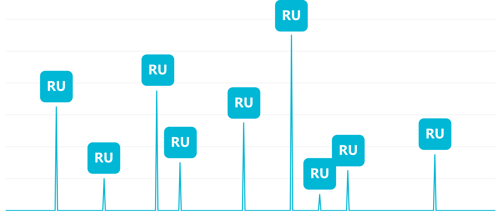

Azure Cosmos DB serverless is a consumption-based model where each request consumes request units. The consumption model eliminates the need to pre-provision throughput request units ahead of time.

Remember, when using Azure Cosmos DB, you typically express database options as a cost described in Request Units per second.

## What are use cases for serverless?

Serverless is great for applications with unpredictable or bursty traffic. You can use serverless with an application such as:

- A new application with hard to forecast users loads
- A new prototype application within your organization
- Serverless compute integration with a service like Azure Functions
- Just getting started with Azure Cosmos DB as a new developer
- Low traffic application that doesn’t send or receive numerous data
