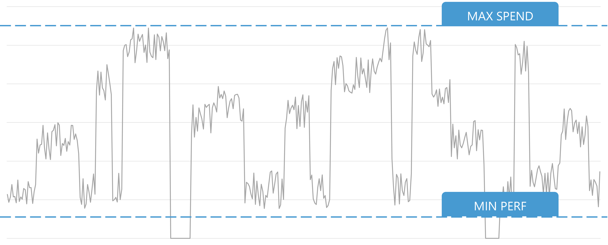
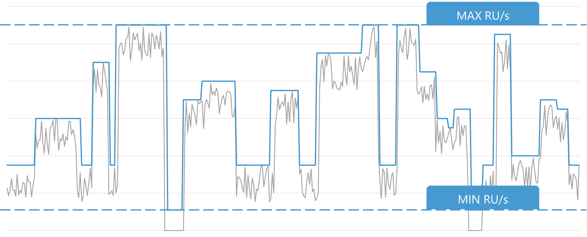

We can often make an educated guess about where our workload will be as far as throughput, but we won’t know exactly where it lands until it’s in production. We also may know our operational tolerances. We know:

- The maximum amount of money we are willing to spend
- The minimum amount of performance we are ready to tolerate.

With all of this information in mind, we could define a range. This range would represent our application running at a comfortable performance level without overspending without our knowledge.

With Azure Cosmos DB autoscale, we can define a range of request units per second (RU/s) to scale our database or container automatically and instantly. The throughput RU/s is scaled based on real-time usage instantly.

Autoscale is great for workloads with variable or unpredictable traffic patterns and can minimize unused capacity that would typically be pre-provisioned.
