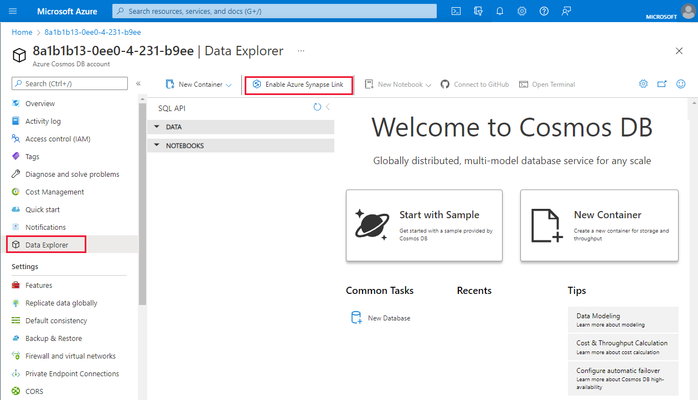
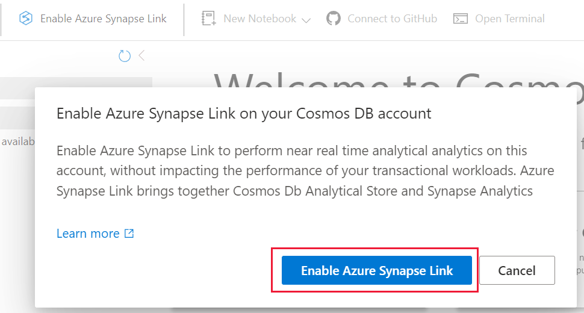
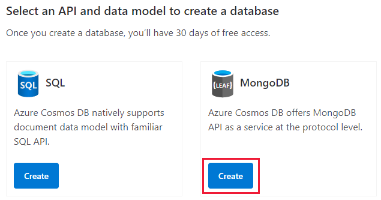
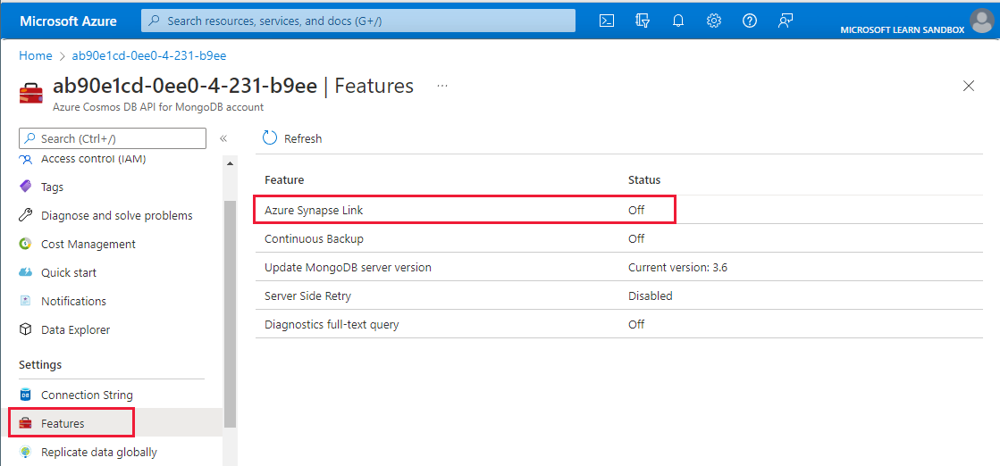
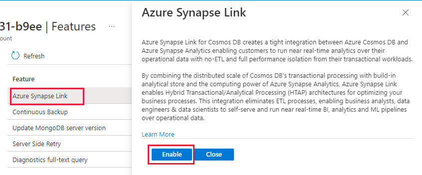

Before we can create an Azure Cosmos DB container with an analytical store, we must first enable Azure Synapse Link on the Azure Cosmos DB account.

> [!Note]
> Today you cannot disable the Synapse Link feature once it is enabled on the account, you cannot disable it. Enabling Synapse Link on the account has no billing implications until containers are created with the analytical store enabled.

## Enabling Synapse Link on Azure Cosmos DB SQL (Core) API account

To enable Azure Synapse link on your previously created Azure Cosmos DB SQL (Core) API preform the following steps:

1.	Navigate to the [Azure portal](https://portal.azure.com) and select the Azure Cosmos DB account.

2.	Navigate to your previously created Azure Cosmos DB SQL (Core) API account
 
    

3.	Select **Data Explorer** in the left-hand menu **(3)**

4.	Then click **Enable Azure Synapse Link** button at the top of the screen **(4)**
 
    

5.	Then click **Enable Azure Synapse Link** on the pop-up dialog box.

    Within a few minutes Azure Synapse Link will be enabled on the account.

    To verify that the Azure Synapse Link feature is enabled on the account follow the follow steps:
 
    

6.	Select **Features** in the left-hand menu **(1)**

7.	Verify that the Azure Synapse Link feature shows with a Status of **on (2)**, this will indicate that the Azure Cosmos DB account has been enabled for Azure Synapse Link.

## Enabling Synapse Link on Azure Cosmos DB API for MongoDB account

We will now use an alternative and equally effective manner for enabling the Synapse Link on your previously provisioned Azure Cosmos DB API for MongoDB account

1.	Navigate to the Azure portal (https://portal.azure.com) and select the Azure Cosmos DB account.

2.	Navigate to your previously created Azure Cosmos DB API for MongoDB account
 
    

3.	Select **Features** in the left-hand menu **(3)**
 
    

4.	Then click on the **Azure Synapse Link** entry in the features table **(4)**.
 
    

5.	The click the **Enable** button on the dialog box on the right (5)

You will then see a notification pop-up that letting you know that Azure is Enabling Synapse Link and will complete within a few minutes.

You can verify that your Azure Cosmos DB API for MongoDB account has been enabled for with the Synapse Link feature in the same manner we did for the Azure Cosmos DB Core (SQL) API account previously. 
