Before we can query our data using Azure Synapse Analytics using Azure Synapse Link, we must first create the container that is going to hold our data at the same time enabling it to have an analytical store.

> [!Note]
> Today enabling analytical store is only available at the time of creating a container and cannot be completely disabled without deleting the container. Setting the default analytical store TTL value to 0 or null effectively disables the analytical store by no longer synchronize new items to it from the transactional store and deleting items already synchronized from the analytical store.

## Create a new Azure Cosmos DB Core (SQL) API container

To create a new Azure Cosmos DB Core (SQL) API container with analytical store enabled, follow the following steps:

1.	Navigate to the Azure portal (https://portal.azure.com) and select the Azure Cosmos DB account.

2.	Navigate to your previously created Azure Cosmos DB Core (SQL) API account

3.	Select **Data Explorer** on the left-hand menu **(3)**.

4.	Click the **New Container** button at the top of screen. 
 
    [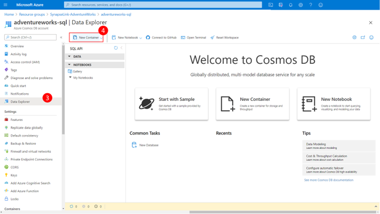](../media/select-new-container.png#lightbox)

    An Add Container dialog will appear.
 
    [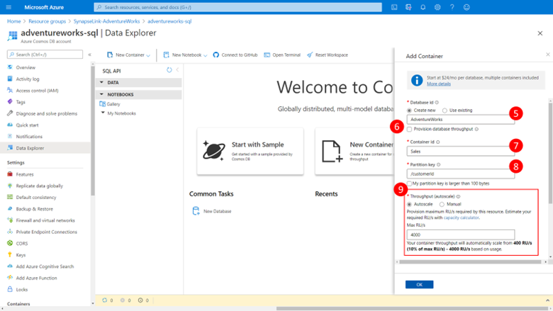](../media/add-new-container.png#lightbox)

5.	Enter the **new databases** and **container** information:
    a.	For the **Database ID** we choosing to use AdventureWorks **(5)**
    b.	Ensure that you unselect the Provision database throughput checkbox **(6)**
    c.	For the **container ID** we choose Sales
    d.	Enter /customerID for the **Partition Key** **(8)**

6.	Choose the throughput for your container by selecting **Autoscale** and **specify a Max RU/s of 4000 (9)**
 
    [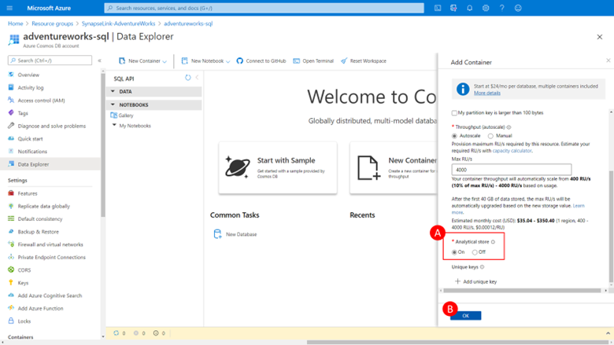](../media/add-analytical-store.png#lightbox)

7.	Scroll down and enable analytical store by ensuring that the **Analytical store** on radio button is selected **(A)**

8.	Click **OK** to create the container.

    Whilst this module assumes you understand how to appropriately configure an Azure Cosmos DB container to maximize performance and minimize cost lets briefly go over some of the thinking used to choose the values we dID:
    
    - We choose a partition key property of customerID as this attribute is used in many of the queries used to retrieve customer and sales order information in our application, it has relatively high cardinality (number of unique values) and thus will allow our container to scale as the number of customers and sales orders grows.

    - We chose to use autoscale provisioned throughput and set the maximum value to 4000 RU/s as we are just starting with our application and don’t expect massive query volumes initial. A max value 4000 RU/s will enable the container to automatically scale between this value all the way down to 10% of this max value (400 RU/s) when not needed. This should be plenty throughput for what we are going to do today. 

## Load sample data into the Azure Cosmos DB Core (SQL) API container

Perform the following steps to load a couple of sample items into the newly created container:

1.	Navigate to the Azure portal (https://portal.azure.com) and select the Azure Cosmos DB account.

2.	Navigate to your previously created Azure Cosmos DB Core (SQL) API account

3.	Select **Data Explorer** in the left-hand menu **(3)**

4.	Navigate to the **items folder** with the Sale container we just created by:
    a.	Expanding AventureWorks database **(4)**
    b.	Expanding the Sale Container **(5)** 
    c.	Clicking on the **Items** folder **(6)**

    You will see no item listed in the items list **(7)**; the container is empty.

5.	Now create a new customer profile item by:
    a.	Clicking the **New Item** button on the top ribbon **(7)**
    b.	Enter customer profile JSON in the **edit pane (8)**
    c.	Click the **Save** button on the ribbon **(9)** to save the item.
 
    [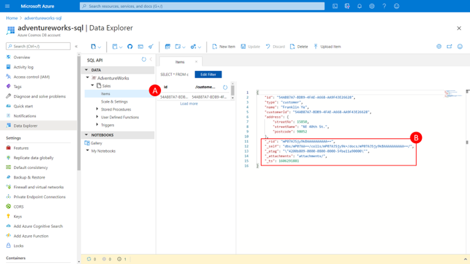](../media/create-customer-profile.png#lightbox)

    You will now see a new row in the items list (A),and if you click on this row in the items list an updated version the item will appear in the items pane, that includes some additional item meta data the service automatically adds and maintains within the item body when an item is added or updated (B) 

6.	Now create a new sales order item for our previously added customer by:
    a.	Clicking the New Item button on the top ribbon **(C)**
    b.	Copy the customer sales order JSON from below and past it in the edit pane **(D)**
    c.	Click the Same button on the ribbon **(9)** to save the item.

    [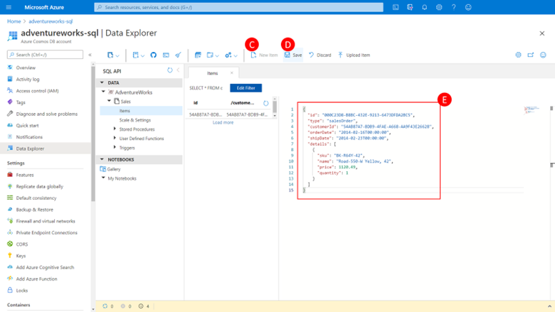](../media/create-new-sales-order-item.png#lightbox)

    And you will now see a second document in the Items list **(F)**

    [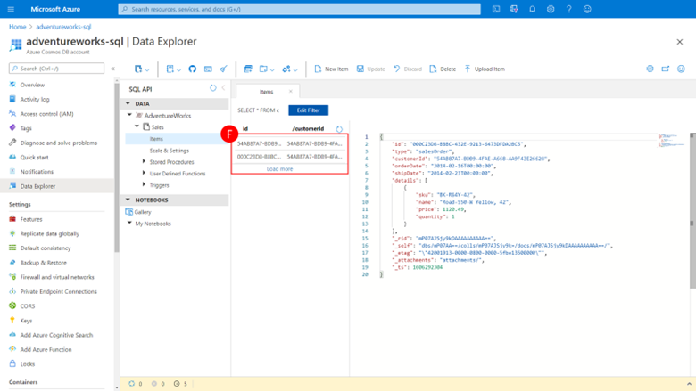](../media/view-second-document.png#lightbox)

7.	Let run a quick query against this data to retrieve customer profile and sales order information for a specific customer, this is typical of the queries our application runs:
    a.	Click the **New SQL Query** icon **(F)**
    b.	Enter the query into the query window **(G)**
    c.	Click the **Execute** button **(H)**

    You will see the results immediately returned in the results pain including the content of both items we previously created (I)

    [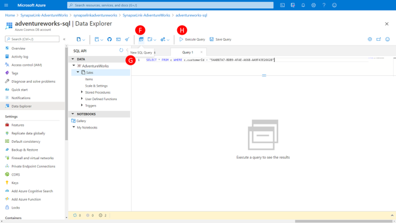](../media/run-query.png#lightbox)

## Create a new Azure Cosmos DB API for MongoDB container

To create a new Azure Cosmos DB API for MongoDB container with analytical store enabled by executing the following steps, in a manner similar to what we recently dID for the SQL API

1.	Navigate to the Azure portal (https://portal.azure.com) and select the Azure Cosmos DB account.

2.	Navigate to your previously created Azure Cosmos DB API for MongoDB account

    [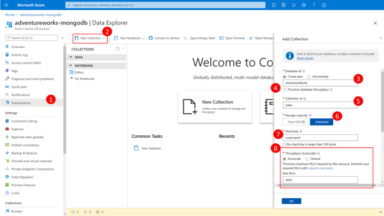](../media/add-collection.png#lightbox)

3.	Select **Data Explorer** on the left-hand menu (1).

4.	Click the **New Container** button at the top of screen (2). 

    An Add Container dialog will appear.

5.	Enter the new databases and container information:
    a.	For the **Database ID** we choosing to use AdventureWorks **(3)**
    b.	Ensure that use unselect the **Provision database throughput** checkbox **(4)**
    c.	For the **container ID** we choose Sales **(4)**
    d.	Select that we want unlimited storage capacity **(6)**, this is an option that we don’t have on creating a SQL API container since all SQL API containers are now unlimited.
    e.	Enter customerID for the **Shard Key (7)**, this is the MongoDB API equivalent of the SQL API partition key.

6.	Choose the throughput for your container by selecting **Autoscale** and specify a Max RU/s of 4000 **(8)**

    [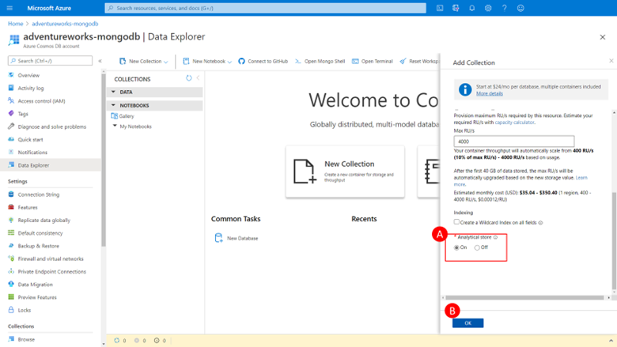](../media/enable-analytics-store.png#lightbox)

7.	Scroll down and enable analytical store by ensuring that the **Analytical store** on radio button is selected **(A)**

8.	Click **OK** to create the container **(B)**. 

## Load sample data into the Azure Cosmos DB API for MongoDB container

Perform the following steps to load a couple of sample items into the newly created MonoDB API container:

1.	Navigate to the Azure portal (https://portal.azure.com) and select the Azure Cosmos DB account.

2.	Navigate to your previously created Azure Cosmos DB API for MongoDB account
 
    [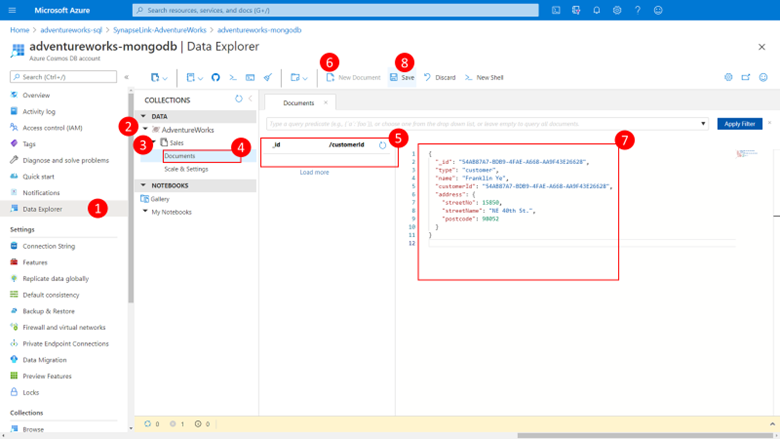](../media/create-customer-profile-mongodb.png#lightbox)

3.	Select **Data Explorer** in the left-hand menu **(1)**

4.	Navigate to the items folder with the Sale container we just created by:
    a.	Expanding AventureWorks database **(2)**
    b.	Expanding the Sale Collection **(3)** 
    c.	Clicking on the Documents folder **(4)**

    You will see no Document _IDs listed in the documents list **(5)**; the collection is empty.

5.	Now create a new customer profile item by:
    a.	Clicking the New Document button on the top ribbon **(6)**
    b.	Enter code into the edit pane **(7)**
    c.	Click the **Save** button on the ribbon **(8)** to save the item.

    You will now see a new row in the documents list. 

6.	Now create a new sales order document for our previously added customer by:
    a.	Click the **New Document** button on the top ribbon **(6)**
    b.	Enter code into the edit pane. 
    c.	Click the **Save** button on the ribbon (8) to save the item.

    And you will now see a second document in the document list.

7.	Let’s run a quick query against this data to retrieve customer profile and sales order information for a specific customer, this is typical of the queries our application runs:
 
    [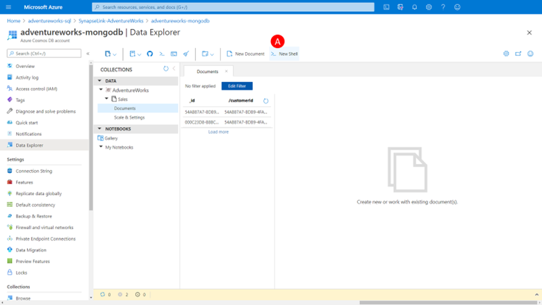](../media/query-to-retrieve-data.png#lightbox)

    a.	Click the New Shell **(A)**
 
    [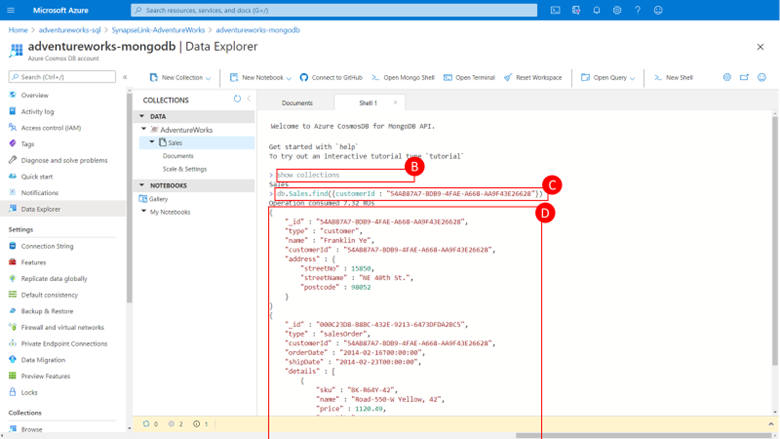](../media/open-mongo-client-shell.png#lightbox)

    This will open a mongo client shell within the portal.

    b.	Type “show collections” and press enter **(B)**
    
    This will return the Sales collection as the only collection in our database.
    
    c.	Type ```cmd db.Sales.find({“customerID” : “54AB87A7-BDB9-4FAE-A668-AA9F43E26628”``` and press enter **(C)**

    This will return our results immediately including the content of both documents we just created **(D)**
