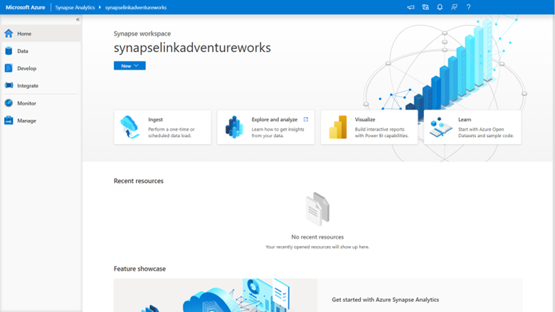
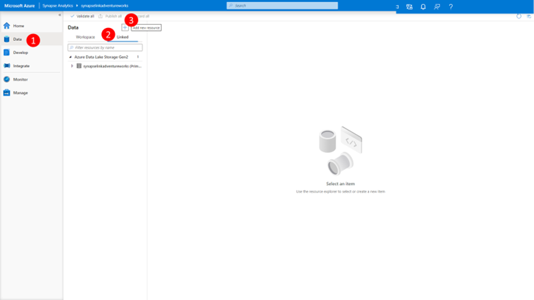
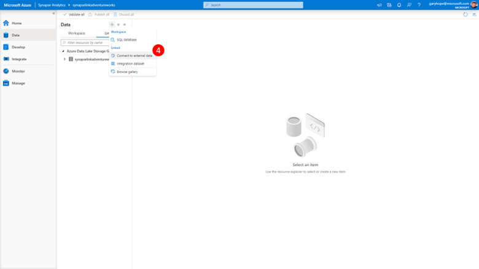
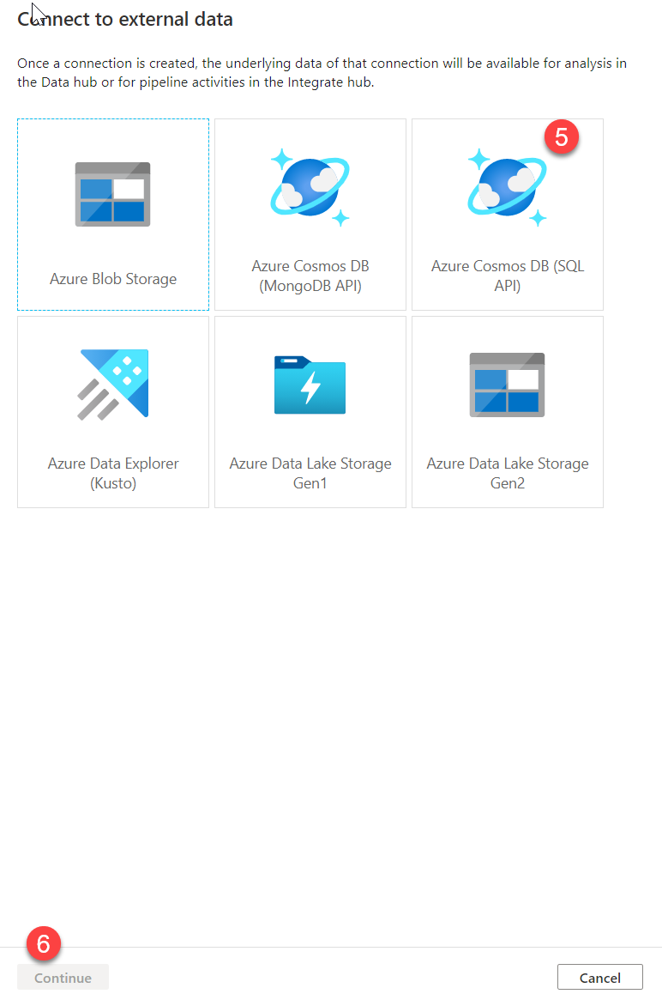
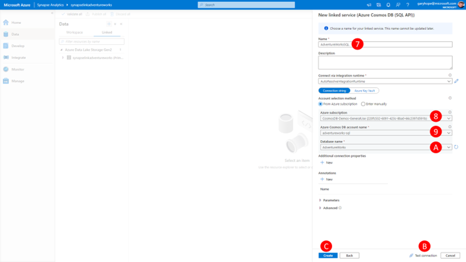
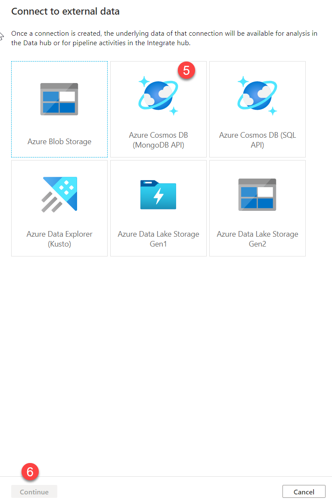

In order to query the data within our Cosmos DB analytical store from Azure Synapse using Spark, we need to configure a linked service 

## Configure Azure Synapse Linked Service for Azure Cosmos DB Core (SQL) API

To configure the Azure Synapse Linked Service for Azure Cosmos DB Core (SQL) API, perform the following steps:
 

1.	Connect to a previously deployed Azure Synapse Workspace running an Azure Synapse SQL Serverless instance **(deployed by default with the workspace)** and an Azure Synapse Spark Pool **(you need to have previously deployed this)**. 
 
    

2.	In the left-hand menu, select **Data (1)**

3.	Click on the **Linked tab** in the explorer view **(2)**

4.	Click the **+ button** to add a resource **(3)**
 
    

5.	Select **Connect to external data** from the list that pops up **(4)**
 
    

6.	Select **Azure Cosmos DB SQL API**

7.	Click **Continue** 
 
    

8.	Type **AdventureWorksSQL** as the name of our linked service **(7)**

9.	Select the **Azure Subscription** in which the previously configured Azure Cosmos DB Core (SQL) API account exists from the drop-down list **(8)**

10.	Select the **Azure Cosmos DB account** from the drop-down list **(9)**

11.	Select the **Sales** database for the drop-down list.

12.	Click **Test connection**. 

    You should immediately receive confirmation that the connection was successful.

13.	Click **Create**.

You are done creating your Linked service for your Azure Cosmos DB Core **(SQL)** API

## Configure Azure Synapse linked service for Azure Cosmos DB API for MongoDB

To configure the Azure Synapse Linked Service for Azure Cosmos DB API for MongoDB, perform the following steps:

1.	Connect to a previous deployed Azure Synapse Workspace 

2.	In the left-hand menu, select **Data** 

3.	Click on the **Linked tab** in the explorer view. 

4.	Click the **+ button** to add a resource. 

5.	Select **Connect to external data** from the list that pops up.
 
    

6.	Select **Azure Cosmos DB (MongoDB API) (5)**

7.	Click **Continue (6)**

8.	Type **AdventureWorksMongoDB** as the name of our linked service 

9.	Select the **Azure Subscription** in which the previously configured Azure Cosmos DB API for MongoDB account exists from the drop-down list. 

10.	Select the **Azure Cosmos DB account** from the drop-down list.

11.	Select the **Sales** database for the drop-down list.

12.	Click **Test connection** 

    You should immediately receive confirmation that the connection was successful.

13.	Click **Create**

You are done creating your Linked service for your Azure Cosmos DB API for MongoDB
