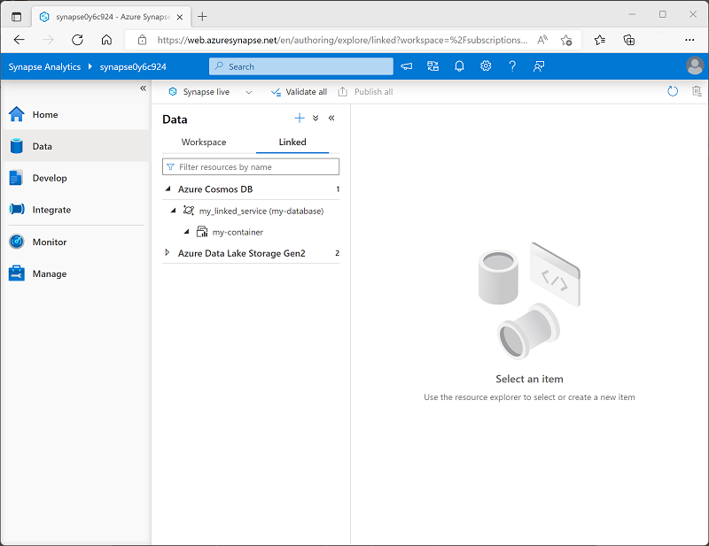

When you have an Azure Cosmos DB container with analytical store support, you can create a linked service in an Azure Synapse Analytics workspace to connect to it.

To create a linked service to an Azure Cosmos DB analytical data store, use Azure Synapse Studio, and add a linked service on the **Data** page by selecting the **Connect to external data** option, as shown here:

As you complete the steps to create your linked service, select the type of Azure Cosmos DB account and then assign your linked service a meaningful name and provide the necessary information to connect to your Azure Cosmos DB database.

To connect to the Azure Cosmos DB database, you can use any of the following authentication options:

- **Account key**: Specify an authentication key for your Cosmos DB account.
- **Service Principal**: Use the identity of the Azure Synapse Analytics service.
- **System Assigned Managed Identity**: Use system-assigned managed identity.
- **User Managed Identity**: Use a user-defined managed identity.

> [!TIP]
> For more information about using managed identities in Microsoft Entra ID, see [What are managed identities for Azure resources?](/azure/active-directory/managed-identities-azure-resources/overview)

After creating a linked service, the Azure Cosmos DB database and its containers will be shown in the **Data** page of Azure Synapse Studio, as shown here:

> [!NOTE]
>The user interface differentiates between containers with analytical store support and those without by using the following icons:
>
>| Analytical store enabled | Analytical store <u>not</u> enabled |
>|--|--|
>| | |
>
> You can query a container without an analytical store, but you won't benefit from the advantages of an HTAP solution that offloads analytical query overhead from the operational data store.
