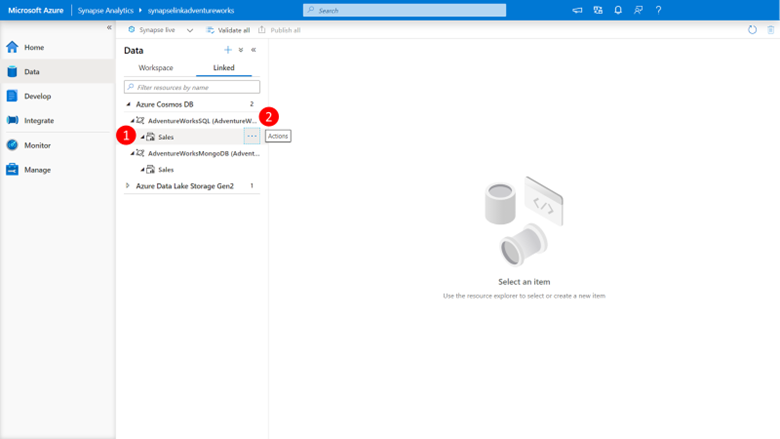
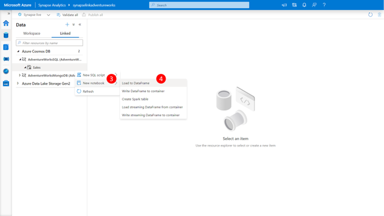
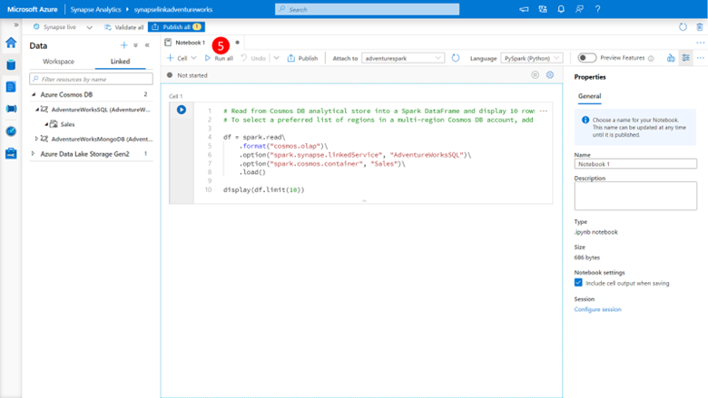
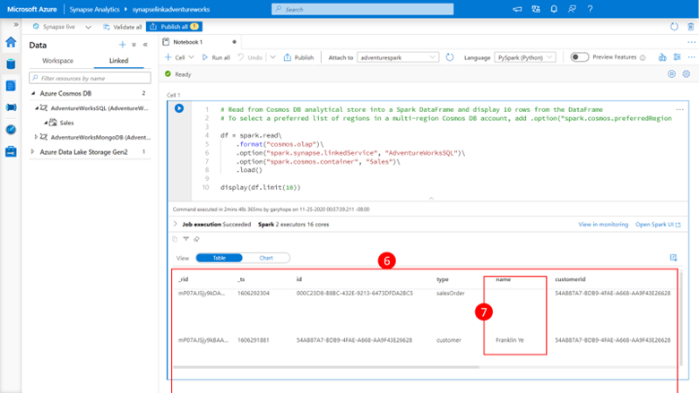
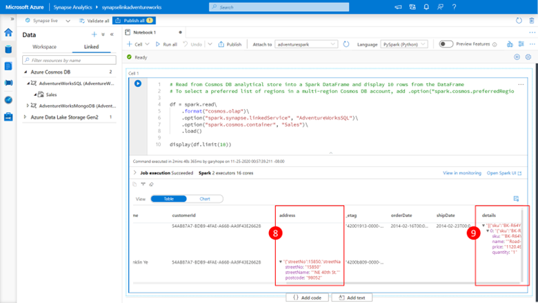
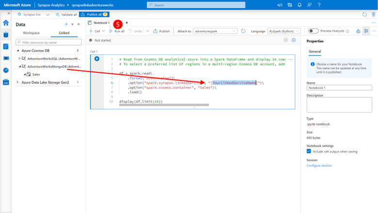
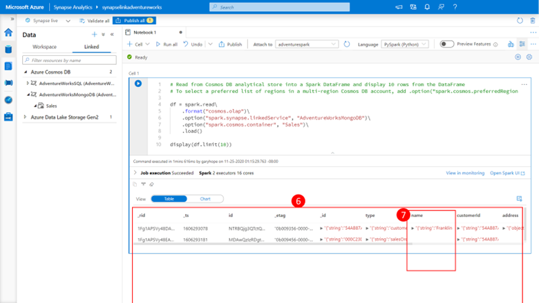
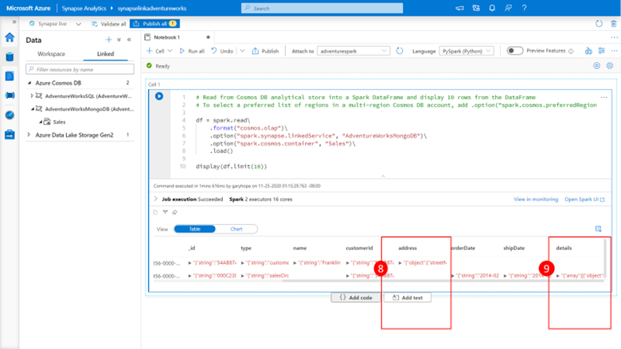

## Spark Queries for Cosmos DB Core (SQL) API

Let’s now connect to our Cosmos DB Cosmos DB Core (SQL) API analytical store using Spark and retrieve some data by performing the following steps:
 

1.	Expand the **AdventureWorksSQL linked service** in the explorer view and click on the **Sale container (1)**

2.	Click on the **Actions ellipsis “…”** 

    

3.	Click on **new notebook** to expose the list of notebooks actions. 

4.	Click on **Load to DataFrame**, to load a prepopulated notebook with a spark query to retrieve the top 10 records from the Linked Server and its associated analytical store.
 
    

5.	Click the **Run All** button on the ribbon to execute the notebook.

    

    You should almost immediately see the query begin to execute and the shortly thereafter receive back a result set **(6)**

    > [!Note] 
    > That for records where data was not defined, such as the name column for the salesOrder record we get back a null value. 
 
    

6.	Scrolling right though the result set 

    You will see that columns that contain JSON objects, such as address **(8)** and JSON arrays such a detail **(9)** has the JSON as their column content. 

## Spark queries for Azure Cosmos DB API for MongoDB

Let’s now connect to our Azure Cosmos DB API for MongoDB analytical store using Spark and retrieve some data by performing the following steps:

1.	Expand the **AdventureWorksMongoDB linked service** in the explorer view and click on the **Sale container**.

2.	Click on the **Actions ellipsis “…”** 

3.	Click on **new notebook** to expose the list of notebooks actions. 

4.	Click on **Load to DataFrame**, to load a prepopulated notebook with a spark query to retrieve the top 10 records from the Linked Server and its associated analytical store.
 
    

5.	Update the linked service name and click the **Run All** button on the ribbon to execute the notebook.
 
    

    You should almost immediately see the query begin to execute and the shortly thereafter receive back a result set **(6)**

    > [!Note] 
    > That for records where data was not defined, such as the name column for the salesOrder record we get back a null value, and that the name column now contains a JSON fragment with both the data type and value since the MongoDB API uses full fidelity schema mode by default.

    

6.	Scrolling right though the result set 

You will see that columns that contain JSON objects, such as address **(8)** and JSON arrays such a detail **(9)** has the JSON as their column content as well, however this too is expanded to include the data type information.
