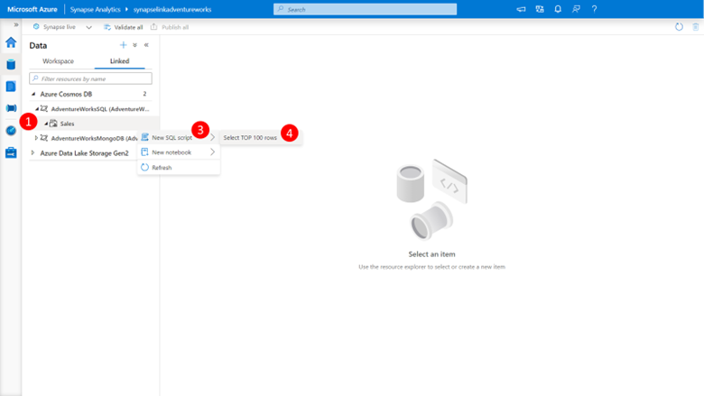
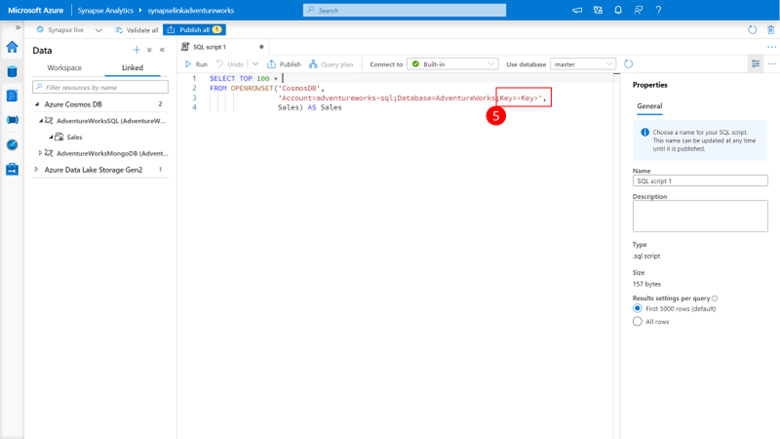
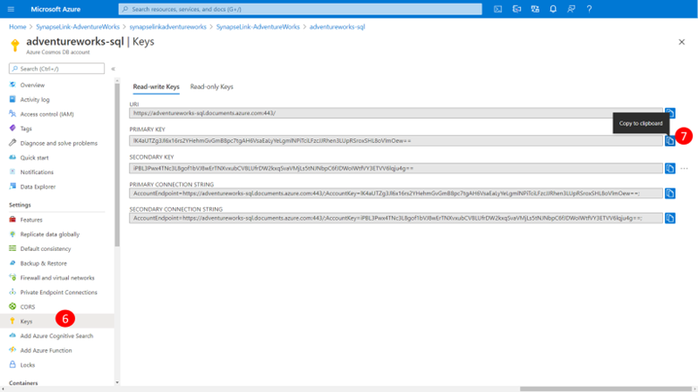
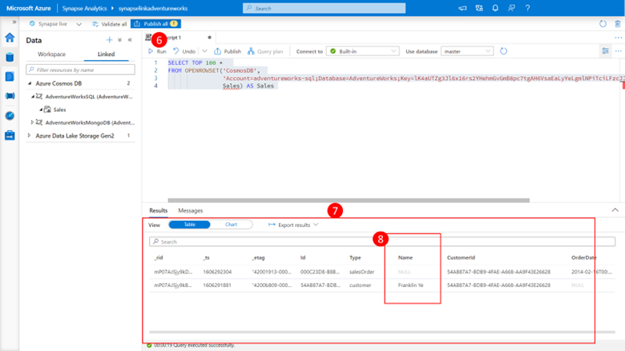
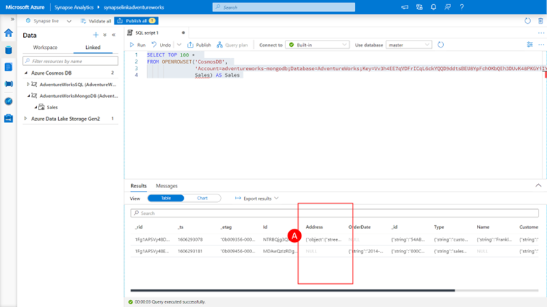

## SQL Queries for Cosmos DB Core **(SQL)** API

Let’s now connect to our Cosmos DB Cosmos DB Core (SQL) API analytical store using the Synapse Analytics SQL Serverless capability and retrieve some data by performing the following steps:
 

1.	Expand the **AdventureWorksSQL linked service** in the explorer view and click on the **Sale container (1)**

2.	Click on the **Actions ellipsis “…”**

3.	Click on **new notebook** to expose the list of New SQL Script actions **(3)** 

4.	Click on Select TOP 100 rows **(4)**, to load a SQL script window to retrieve the top 100 records from the Linked Server and its associated analytical store.
 
    

    You will note that the SQL script template requires the Azure Cosmos DB account key **(5)** for the account we are trying to connect to.

    

5.	You can retrieve this from the Azure Cosmos DB account by 
    a.	Clicking on the **Keys** in the left-hand menu **(6)**
    b.	Clicking the **copy icon** next to the PRIMARY KEY value **(7)**

    

6.	And past the key value from the clipboard back into the query **(5)**

    

7.	Now we can click the **Run** button.

    You should almost immediately see the query begin to execute and the shortly thereafter receive back a result set **(7)**

    > [!Note]
    > That for records where data was not defined, such as the name column for the salesOrder record we get back a null value **(8)**

    

    You will see that columns that contain JSON objects, such as address **(A)** and JSON arrays such a detail has the JSON as their column value content. 

8.	You can now close the SQL script and discard the changes by clicking the Close and discard changes on the dialog that pops up

## SQL Queries for Cosmos DB API for MongoDB

Let’s now connect to our Cosmos DB Cosmos DB API for MongoDB analytical store using the Synapse Analytics SQL Serverless capability and retrieve some data by performing the following steps:

1.	Expand the **AdventureWorksMongoDB linked service** in the explorer view and click on the **Sale container (1)**

2.	Click on the **Actions ellipsis “…”** 

3.	Click on **new notebook** to expose the list of New SQL Script actions **(3)** 

4.	Click on **Select TOP 100 rows (4)**, to load a SQL script window to retrieve the top 100 records from the Linked Server and its associated analytical store.

    You will see that the SQL script template requires the Azure Cosmos DB account key **(5)** for the account we are trying to connect to.

5.	You can retrieve this from the Azure Cosmos DB account by 
    a.	Click on the **Keys** in the left-hand menu 
    b.	Click the **copy icon** next to the PRIMARY KEY value

6.	And paste the key value from the clipboard back into the query

7.	Now we can click the **Run** button.

    

You should almost immediately see the query begin to execute and the shortly thereafter receive back a result set. 

> [!Note] 
> that for records where data was not defined, such as the name column for the salesOrder record we get back a null value and that the other column values are returned as JSON and expanded to include the properties data type.
